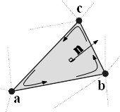

.. _chap_image_features:

Image features
==============

General considerations
----------------------

In this chapter we will describe a set of quantitative image features.
The feature set presented here largely builds upon the feature sets
proposed by :cite:`Aerts2014` and
:cite:`Hatt2016`, which are themselves largely derived from
earlier works. References to earlier work are provided whenever they
could be identified.

The set of features can be divided into a number of families, of which
intensity-based statistical, intensity histogram-based, intensity-volume
histogram-based, morphological features, local intensity, and texture
matrix-based features are treated here. All texture matrices are
rotationally and translationally invariant. Illumination invariance of
texture matrices may be achieved by particular discretisation schemes,
e.g. *histogram matching*. None of the texture matrices are scale
invariant, a property which can be useful in many (biomedical)
applications for scale optimization. What the presented texture matrices
lack, however, is directionality in combination with rotation
invariance. These may be achieved by local binary patterns and steerable
filters, which however fall beyond the scope of the current work. For
these and other texture features, see
:cite:`Depeursinge2014`.

Features are calculated on the base image, as well as images transformed
using wavelet or Gabor filters). To calculate features, it is assumed
that an image segmentation mask exists, which identifies the voxels
located within a region of interest (ROI). The ROI itself consists of
two masks, an intensity mask and a morphological mask. These masks may
be identical, but not necessarily so, as described in Section
[ref\_resegmentation].

Several feature families require additional image processing steps
before feature calculation. Notably intensity histogram and texture
feature families require prior discretisation of intensities into grey
level bins. Other feature families do not require discretisation before
calculations. For more details on image processing, see figure
[figImageProc] in the previous chapter.

Below is an overview table that summarises image processing requirements
for the different feature families.

.. list-table::
   :widths: auto
   :header-rows: 1

   * - Feature family
     - count
     - morph.
     - int.
     - discr.
   * -  morphology 
     -  29 
     -  
     -  
     - 
   * -  local intensity 
     -  2 
     -  
     -  
     - 
   * -  intensity-based statistics 
     -  18 
     -  
     -  
     - 
   * -  intensity histogram 
     -  23 
     -  
     -  
     - 
   * -  intensity-volume histogram 
     -  5 
     -  
     -  
     -  ()
   * -  grey level co-occurrence matrix 
     -  25 
     -  
     -  
     - 
   * -  grey level run length matrix 
     -  16 
     -  
     -  
     - 
   * -  grey level size zone matrix 
     -  16 
     -  
     -  
     - 
   * -  grey level distance zone matrix 
     -  16 
     -  
     -  
     - 
   * -  neighbourhood grey tone difference matrix 
     -  5 
     -  
     -  
     - 
   * -  neighbouring grey level dependence matrix 
     -  17 
     -  
     -  
     - 

Aside from image processing requirements there are two other concepts
which were not explicitly introduced, but which play an important role
for many features: distance and feature aggregation. In addition,
distance weighting for texture features is described. All three are
defined below.

Grid distances
^^^^^^^^^^^^^^

Grid distance is an important concept that is used by several feature
families, particularly texture features. Grid distances can be measured
in several ways. Let :math:`\mathbf{m}=\left(m_x,m_y,m_z\right)` be the
vector from a center voxel at
:math:`\mathbf{k}=\left(k_x,k_y,k_z\right)` to a neighbour voxel at
:math:`\mathbf{k}+\mathbf{m}`. The following norms (distances) are used:

-  :math:`\ell_1` norm or *Manhattan* norm ():

   .. math:: \|\mathbf{m}\|_1 = |m_x| + |m_y| + |m_z|

-  :math:`\ell_2` norm or *Euclidean* norm ():

   .. math:: \|\mathbf{m}\|_2 = \sqrt{m_x^2 + m_y^2 + m_z^2}

-  :math:`\ell_{\infty}` norm or *Chebyshev* norm ():

   .. math:: \|\mathbf{m}\|_{\infty} = \text{max}(|m_x|,|m_y|,|m_z|)

An example of how the above norms differ in practice is shown in figure
[fig:distance\_norms].

120pt [fig:manhattan\_distance]

120pt [fig:euclidean\_distance]

120pt [fig:chebyshev\_distance]

Feature aggregation
^^^^^^^^^^^^^^^^^^^

Features from some families may be calculated from, e.g. slices. As a
consequence, multip le values for the same feature may be computed.
These different values should be combined into a single value for many
common purposes. This process is referred to as feature aggregation.
Feature aggregation methods depend on the family, and are detailed in
the family description.

Distance weighting
^^^^^^^^^^^^^^^^^^

Distance weighting is not a default operation for any of the texture
families, but is implemented in software such as PyRadiomics
:cite:`VanGriethuysen2017`. It may for example be used to
put more emphasis on local intensities.

Morphological features
----------------------

Morphological features describe geometric aspects of a region of
interest (ROI), such as area and volume. Morphological features are
based on ROI voxel representations of the volume. Three voxel
representations of the volume are conceivable:

#. The volume is represented by a collection of voxels with each voxel
   taking up a certain volume ().

#. The volume is represented by a voxel point set :math:`\mathbf{X}_{c}`
   that consists of coordinates of the voxel centers ().

#. The volume is represented by a surface mesh ().

We use the second representation when the inner structure of the volume
is important, and the third representation when only the outer surface
structure is important. The first representation is not used outside
volume approximations because it does not handle partial volume effects
at the ROI edge well, and also to avoid inconsistencies in feature
values introduced by mixing representations in small voxel volumes.

Mesh-based representation
^^^^^^^^^^^^^^^^^^^^^^^^^

A mesh-based representation of the outer surface allows consistent
evaluation of the surface volume and area independent of size.
Voxel-based representations lead to partial volume effects and
over-estimation of surface area. The surface of the ROI volume is
translated into a triangle mesh using a meshing algorithm. While
multiple meshing algorithms exist, we suggest the use of the *Marching
Cubes* algorithm :cite:`Lorensen1987,Lewiner2003` because
of its widespread availability in different programming languages and
reasonable approximation of the surface area and volume
:cite:`Stelldinger2007`. In practice, mesh-derived feature
values depend upon the meshing algorithm and small differences may occur
between meshing implementations.

   Meshing algorithms draw faces and vertices to cover the ROI. One
   face, spanned by vertices :math:`\mathbf{a}`, :math:`\mathbf{b}` and
   :math:`\mathbf{c}`, is highlighted. Moreover, the vertices define the
   three edges :math:`\mathbf{ab}=\mathbf{b}-\mathbf{a}`,
   :math:`\mathbf{bc}=\mathbf{c}-\mathbf{b}` and
   :math:`\mathbf{ca}=\mathbf{a}-\mathbf{c}`. The face normal
   :math:`\mathbf{n}` is determined using the right-hand rule, and
   calculated as
   :math:`\mathbf{n}=\left(\mathbf{ab} \times \mathbf{bc}\right) / \| \mathbf{ab} \times \mathbf{bc}\|`,
   i.e. the outer product of edge :math:`\mathbf{ab}` with edge
   :math:`\mathbf{bc}`, normalised by its length.

Meshing algorithms use the ROI voxel point set :math:`\mathbf{X}_{c}` to
create a closed mesh. Dependent on the algorithm, a parameter is
required to specify where the mesh should be drawn. A default level of
0.5 times the voxel spacing is used for marching cube algorithms. Other
algorithms require a so-called *isovalue*, for which a value of 0.5 can
be used since the ROI mask consists of :math:`0` and :math:`1` values,
and we want to roughly draw the mesh half-way between voxel centers.
Depending on implementation, algorithms may also require padding of the
ROI mask with non-ROI (:math:`0`) voxels to correctly estimate the mesh
in places where ROI voxels would otherwise be located at the edge of the
mask.

The closed mesh drawn by the meshing algorithm consists of
:math:`N_{fc}` triangle faces spanned by :math:`N_{vx}` vertex points.
An example triangle face is drawn in Figure [figMorphMesh]. The set of
vertex points is then :math:`\mathbf{X}_{vx}`.

The calculation of the mesh volume requires that all faces have the same
orientation of the face normal. Consistent orientation can be checked by
the fact that in a regular, closed mesh, all edges are shared between
exactly two faces. Given the edge spanned by vertices :math:`\mathbf{a}`
and :math:`\mathbf{b}`, the edge must be
:math:`\mathbf{ab}=\mathbf{b}-\mathbf{a}` for one face and
:math:`\mathbf{ba}=\mathbf{a}-\mathbf{b}` for the adjacent face. This
ensures consistent application of the right-hand rule, and thus
consistent orientation of the face normals. Algorithm implementations
may return consistently orientated faces by default.

ROI morphological and intensity masks
^^^^^^^^^^^^^^^^^^^^^^^^^^^^^^^^^^^^^

The ROI consists of a morphological and an intensity mask. The
morphological mask is used to calculate many of the morphological
features and to generate the voxel point set :math:`\mathbf{X}_{c}`. Any
holes within the morphological mask are understood to be the result of
segmentation decisions, and thus to be intentional. The intensity mask
is used to generate the voxel intensity set :math:`\mathbf{X}_{gl}` with
corresponding point set :math:`\mathbf{X}_{c,gl}`. In the benchmark data
sets (Chapter [chap\_benchmark sets]), the masks are identical for the
digital phantom, but differ due to re-segmentation of the intensity
mask.

Aggregating features
^^^^^^^^^^^^^^^^^^^^

By definition, morphological features are calculated in 3D (), and not
per slice.

Volume 
~~~~~~~

The *volume* :math:`V` is calculated from the ROI mesh as follows
:cite:`Zhang2001`. A tetrahedron is formed by each face
:math:`k` and the origin. By placing the origin vertex of each
tetrahedron at :math:`(0,0,0)`, the signed volume of the tetrahedron is:

.. math:: V_k = \frac{\mathbf{a}\cdot\left(\mathbf{b}\times\mathbf{c}\right)}{6}

Here :math:`\mathbf{a}`, :math:`\mathbf{b}` and :math:`\mathbf{c}` are
the vertex points of face :math:`k`. Depending on the orientation of the
normal, the signed volume may be positive or negative. Hence, the
orientation of face normals should be consistent, e.g. all normals must
be either pointing outward or inward. The *volume* :math:`V` is then
calculated by summing over the face volumes, and taking the absolute
value:

.. math:: F_{\mathit{morph.vol}} = V = \left|\sum_{k=1}^{N_{fc}}V_k\right|

For positron emission tomography, *volume* is equivalent to the
*metabolically active tumour volume* (MATV).

Approximate volume
~~~~~~~~~~~~~~~~~~

In clinical practice, volumes are commonly determined by counting
voxels. For volumes consisting of a large number of voxels (1000s), the
differences between *approximate volume* and mesh-based *volume* are
usually negligible. However for volumes with a low number of voxels (10s
to 100s), *approximate volume* will overestimate volume compared to
mesh-based *volume*. It is therefore only used as a reference feature,
and not in the calculation of other morphological features.

*Approximate volume* is defined as:

.. math:: F_{\mathit{morph.approx.vol}} = \sum_{k=1}^{N_v} V_k

Here :math:`N_v` is the number of voxels in the morphological mask of
the ROI, and :math:`V_k` the volume of voxel :math:`k`.

Surface area
~~~~~~~~~~~~

The *surface area* :math:`A` is also calculated from the ROI mesh by
summing over the triangular face surface areas
:cite:`Aerts2014`. By definition, the area of face
:math:`k` is:

.. math:: A_k = \frac{|\mathbf{ab} \times \mathbf{ac}|}{2}

As in Figure [figMorphMesh], edge
:math:`\mathbf{ab}=\mathbf{b}-\mathbf{a}` is the vector from vertex
:math:`\mathbf{a}` to vertex :math:`\mathbf{b}`, and edge
:math:`\mathbf{ac}=\mathbf{c}-\mathbf{a}` the vector from vertex
:math:`\mathbf{a}` to vertex :math:`\mathbf{c}`. The total *surface
area* :math:`A` is then:

.. math:: F_{\mathit{morph.area}} = A = \sum_{k=1}^{N_{fc}} A_k

Surface to volume ratio
~~~~~~~~~~~~~~~~~~~~~~~

The *surface to volume ratio* is given as
:cite:`Aerts2014`:

.. math:: F_{\mathit{morph.av}} = \frac{A}{V}

Compactness 1
~~~~~~~~~~~~~

Several features (*compactness 1* and *2*, *spherical disproportion*,
*sphericity* and *asphericity*) quantify the deviation of the ROI volume
from a representative spheroid. All these definitions can be derived
from one another. As a results these features are are highly correlated
and may thus be redundant. *Compactness 1*
:cite:`Aerts2014` is a measure for how compact, or
sphere-like the volume is. It is defined as:

.. math:: F_{\mathit{morph.comp.1}} = \frac{V}{\pi^{1/2} A^{3/2}}

Some definitions use :math:`A^{2/3}` instead of :math:`A^{3/2}`
:cite:`Aerts2014`, but this does not lead to dimensionless
quantity.

Compactness 2
~~~~~~~~~~~~~

*Compactness 2* :cite:`Aerts2014` also quantifies how
sphere-like the volume is:

.. math:: F_{\mathit{morph.comp.2}} = 36\pi\frac{V^2}{A^3}

By definition
:math:`F_{\mathit{morph.comp.1}} = 1/6\pi \left(F_{\mathit{morph.comp.2}}\right)^{1/2}`.

Spherical disproportion 
~~~~~~~~~~~~~~~~~~~~~~~~

*Spherical disproportion* :cite:`Aerts2014` likewise
describes how sphere-like the volume is:

.. math:: F_{\mathit{morph.sph.dispr}} = \frac{A}{4\pi R^2} = \frac{A}{\left(36\pi V^2\right)^{1/3}}

By definition
:math:`F_{\mathit{morph.sph.dispr}} = \left(F_{\mathit{morph.comp.2}}\right)^{-1/3}`.

Sphericity 
~~~~~~~~~~~

*Sphericity* :cite:`Aerts2014` is a further measure to
describe how sphere-like the volume is:

.. math:: F_{\mathit{morph.sphericity}} = \frac{\left(36\pi V^2\right)^{1/3}}{A}

By definition
:math:`F_{\mathit{morph.sphericity}} = \left(F_{\mathit{morph.comp.2}}\right)^{1/3}`.

Asphericity 
~~~~~~~~~~~~

*Asphericity* :cite:`Apostolova2014` also describes how
much the ROI deviates from a perfect sphere, with perfectly spherical
volumes having an asphericity of 0. Asphericity is defined as:

.. math:: F_{\mathit{morph.asphericity}}=\left(\frac{1}{36\pi}\frac{A^3}{V^2}\right)^{1/3}-1

By definition
:math:`F_{\mathit{morph.asphericity}} = \left(F_{\mathit{morph.comp.2}}\right)^{-1/3}-1`

Centre of mass shift 
~~~~~~~~~~~~~~~~~~~~~

The distance between the ROI volume centroid and the intensity-weighted
ROI volume is an abstraction of the spatial distribution of low/high
intensity regions within the ROI. Let :math:`N_{v,m}` be the number of
voxels in the morphological mask. The ROI volume centre of mass is
calculated from the morphological voxel point set :math:`\mathbf{X}_{c}`
as follows:

.. math:: \overrightarrow{CoM}_{geom} = \frac{1}{N_{v,m}}\sum_{k=1}^{N_{v,m}} \vec{X}_{c,k}

The intensity-weighted ROI volume is based on the intensity mask. The
position of each voxel centre in the intensity mask voxel set
:math:`\mathbf{X}_{c,gl}` is weighted by its corresponding intensity
:math:`\mathbf{X}_{gl}`. Therefore, with :math:`N_{v,gl}` the number of
voxels in the intensity mask:

.. math:: \overrightarrow{CoM}_{gl} =\frac{\sum_{k=1}^{N_{v,gl}} X_{gl,k}\vec{X}_{c,gl,k}}{\sum_{k=1}^{N_{v,gl}} X_{gl,k}}

The distance between the two centres of mass is then:

.. math:: F_{\mathit{morph.com}} = ||\overrightarrow{CoM}_{geom}-\overrightarrow{CoM}_{gl}||_2

Maximum 3D diameter 
~~~~~~~~~~~~~~~~~~~~

The *maximum 3D diameter* :cite:`Aerts2014` is the distance
between the two most distant vertices in the ROI mesh vertex set
:math:`\mathbf{X}_{vx}`:

.. math:: F_{\mathit{morph.diam}} = \text{max}\left( ||\vec{X}_{vx,k_{1}}-\vec{X}_{vx,k_{2}}||_2\right),\qquad k_{1}=1,\ldots,N\qquad k_{2}=1,\ldots,N

A practical way of determining the *maximum 3D diameter* is to first
construct the convex hull of the ROI mesh. The convex hull vertex set
:math:`\mathbf{X}_{vx,convex}` is guaranteed to contain the two most
distant vertices of :math:`\mathbf{X}_{vx}`. This significantly reduces
the computational cost of calculating distances between all vertices.
Despite the remaining :math:`O(n^2)` cost of calculating distances
between different vertices, :math:`\mathbf{X}_{vx,convex}` is usually
considerably smaller in size than :math:`\mathbf{X}_{vx}`. Moreover, the
convex hull is later used for the calculation of other morphological
features
([feat\_morph\_vol\_dens\_conv\_hull]-[feat\_morph\_area\_dens\_conv\_hull]).

Major axis length 
~~~~~~~~~~~~~~~~~~

Principal component analysis (PCA) can be used to determine the main
orientation of the ROI :cite:`Solomon2011`. On a three
dimensional object, PCA yields three orthogonal eigenvectors
:math:`\left\lbrace e_1,e_2,e_3\right\rbrace` and three eigenvalues
:math:`\left( \lambda_1, \lambda_2, \lambda_3\right)`. These eigenvalues
and eigenvectors geometrically describe a triaxial ellipsoid. The three
eigenvectors determine the orientation of the ellipsoid, whereas the
eigenvalues provide a measure of how far the ellipsoid extends along
each eigenvector. Several features make use of principal component
analysis, namely *major*, *minor* and *least axis length*, *elongation*,
*flatness*, and *approximate enclosing ellipsoid volume* and area
density.

The eigenvalues can be ordered so that
:math:`\lambda_{\mathit{major}} \geq \lambda_{\mathit{minor}}\geq \lambda_{\mathit{least}}`
correspond to the major, minor and least axes of the ellipsoid
respectively. The semi-axes lengths :math:`a`, :math:`b` and :math:`c`
for the major, minor and least axes are then
:math:`2\sqrt{\lambda_{\mathit{major}}}`,
:math:`2\sqrt{\lambda_{\mathit{minor}}}` and
:math:`2\sqrt{\lambda_{\mathit{least}}}` respectively. The *major axis
length* is twice the semi-axis length :math:`a`, determined using the
largest eigenvalue obtained by PCA on the point set of voxel centers
:math:`\mathbf{X}_{c}` :cite:`Heiberger2015`:

.. math:: F_{\mathit{morph.pca.major}} = 2a = 4\sqrt{\lambda_{\mathit{major}}}

Minor axis length 
~~~~~~~~~~~~~~~~~~

The *minor axis length* of the ROI provides a measure of how far the
volume extends along the second largest axis. The *minor axis length* is
twice the semi-axis length :math:`b`, determined using the second
largest eigenvalue obtained by PCA, as described in Section
[feat\_morph\_pca\_major]:

.. math:: F_{\mathit{morph.pca.minor}}= 2b =4\sqrt{\lambda_{\mathit{minor}}}

Least axis length 
~~~~~~~~~~~~~~~~~~

The least axis is the axis along which the object is least extended. The
*least axis length* is twice the semi-axis length :math:`c`, determined
using the smallest eigenvalue obtained by PCA, as described in Section
[feat\_morph\_pca\_major]:

.. math:: F_{\mathit{morph.pca.least}}= 2c =4\sqrt{\lambda_{\mathit{least}}}

Elongation 
~~~~~~~~~~~

The ratio of the major and minor principal axis lengths could be viewed
as the extent to which a volume is longer than it is wide, i.e. is
eccentric. For computational reasons, we express *elongation* as an
inverse ratio. 1 is thus completely non-elongated, e.g. a sphere, and
smaller values express greater elongation of the ROI volume.

.. math:: F_{\mathit{morph.pca.elongation}} =\sqrt{\frac{\lambda_{minor}}{\lambda_{major}}}

Flatness
~~~~~~~~

The ratio of the major and least axis lengths could be viewed as the
extent to which a volume is flat relative to its length. For
computational reasons, we express *flatness* as an inverse ratio. 1 is
thus completely non-flat, e.g. a sphere, and smaller values express
objects which are increasingly flatter.

.. math:: F_{\mathit{morph.pca.flatness}} = \sqrt{\frac{\lambda_{least}}{\lambda_{major}}}

Volume density - axis-aligned bounding box
~~~~~~~~~~~~~~~~~~~~~~~~~~~~~~~~~~~~~~~~~~

Volume density is the fraction of the ROI volume and a comparison
volume. Here the comparison volume is that of the axis-aligned bounding
box (AABB) of the ROI mesh vertex set :math:`\mathbf{X}_{vx}` or the ROI
mesh convex hull vertex set :math:`\mathbf{X}_{vx,convex}`. Both vertex
sets generate an identical bounding box, which is the smallest box
enclosing the vertex set, and aligned with the axes of the reference
frame.

.. math:: F_{\mathit{morph.v.dens.aabb}} = \frac{V}{V_{\mathit{aabb}}}

This feature is also called *extent*
:cite:`ElNaqa2009,Solomon2011`.

Area density - axis-aligned bounding box
~~~~~~~~~~~~~~~~~~~~~~~~~~~~~~~~~~~~~~~~

Conceptually similar to the *volume density - axis-aligned bounding box*
feature, *area density* considers the ratio of the ROI surface area and
the surface area :math:`A_{aabb}` of the axis-aligned bounding box
enclosing the ROI mesh vertex set :math:`\mathbf{X}_{vx}`
:cite:`VanDijk2016`. The bounding box is identical to the
one used in the *volume density - axis-aligned bounding box* feature.
Thus:

.. math:: F_{\mathit{morph.a.dens.aabb}} = \frac{A}{A_{aabb}}

Volume density - oriented minimum bounding box
~~~~~~~~~~~~~~~~~~~~~~~~~~~~~~~~~~~~~~~~~~~~~~

The volume of an axis-aligned bounding box is generally not the smallest
obtainable volume enclosing the ROI. By orienting the box along a
different set of axes, a smaller enclosing volume may be attainable. The
oriented minimum bounding box of the ROI mesh vertex set
:math:`\mathbf{X}_{vx}` or :math:`\mathbf{X}_{vx,convex}` encloses the
vertex set and has the smallest possible volume. A 3D rotating callipers
technique was devised by :cite:`ORourke1985` to derive the
oriented minimum bounding box. Due to computational complexity of the
rotating callipers technique, the oriented minimum bounding box is
commonly approximated at lower complexity, see e.g.
:cite:`Barequet2001` and :cite:`Chan2001`.
Thus:

.. math:: F_{\mathit{morph.v.dens.ombb}} = \frac{V}{V_{ombb}}

Here :math:`V_{ombb}` is the volume of the oriented minimum bounding
box.

Area density - oriented minimum bounding box
~~~~~~~~~~~~~~~~~~~~~~~~~~~~~~~~~~~~~~~~~~~~

The *area density* is estimated as:

.. math:: F_{\mathit{morph.a.dens.ombb}} = \frac{A}{A_{ombb}}

Here :math:`A_{ombb}` is the surface area of the same bounding box as
calculated for the *volume density - oriented minimum bounding box*
feature.

Volume density - approximate enclosing ellipsoid
~~~~~~~~~~~~~~~~~~~~~~~~~~~~~~~~~~~~~~~~~~~~~~~~

The eigenvectors and eigenvalues from PCA of the ROI voxel center point
set :math:`\mathbf{X}_{c}` can be used to describe an ellipsoid
approximating the point cloud :cite:`Mazurowski2016`. The
volume of an ellipsoid is :math:`V_{\mathit{aee}}=4 \pi\,a\,b\,c /3`,
with :math:`a`, :math:`b`, and :math:`c` being the lengths of the
ellipsoid’s semi-principal axes, see Section [feat\_morph\_pca\_major].
The *volume density* is then:

.. math:: F_{\mathit{morph.v.dens.aee}} = \frac{3V}{4\pi abc}

Area density - approximate enclosing ellipsoid
~~~~~~~~~~~~~~~~~~~~~~~~~~~~~~~~~~~~~~~~~~~~~~

The surface area of an ellipsoid can generally not be evaluated in an
elementary form. However, it is possible to approximate the surface
using an infinite series. We use the same semi-principal axes as for the
*volume density - approximate ellipsoid* feature and define:

.. math:: A_{\mathit{aee}}\left(a,b,c\right)=4\pi\,a\,b\sum_{\nu=0}^{\infty}\frac{\left(\alpha\,\beta\right)^{\nu}}{1-4\nu^2}P_{\nu}\left(\frac{\alpha^2+\beta^2}{2\alpha\beta}\right)

Here :math:`\alpha=\sqrt{1-b^2/a^2}` and :math:`\beta=\sqrt{1-c^2/a^2}`
are eccentricities of the ellipsoid and :math:`P_{\nu}` is the Legendre
polynomial function for degree :math:`\nu`. Though infinite, the series
converges, and calculation may be stopped early. Gains in precision past
:math:`\nu=20` are limited, and as a default we stop calculations at
this polynomial degree.

The *area density* is then approximated as:

.. math:: F_{\mathit{morph.a.dens.aee}} = \frac{A}{A_{\mathit{aee}}}

Volume density - minimum volume enclosing ellipsoid
~~~~~~~~~~~~~~~~~~~~~~~~~~~~~~~~~~~~~~~~~~~~~~~~~~~

The approximate ellipsoid may not enclose the ROI or be the smallest
enclosing ellipsoid. The minimum volume enclosing ellipsoid is generally
approximated to make calculation more feasible. Various algorithms have
been described, e.g. :cite:`Todd2007,Ahipasaoglu2015`,
which are usually elaborations on Khachiyan’s barycentric coordinate
descent method :cite:`Khachiyan1996`.

The minimum volume enclosing ellipsoid (MVEE) encloses the ROI mesh
vertex set :math:`\mathbf{X}_{vx}`, and by definition
:math:`\mathbf{X}_{vx,convex}` as well. Use of the convex mesh set
:math:`\mathbf{X}_{vx,convex}` is recommended due to its sparsity
compared to the full vertex set. The volume of the MVEE is defined by
its semi-axes lengths :math:`V_{\mathit{mvee}}=4 \pi\,a\,b\,c /3`. Then:

.. math:: F_{\mathit{morph.v.dens.mvee}} = \frac{V}{V_{\mathit{mvee}}}

For Khachiyan’s barycentric coordinate descent-based methods we use a
default tolerance :math:`\tau=0.001` as stopping criterion.

Area density - minimum volume enclosing ellipsoid
~~~~~~~~~~~~~~~~~~~~~~~~~~~~~~~~~~~~~~~~~~~~~~~~~

The surface area of an ellipsoid does not have a general elementary
form, but should be approximated as noted in Section
[feat\_morph\_area\_dens\_aee]. Let the approximated surface area of the
MVEE be :math:`A_{\mathit{mvee}}`. Then:

.. math:: F_{\mathit{morph.a.dens.mvee}} = \frac{A}{A_{\mathit{mvee}}}

Volume density - convex hull
~~~~~~~~~~~~~~~~~~~~~~~~~~~~

The convex hull encloses ROI mesh vertex set :math:`\mathbf{X}_{vx}` and
consists of the vertex set :math:`\mathbf{X}_{vx,convex}` and
corresponding faces, see section [feat\_morph\_max\_3d\_diam]. The
volume of the ROI mesh convex hull set :math:`V_{convex}` is calculated
as for the *volume* feature ([feat\_morph\_volume]). The *volume
density* can then be calculated as follows:

.. math:: F_{\mathit{morph.v.dens.conv.hull}} = \frac{V}{V_{convex}}

This feature is also called *solidity*
:cite:`ElNaqa2009,Solomon2011`.

Area density - convex hull
~~~~~~~~~~~~~~~~~~~~~~~~~~

The area of the convex hull :math:`A_{convex}` is the sum of the areas
of the faces of the convex hull, as in the calculation of the *area*
feature (section [feat\_morph\_area]). The convex hull is identical to
the one used in the *volume density - convex hull* feature. Then:

.. math:: F_{\mathit{morph.a.dens.conv.hull}} = \frac{A}{A_{convex}}

Integrated intensity
~~~~~~~~~~~~~~~~~~~~

*Integrated intensity* is the average grey level multiplied by the
volume. In the context of :sup:`18`\ F-FDG-PET, this feature is called
*total lesion glycolysis* :cite:`Vaidya2012`. Thus:

.. math:: F_{\mathit{morph.integ.int}}=V\;\frac{1}{N_{v,gl}}\sum_{k=1}^{N_{v,gl}} X_{gl,k}

:math:`N_{v,gl}` is the number of voxels in the ROI intensity mask.

Moran’s I index
~~~~~~~~~~~~~~~

Moran’s *I* index is an indicator of spatial autocorrelation
:cite:`Moran1950,Dale2002`. It is defined as:

.. math:: F_{\mathit{morph.moran.i}} = \frac{N_{v,gl}}{\sum_{k_{1}=1}^{N_{v,gl}} \sum_{k_{2}=1}^{N_{v,gl}}w_{k_{1}k_{2}}} \frac{\sum_{k_{1}=1}^{N_{v,gl}}\sum_{k_{2}=1}^{N_{v,gl}} w_{k_{1}k_{2}}\left(X_{gl,k_{1}}-\mu \right) \left( X_{gl,k_{2}}-\mu \right)} {\sum_{k=1}^{N_{v,gl}} \left(X_{gl,k}-\mu \right)^2},\qquad k_{1}\neq k_{2}

As before :math:`N_{v,gl}` is the number of voxels in the ROI intensity
mask, :math:`\mu` is the mean of :math:`\mathbf{X}_{gl}` and
:math:`w_{k_{1}k_{2}}` is a weight factor, equal to the inverse
Euclidean distance between voxels :math:`k_{1}` and :math:`k_{2}` of the
point set :math:`\mathbf{X}_{c,gl}` of the ROI intensity mask
:cite:`DaSilva2008`. Values of Moran’s *I* close to 1.0,
0.0 and -1.0 indicate high spatial autocorrelation, no spatial
autocorrelation and high spatial anti-autocorrelation, respectively.

Note that for an ROI containing many voxels, calculating Moran’s *I*
index may be computationally expensive due to :math:`O(n^2)` behaviour.
Approximation by repeated subsampling of the ROI may be required to make
the calculation tractable, at the cost of accuracy.

Geary’s C measure
~~~~~~~~~~~~~~~~~

Geary’s *C* measure assesses spatial autocorrelation, similar to Moran’s
*I* index :cite:`Geary1954,Dale2002`. In contrast to
Moran’s *I* index, Geary’s *C* measure directly assesses grey level
differences between voxels and is more sensitive to local spatial
autocorrelation. This measure is defined as:

.. math:: F_{\mathit{morph.geary.c}} = \frac{N_{v,gl}-1}{2\sum_{k_{1}=1}^{N_{v,gl}} \sum_{k_{2}=1}^{N_{v,gl}}w_{k_{1}k_{2}}} \frac{\sum_{k_{1}=1}^{N_{v,gl}}\sum_{k_{2}=1}^{N_{v,gl}} w_{k_{1}k_{2}}\left(X_{gl,k_{1}}-X_{gl,k_{2}} \right)^2} {\sum_{k=1}^{N_{v,gl}} \left(X_{gl,k}-\mu \right)^2},\qquad k_{1}\neq k_{2}

As with Moran’s *I*, :math:`N_{v,gl}` is the number of voxels in the
ROI intensity mask, :math:`\mu` is the mean of :math:`\mathbf{X}_{gl}`
and :math:`w_{k_{1}k_{2}}` is a weight factor, equal to the inverse
Euclidean distance between voxels :math:`k_{1}` and :math:`k_{2}` of the
ROI voxel point set :math:`\mathbf{X}_{c,gl}`
:cite:`DaSilva2008`.

Just as Moran’s *I*, Geary’s *C* measure exhibits :math:`O(n^2)`
behaviour and an approximation scheme may be required to make
calculation feasible for large ROIs.

Local intensity features
------------------------

Voxel intensities within a defined neighbourhood around a center voxel
are used to compute local intensity features. Unlike many other feature
sets, local features do not draw solely on intensities within the ROI.
While only voxels within the ROI intensity map are used as a center
voxel, the corresponding local neighbourhood draws upon all voxels
regardless of being in an ROI.

Aggregating features
^^^^^^^^^^^^^^^^^^^^

By definition, local intensity features are calculated in 3D (), and not
per slice.

Local intensity peak 
~~~~~~~~~~~~~~~~~~~~~

The *local intensity peak* was originally devised for reducing variance
in determining standardised uptake values :cite:`Wahl2009`.
It is defined as the mean intensity in a 1 cm\ :sup:`3` spherical volume
(in world coordinates), which is centered on the voxel with the maximum
intensity level in the ROI intensity mask
:cite:`Frings2014`.

To calculate :math:`F_{\mathit{loc.peak.local}}`, we first select all
the voxels with centers within a radius
:math:`r=\left(\frac{3}{4 \pi}\right)^{1/3} \approx 0.62` cm of the
center of the maximum intensity voxel. Subsequently, the mean intensity
of the selected voxels, including the center voxel, are calculated.

In case the maximum intensity is found in multiple voxels within the
ROI, *local intensity peak* is calculated for each of these voxels, and
the highest *local intensity peak* is chosen.

Global intensity peak 
~~~~~~~~~~~~~~~~~~~~~~

The *global intensity peak* feature :math:`F_{\mathit{loc.peak.global}}`
is similar to the *local intensity peak*
:cite:`Frings2014`. However, instead of calculating the
mean intensity for the voxel(s) with the maximum intensity, the mean
intensity is calculated within a 1 cm\ :sup:`3` neighbourhood for every
voxel in the ROI intensity mask. The highest intensity peak value is
then selected.

Calculation of the *global intensity peak* feature may be accelerated by
construction and application of an appropriate spatial spherical mean
convolution filter, due to the convolution theorem. In this case one
would first construct an empty 3D filter that will fit a 1 cm\ :sup:`3`
sphere. Within this context, the filter voxels may be represented by a
point set, akin to :math:`\mathbf{X}_{c}` in section [sec\_morph\_feat].
Euclidean distances in world spacing between the central voxel of the
filter and every remaining voxel are computed. If this distance lies
within radius :math:`r=\left(\frac{3}{4 \pi}\right)^{1/3} \approx 0.62`
the corresponding voxel receives a label :math:`1`, and :math:`0`
otherwise. Subsequent summation of the voxel labels yields :math:`N_s`,
the number of voxels within the 1 cm\ :sup:`3` sphere. The filter then
becomes a spherical mean filter by dividing the labels by :math:`N_s`.

Intensity-based statistical features
------------------------------------

The intensity-based statistical features describe how grey levels within
the region of interest (ROI) are distributed. The features in this set
do not require discretisation, and may be used to describe a continuous
intensity distribution. Intensity-based statistical features are not
meaningful if the intensity scale is arbitrary.

The set of intensities of the :math:`N_v` voxels included in the ROI
intensity mask is denoted as
:math:`\mathbf{X}_{gl}=\left\lbrace X_{gl,1},X_{gl,2},\ldots,X_{gl,N_v}\right\rbrace`.

Aggregating features
^^^^^^^^^^^^^^^^^^^^

We recommend calculating intensity-based statistical features using the
3D volume (). Computing features per slice and subsequently averaging ()
is not recommended.

Mean
~~~~

The *mean* grey level of :math:`\mathbf{X}_{gl}` is calculated as:

.. math:: F_{\mathit{stat.mean}} = \frac{1}{N_v}\sum_{k=1}^{N_v} X_{gl,k}

Variance
~~~~~~~~

The grey level *variance* of :math:`\mathbf{X}_{gl}` is defined as:

.. math:: F_{\mathit{stat.var}} = \frac{1}{N_v}\sum_{k=1}^{N_v} \left( X_{gl,k}-\mu \right)^2

Skewness
~~~~~~~~

The *skewness* of the grey level distribution of :math:`\mathbf{X}_{gl}`
is defined as:

.. math:: F_{\mathit{stat.skew}} = \frac{\frac{1}{N_v}\sum_{k=1}^{N_v} \left( X_{gl,k}-\mu \right) ^3}{\left(\frac{1}{N_v}\sum_{k=1}^{N_v} \left( X_{gl,k}-\mu \right)^2\right)^{3/2}}

Here :math:`\mu=F_{\mathit{stat.mean}}`. If the grey level *variance*
:math:`F_{\mathit{stat.var}} = 0`, :math:`F_{\mathit{stat.skew}}=0`.

Kurtosis
~~~~~~~~

*Kurtosis*, or technically excess kurtosis, is a measure of peakedness
in the grey level distribution :math:`\mathbf{X}_{gl}`:

.. math:: F_{\mathit{stat.kurt}} = \frac{\frac{1}{N_v}\sum_{k=1}^{N_v} \left( X_{gl,k}-\mu \right) ^4}{\left(\frac{1}{N_v}\sum_{k=1}^{N_v} \left( X_{gl,k}-\mu \right)^2\right)^{2}} -3

Here :math:`\mu=F_{\mathit{stat.mean}}`. Note that kurtosis is
corrected by a Fisher correction of -3 to center it on 0 for normal
distributions. If the grey level *variance*
:math:`F_{\mathit{stat.var}} = 0`, :math:`F_{\mathit{stat.kurt}}=0`.

Median
~~~~~~

The *median* :math:`F_{\mathit{stat.median}}` is the sample median of
:math:`\mathbf{X}_{gl}`.

Minimum grey level
~~~~~~~~~~~~~~~~~~

The *minimum grey level* :math:`F_{\mathit{stat.min}}` is equal to the
lowest grey level present in :math:`\mathbf{X}_{gl}`.

10\ :sup:`th` percentile
~~~~~~~~~~~~~~~~~~~~~~~~

:math:`P_{10}` is the 10\ :sup:`th` percentile of
:math:`\mathbf{X}_{gl}`. :math:`P_{10}` is more robust to grey level
outliers than the *minimum grey level* and is defined as
:math:`F_{\mathit{stat.P10}}`.

90\ :sup:`th` percentile
~~~~~~~~~~~~~~~~~~~~~~~~

:math:`P_{90}` is the 90\ :sup:`th` percentile of
:math:`\mathbf{X}_{gl}`. :math:`P_{90}` is more robust to grey level
outliers than the *maximum grey level* and is defined as
:math:`F_{\mathit{stat.P90}}`.

Maximum grey level
~~~~~~~~~~~~~~~~~~

The *maximum grey level* :math:`F_{\mathit{stat.max}}` is equal to the
highest grey level present in :math:`\mathbf{X}_{gl}`.

Interquartile range
~~~~~~~~~~~~~~~~~~~

The *interquartile range* (IQR) of :math:`\mathbf{X}_{gl}` is defined
as:

.. math:: F_{\mathit{stat.iqr}} = P_{75}-P_{25}

:math:`P_{25}` and :math:`P_{75}` are the 25\ :sup:`th` and
75\ :sup:`th` percentiles of :math:`\mathbf{X}_{gl}`, respectively.

Range
~~~~~

The *range* of grey levels is defined as:

.. math:: F_{\mathit{stat.range}} = \text{max}(\mathbf{X}_{gl}) - \text{min}(\mathbf{X}_{gl})

Mean absolute deviation
~~~~~~~~~~~~~~~~~~~~~~~

*Mean absolute deviation* is a measure of dispersion from the mean of
:math:`\mathbf{X}_{gl}`:

.. math:: F_{\mathit{stat.mad}} = \frac{1}{N_v}\sum_{k=1}^{N_v} \left|X_{gl,k}-\mu\right|

Here :math:`\mu=F_{\mathit{stat.mean}}`.

Robust mean absolute deviation
~~~~~~~~~~~~~~~~~~~~~~~~~~~~~~

The *mean absolute deviation* feature may be influenced by outliers. To
increase robustness, the set of grey levels can be restricted to those
which lie closer to the center of the distribution. Let

.. math:: \mathbf{X}_{gl,10-90}= \left\lbrace x \in \mathbf{X}_{gl} | P_{10}\left(\mathbf{X}_{gl}\right)\leq x \leq P_{90}\left(\mathbf{X}_{gl}\right)\right\rbrace

Thus :math:`\mathbf{X}_{gl,10-90}` is the set of
:math:`N_{v,10-90}\leq N_v` voxels in :math:`\mathbf{X}_{gl}` whose grey
levels are equal to, or lie between, the values corresponding to the
10\ :sup:`th` and 90\ :sup:`th` percentiles of :math:`\mathbf{X}_{gl}`.
The robust mean absolute deviation is then:

.. math:: F_{\mathit{stat.rmad}} = \frac{1}{N_{v,10-90}}\sum_{k=1}^{N_{v,10-90}} \left|X_{gl,10-90,k}-\overline{X}_{gl,10-90}\right|

:math:`\overline{X}_{gl,10-90}` denotes the sample mean of
:math:`\mathbf{X_{gl,10-90}}`.

Median absolute deviation
~~~~~~~~~~~~~~~~~~~~~~~~~

*Median absolute deviation* is similar in concept to *mean absolute
deviation*, but measures dispersion from the median instead of mean.
Thus:

.. math:: F_{\mathit{stat.medad}} = \frac{1}{N_v}\sum_{k=1}^{N_v} \left| X_{gl,k}-M\right|

Here, median :math:`M = F_{\mathit{stat.median}}`.

Coefficient of variation
~~~~~~~~~~~~~~~~~~~~~~~~

The *coefficient of variation* measures the dispersion of the
:math:`\mathbf{X}_{gl}` distribution. It is defined as:

.. math:: F_{\mathit{stat.cov}}=\frac{\sigma}{\mu}

Here :math:`\sigma={F_{\mathit{stat.var}}}^{1/2}` and
:math:`\mu=F_{\mathit{stat.mean}}` are the standard deviation and mean
of the grey level distribution, respectively.

Quartile coefficient of dispersion
~~~~~~~~~~~~~~~~~~~~~~~~~~~~~~~~~~

The *quartile coefficient of dispersion* is a more robust alternative to
*coefficient of variance*. It is defined as:

.. math:: F_{\mathit{stat.qcod}} = \frac{P_{75}-P_{25}}{P_{75}+P_{25}}

:math:`P_{25}` and :math:`P_{75}` are the 25\ :sup:`th` and
75\ :sup:`th` percentile of :math:`\mathbf{X}_{gl}`, respectively.

Energy
~~~~~~

*Energy* :cite:`Aerts2014` of :math:`\mathbf{X}_{gl}` is
defined as:

.. math:: F_{\mathit{stat.energy}} = \sum_{k=1}^{N_v} X_{gl,k}^2

Root mean square
~~~~~~~~~~~~~~~~

The *root mean square* feature :cite:`Aerts2014`, which
also called the *quadratic mean*, of :math:`\mathbf{X}_{gl}` is defined
as:

.. math:: F_{\mathit{stat.rms}} = \sqrt{\frac{\sum_{k=1}^{N_v} X_{gl,k}^2}{N_v}}

Intensity histogram features
----------------------------

An intensity histogram is generated by discretising the original set of
grey levels :math:`\mathbf{X}_{gl}` into grey level bins. Approaches to
discretisation are described in Section [discretisation].

Let
:math:`\mathbf{X}_{d}=\left\lbrace X_{d,1},X_{d,2},\ldots,X_{d,N_v}\right\rbrace`
be the set of :math:`N_g` discretised grey levels of the :math:`N_v`
voxels in the ROI intensity mask. Let
:math:`\mathbf{H}=\left\lbrace n_1, n_2,\ldots, n_{N_g}\right\rbrace` be
the histogram with frequency count :math:`n_i` of each discretised grey
level :math:`i` in :math:`\mathbf{X}_{d}`. The occurrence probability
:math:`p_i` for each grey level bin :math:`i` is then approximated as
:math:`p_i=n_i/N_v`.

Aggregating features
^^^^^^^^^^^^^^^^^^^^

We recommend calculating intensity histogram features using the 3D
volume (). Computing features per slice and subsequently averaging () is
not recommended.

Intensity histogram mean
~~~~~~~~~~~~~~~~~~~~~~~~

The *mean* :cite:`Aerts2014` of :math:`\mathbf{X}_{d}` is
calculated as:

.. math:: F_{\mathit{ih.mean}} = \frac{1}{N_v}\sum_{k=1}^{N_v} X_{d,k}

An equivalent formulation is:

.. math:: F_{\mathit{ih.mean}} = \sum_{i=1}^{N_g}i\,p_i

Intensity histogram variance
~~~~~~~~~~~~~~~~~~~~~~~~~~~~

The *variance* :cite:`Aerts2014` of :math:`\mathbf{X}_{d}`
is defined as:

.. math:: F_{\mathit{ih.var}} = \frac{1}{N_v}\sum_{k=1}^{N_v} \left( X_{d,k}-\mu \right)^2

Here :math:`\mu=F_{\mathit{ih.mean}}`. This formulation is equivalent
to:

.. math:: F_{\mathit{ih.var}} = \sum_{i=1}^{N_g}\left(i-\mu\right)^2 p_i

Intensity histogram skewness
~~~~~~~~~~~~~~~~~~~~~~~~~~~~

The *skewness* :cite:`Aerts2014` of :math:`\mathbf{X}_{d}`
is defined as:

.. math:: F_{\mathit{ih.skew}} = \frac{\frac{1}{N_v}\sum_{k=1}^{N_v} \left( X_{d,k}-\mu \right) ^3}{\left(\frac{1}{N_v}\sum_{k=1}^{N_v} \left( X_{d,k}-\mu \right)^2\right)^{3/2}}

Here :math:`\mu=F_{\mathit{ih.mean}}`. This formulation is equivalent
to:

.. math:: F_{\mathit{ih.skew}} = \frac{\sum_{i=1}^{N_g}\left(i-\mu\right)^3 p_i}{\left(\sum_{i=1}^{N_g}\left(i-\mu\right)^2 p_i\right)^{3/2}}

If the discretised grey level variance :math:`F_{\mathit{ih.var}} = 0`,
:math:`F_{\mathit{ih.skew}}=0`.

Intensity histogram kurtosis
~~~~~~~~~~~~~~~~~~~~~~~~~~~~

*Kurtosis* :cite:`Aerts2014`, or technically excess
kurtosis, is calculated as measure of peakedness of the distribution
:math:`\mathbf{X}_{d}`:

.. math:: F_{\mathit{ih.kurt}} = \frac{\frac{1}{N_v}\sum_{k=1}^{N_v} \left( X_{d,k}-\mu \right) ^4}{\left(\frac{1}{N_v}\sum_{k=1}^{N_v} \left( X_{d,k}-\mu \right)^2\right)^{2}} -3

Here :math:`\mu=F_{\mathit{ih.mean}}`. The alternative, but equivalent,
formulation is:

.. math:: F_{\mathit{ih.kurt}} = \frac{\sum_{i=1}^{N_g}\left(i-\mu\right)^4 p_i}{\left(\sum_{i=1}^{N_g}\left(i-\mu\right)^2 p_i\right)^{2}} -3

Note that kurtosis is corrected by a Fisher correction of -3 to center
kurtosis on 0 for normal distributions. If the discretised grey level
:math:`F_{\mathit{ih.var}} = 0`, :math:`F_{\mathit{ih.kurt}}=0`.

Intensity histogram median
~~~~~~~~~~~~~~~~~~~~~~~~~~

The *median* :math:`F_{\mathit{ih.median}}` is the sample median of
:math:`\mathbf{X}_{d}` :cite:`Aerts2014`.

Intensity histogram minimum grey level
~~~~~~~~~~~~~~~~~~~~~~~~~~~~~~~~~~~~~~

The *minimum grey level* :cite:`Aerts2014`
:math:`F_{\mathit{ih.min}}` is equal to the lowest discretised grey
level present in :math:`\mathbf{X}_{d}`. For *fixed bin number*
discretisation :math:`F_{\mathit{ih.min}}=1` by definition, but it may
deviate for *fixed bin size* discretisation.

Intensity histogram 10\ :sup:`th` percentile
~~~~~~~~~~~~~~~~~~~~~~~~~~~~~~~~~~~~~~~~~~~~

:math:`P_{10}` is the 10\ :sup:`th` percentile of :math:`\mathbf{X}_{d}`
and is defined as :math:`F_{\mathit{ih.P10}}`.

Intensity histogram 90\ :sup:`th` percentile
~~~~~~~~~~~~~~~~~~~~~~~~~~~~~~~~~~~~~~~~~~~~

:math:`P_{90}` is the 90\ :sup:`th` percentile of :math:`\mathbf{X}_{d}`
and is defined as :math:`F_{\mathit{ih.P90}}`.

Intensity histogram maximum grey level
~~~~~~~~~~~~~~~~~~~~~~~~~~~~~~~~~~~~~~

The *maximum grey level* :cite:`Aerts2014`
:math:`F_{\mathit{ih.max}}` is equal to the highest discretised grey
level present in :math:`\mathbf{X}_{d}`. :math:`F_{\mathit{ih.max}}=N_g`
by definition.

Intensity histogram mode
~~~~~~~~~~~~~~~~~~~~~~~~

The *mode* of :math:`\mathbf{X}_{d}` :math:`F_{\mathit{ih.mode}}` is the
most common discretised grey level present, i.e. :math:`i` for which
count :math:`n_i` is maximal. The mode may not be uniquely defined. When
multiple bins contain the highest grey level count, the bin closest to
the histogram mean is chosen as :math:`F_{\mathit{ih.mode}}`. In
pathological cases with two such bins equidistant to the mean, the bin
to the left of the mean is selected.

Intensity histogram interquartile range
~~~~~~~~~~~~~~~~~~~~~~~~~~~~~~~~~~~~~~~

The *interquartile range* (IQR) of :math:`\mathbf{X}_{d}` is defined as:

.. math:: F_{\mathit{ih.iqr}} = P_{75}-P_{25}

:math:`P_{25}` and :math:`P_{75}` are the 25\ :sup:`th` and
75\ :sup:`th` percentile of :math:`\mathbf{X}_{d}`, respectively. The
interquartile range of :math:`\mathbf{X}_{d}` is always an integer.

Intensity histogram range
~~~~~~~~~~~~~~~~~~~~~~~~~

The *range* of grey levels :cite:`Aerts2014` in the
histogram is defined as:

.. math:: F_{\mathit{ih.range}} = \text{max}(\mathbf{X}_{d}) - \text{min}(\mathbf{X}_{d})

The *intensity histogram range* is therefore equal to the width of the
histogram. For *fixed bin number* discretisation
:math:`F_{\mathit{ih.range}}=N_g` by definition.

Intensity histogram mean absolute deviation
~~~~~~~~~~~~~~~~~~~~~~~~~~~~~~~~~~~~~~~~~~~

The *mean absolute deviation* :cite:`Aerts2014` is a
measure of dispersion from the mean of :math:`\mathbf{X}_{d}`:

.. math:: F_{\mathit{ih.mad}} = \frac{1}{N_v}\sum_{i=1}^{N_v} \left|X_{d,i}-\mu\right|

Here :math:`\mu=F_{\mathit{ih.mean}}`.

Intensity histogram robust mean absolute deviation
~~~~~~~~~~~~~~~~~~~~~~~~~~~~~~~~~~~~~~~~~~~~~~~~~~

*Intensity histogram mean absolute deviation* may be affected by
outliers. To increase robustness, the set of discretised grey levels
under consideration can be restricted to those which are closer to the
center of the distribution. Let

.. math:: \mathbf{X}_{d,10-90}= \left\lbrace x \in \mathbf{X}_{d} | P_{10}\left(\mathbf{X}_{d}\right)\leq x \leq P_{90}\left(\mathbf{X}_{d}\right)\right\rbrace

In short, :math:`\mathbf{X}_{d,10-90}` is the set of
:math:`N_{v,10-90}\leq N_v` voxels in :math:`\mathbf{X}_{d}` whose
discretised grey levels are equal to, or lie between, the values
corresponding to the 10\ :sup:`th` and 90\ :sup:`th` percentiles of
:math:`\mathbf{X}_{d}`. The robust mean absolute deviation is then:

.. math:: F_{\mathit{ih.rmad}} = \frac{1}{N_{v,10-90}}\sum_{k=1}^{N_{v,10-90}} \left|X_{d,10-90,k}-\overline{X}_{d,10-90}\right|

:math:`\overline{X}_{d,10-90}` denotes the sample mean of
:math:`\mathbf{X}_{d,10-90}`.

Intensity histogram median absolute deviation
~~~~~~~~~~~~~~~~~~~~~~~~~~~~~~~~~~~~~~~~~~~~~

*Histogram median absolute deviation* is conceptually similar to
*histogram mean absolute deviation*, but measures dispersion from the
median instead of mean. Thus:

.. math:: F_{\mathit{ih.medad}} = \frac{1}{N_v}\sum_{k=1}^{N_v} \left| X_{d,k}-M\right|

Here, median :math:`M = F_{\mathit{ih.median}}`.

Intensity histogram coefficient of variation
~~~~~~~~~~~~~~~~~~~~~~~~~~~~~~~~~~~~~~~~~~~~

The *coefficient of variation* measures the dispersion of the histogram.
It is defined as:

.. math:: F_{\mathit{ih.cov}}=\frac{\sigma}{\mu}

Here :math:`\sigma={F_{\mathit{ih.var}}}^{1/2}` and
:math:`\mu=F_{\mathit{ih.mean}}` are the standard deviation and mean of
the discretised grey level distribution, respectively.

Intensity histogram quartile coefficient of dispersion
~~~~~~~~~~~~~~~~~~~~~~~~~~~~~~~~~~~~~~~~~~~~~~~~~~~~~~

The *quartile coefficient of dispersion* is a more robust alternative to
*coefficient of variance*. It is defined as:

.. math:: F_{\mathit{ih.qcod}} = \frac{P_{75}-P_{25}}{P_{75}+P_{25}}

:math:`P_{25}` and :math:`P_{75}` are the 25\ :sup:`th` and
75\ :sup:`th` percentile of :math:`\mathbf{X}_{d}`, respectively.

Intensity histogram entropy
~~~~~~~~~~~~~~~~~~~~~~~~~~~

*Entropy* :cite:`Aerts2014` is an information-theoretic
concept that gives a metric for the information contained within
:math:`\mathbf{X}_{d}`. The particular metric used is Shannon entropy,
which is defined as:

.. math:: F_{\mathit{ih.entropy}} = - \sum_{i=1}^{N_g} p_i \log_2 p_i

Intensity histogram uniformity
~~~~~~~~~~~~~~~~~~~~~~~~~~~~~~

*Uniformity* :cite:`Aerts2014` of :math:`\mathbf{X}_{d}` is
defined as:

.. math:: F_{\mathit{ih.uniformity}} = \sum_{i=1}^{N_g} p_i^2

Note that this feature is sometimes also referred to as *energy*.

Maximum histogram gradient
~~~~~~~~~~~~~~~~~~~~~~~~~~

The histogram gradient :math:`\mathbf{H}'` of intensity histogram
:math:`\mathbf{H}` can be calculated as:

.. math::

   H'_i= \begin{cases}
   n_2-n_1 & i=1\\
   \left(n_{i+1}-n_{i-1}\right)/2 & 1<i<N_g\\
   n_{N_g}-n_{N_g-1} & i=N_g\\
   \end{cases}

Histogram :math:`\mathbf{H}` should be non-sparse, i.e. bins where
:math:`n_i=0` should not be omitted. Ostensibly, the histogram gradient
can be calculated in different ways. The method above has the advantages
of being easy to implement and leading to a gradient :math:`\mathbf{H}'`
with same size as :math:`\mathbf{H}`. This helps avoid ambiguity
concerning correspondence between the discretised grey level and the
bin. The *maximum histogram gradient* :cite:`VanDijk2016`
is:

.. math:: F_{\mathit{ih.max.grad}} = \text{max}\left(\mathbf{H}'\right)

Maximum histogram gradient grey level
~~~~~~~~~~~~~~~~~~~~~~~~~~~~~~~~~~~~~

The *maximum histogram gradient grey level*
:cite:`VanDijk2016` :math:`F_{\mathit{ih.max.grad.gl}}` is
the discretised grey level corresponding to the *maximum histogram
gradient*, i.e. :math:`i` for which :math:`\mathbf{H}'` was maximal.

Minimum histogram gradient
~~~~~~~~~~~~~~~~~~~~~~~~~~

The *minimum histogram gradient* :cite:`VanDijk2016` is:

.. math:: F_{\mathit{ih.min.grad}} = \text{min}\left(\mathbf{H}'\right)

Minimum histogram gradient grey level
~~~~~~~~~~~~~~~~~~~~~~~~~~~~~~~~~~~~~

The *minimum histogram gradient grey level*
:cite:`VanDijk2016` :math:`F_{\mathit{ih.min.grad.gl}}` is
the discretised grey level corresponding to the *minimum histogram
gradient*, i.e. :math:`i` for which :math:`\mathbf{H}'` was minimal.

.. _sect_ivh:

Intensity-volume histogram features
-----------------------------------

The (cumulative) intensity-volume histogram (IVH) of the voxel grey
level set :math:`\mathbf{X}_{gl}` of the ROI intensity mask describes
the relationship between discretised grey level :math:`i` and the
fraction of the volume containing at least grey level :math:`i`,
:math:`\nu` :cite:`ElNaqa2009`. Dependent on the imaging
modality, the calculation of IVH features requires discretising
:math:`\mathbf{X}_{gl}` to generate a discretised grey level voxel set
:math:`\mathbf{X}_{d,gl}`. Moreover, the total range :math:`\mathbf{G}`
of discretised grey level values with discretisation interval
:math:`w_d` should be provided or determined. The total range determines
the range of discretised grey level values to be included in the IVH,
whereas the discretisation interval determines the difference between
adjacent discretised grey levels in the IVH. For images with definite
intensity units, the discretisation interval matches the bin width for
discretisation. However, it differs for images with arbitrary intensity
units. For consistency of IVH metric comparisons, it is recommended to
use a range :math:`\mathbf{G}` as defined by the re-segmentation range
whenever it is possible for imaging modalities with definite intensity
units (both discrete and continuous cases).

Definite intensity units – discrete case
^^^^^^^^^^^^^^^^^^^^^^^^^^^^^^^^^^^^^^^^

Some imaging modalities by default generate voxels with calibrated,
discrete intensities – for example CT. In this case, the discretised ROI
voxel set :math:`\mathbf{X}_{d,gl}=\mathbf{X}_{gl}` (i.e. no
discretisation required). If a re-segmentation range is provided (see
Section [ref\_resegmentation]), the total range :math:`\mathbf{G}` is
equal to the re-segmentation range. In the case of a half-open
re-segmentation range, the upper limit of the range is
:math:`\text{max}(\mathbf{X}_{gl})`. When no range is provided,
:math:`\mathbf{G}=[\text{min}(\mathbf{X}_{gl}),\text{max}(\mathbf{X}_{gl})]`.
The discretisation interval is :math:`w_d=1`.

Definite intensity units – continuous case
^^^^^^^^^^^^^^^^^^^^^^^^^^^^^^^^^^^^^^^^^^

Imaging with calibrated, continuous intensities such as PET requires
discretisation to determine the IVH, while preserving the quantitative
intensity information. The use of a *fixed bin size* discretisation
method is thus recommended, see Section [discretisation]. Proper use of
this method requires to set the minimum grey level :math:`X_{gl,min}`,
the maximum grey level :math:`X_{gl,max}` and the bin width :math:`w_b`
prior to discretisation. If a re-segmentation range is defined (see
Section [ref\_resegmentation]), :math:`X_{gl,min}` is set to the lower
bound of the re-segmentation range and :math:`X_{gl,max}` to the upper
bound; otherwise :math:`X_{gl,min} = \text{min}(\mathbf{X}_{gl})` and
:math:`X_{gl,max} = \text{max}(\mathbf{X}_{gl})` (i.e. the minimum and
maximum grey levels in the imaging volume prior to discretisation). The
bin width :math:`w_b` is modality dependent, but should be small
relative to the intensity range, e.g. 0.10 SUV for :sup:`18`\ F-FDG-PET.

Next, *fixed bin size* discretisation produces the voxel set
:math:`\mathbf{X}_{d}` of bin numbers, which needs to be converted to
bin centers in order to maintain a direct relationship with the original
intensities. We thus replace bin numbers :math:`\mathbf{X}_{d}` with the
intensity corresponding to the bin center:

.. math:: \mathbf{X}_{d,gl} = X_{gl,min} + \left(\mathbf{X}_{d}-0.5\right)w_b

The total range is then
:math:`\mathbf{G}=[X_{gl,min}+0.5w_b, X_{gl,max}-0.5w_b]`. In this case,
the discretisation interval matches the bin width, i.e. :math:`w_d=w_b`.

Arbitrary intensity units
^^^^^^^^^^^^^^^^^^^^^^^^^

Some imaging modalities such as raw MRI data have arbitrary intensities.
In such cases, a *fixed bin number* discretisation method with
:math:`N_g=1000` bins is recommended, see Section [discretisation]. The
discretisation bin width is
:math:`w_b=\left(X_{gl,max}-X_{gl,min}\right)/N_g`, with
:math:`X_{gl,max}=\text{max}\left(\mathbf{X}_{gl}\right)` and
:math:`X_{gl,min}=\text{min}\left(\mathbf{X}_{gl}\right)`, as
re-segmentation ranges generally cannot be provided for non-calibrated
intensities. The *fixed bin number* discretisation produces the voxel
set :math:`\mathbf{X}_{d} \in \{1,2,\ldots,N_g\}`. Because of the lack
of calibration, :math:`\mathbf{X}_{d,gl}=\mathbf{X}_{d}`, and
consequentially the discretisation interval is :math:`w_d=1` and the
total range is :math:`\mathbf{G}=[1,N_g]`

Calculating the IV histogram
^^^^^^^^^^^^^^^^^^^^^^^^^^^^

We use :math:`\mathbf{X}_{d,gl}` to calculate fractional volumes and
fractional grey levels.

As voxels for the same image stack generally all have the same
dimensions, we may define fractional volume :math:`\nu` for discrete
grey level :math:`i` in the range :math:`\mathbf{G}` with discretisation
interval :math:`w_d` as:

.. math:: \nu_i = 1 - \frac{1}{N_v}\sum_{k=1}^{N_v}\left[X_{d,gl,k}< i\right]

Here :math:`\left[\ldots\right]` is an Iverson bracket, yielding
:math:`1` if the condition is true and :math:`0` otherwise. In essence,
we count the voxels containing a discretised grey level smaller than
:math:`i`, divide by the total number of voxels, and then subtract this
volume fraction to find :math:`\nu_i`.

The grey level fraction :math:`\gamma` for discrete grey level :math:`i`
in the range :math:`\mathbf{G}` with discretisation interval :math:`w_d`
is calculated as:

.. math:: \gamma_i=\frac{i-\text{min}\left(\mathbf{G}\right)} {\text{max}\left(\mathbf{G}\right) - \text{min}\left(\mathbf{G}\right)}

Note that we evaluate grey levels that may actually be absent in
:math:`\mathbf{X}_{d,gl}`. For the digital phantom of the benchmark data
sets (Chapter [chap\_benchmark sets]) grey levels 2 and 5 are absent,
but still evaluated to determine both the fractional volume and the grey
level fraction. An example IVH for the digital phantom is shown in Table
[TableAUC-CVH].

+-------------+------------------+---------------+
| :math:`i`   | :math:`\gamma`   | :math:`\nu`   |
+=============+==================+===============+
| 1           | 0.0              | 1.000         |
+-------------+------------------+---------------+
| 2           | 0.2              | 0.324         |
+-------------+------------------+---------------+
| 3           | 0.4              | 0.324         |
+-------------+------------------+---------------+
| 4           | 0.6              | 0.311         |
+-------------+------------------+---------------+
| 5           | 0.8              | 0.095         |
+-------------+------------------+---------------+
| 6           | 1.0              | 0.095         |
+-------------+------------------+---------------+

Table: Example intensity-volume histogram evaluated at discrete grey
levels :math:`i` of the digital phantom. The total range
:math:`\mathbf{G}=[1,6]`, with discretisation interval :math:`w=1`. Thus
:math:`\gamma` is the fractional grey level and :math:`\nu` is the
corresponding volume fraction that contains grey level :math:`i` or
greater.

Aggregating features
^^^^^^^^^^^^^^^^^^^^

We recommend calculating intensity-volume histogram features using the
3D volume (). Computing features per slice and subsequently averaging ()
is not recommended.

Volume at intensity fraction
~~~~~~~~~~~~~~~~~~~~~~~~~~~~

The *volume at intensity fraction* :math:`V_x` is the largest volume
fraction :math:`\nu` that has an intensity fraction :math:`\gamma` of at
least :math:`x\%`. This differs from conceptually similar dose-volume
histograms used in radiotherapy planning, where :math:`V_{10}` would
indicate the volume fraction receiving at least 10 Gy planned dose.
:cite:`ElNaqa2009` defined both :math:`V_{10}` and
:math:`V_{90}` as features. In the context of this work, these two
features are defined as :math:`F_{\mathit{ivh.V10}}` and
:math:`F_{\mathit{ivh.V90}}`, respectively.

Intensity at volume fraction
~~~~~~~~~~~~~~~~~~~~~~~~~~~~

The *intensity at volume fraction* :math:`I_x` is the minimum
discretised grey level :math:`i` present in at most :math:`x\%` of the
volume. :cite:`ElNaqa2009` defined both :math:`I_{10}` and
:math:`I_{90}` as features. In the context of this work, these two
features are defined as :math:`F_{\mathit{ivh.I10}}` and
:math:`F_{\mathit{ivh.I90}}`, respectively.

Volume fraction difference between intensity fractions
~~~~~~~~~~~~~~~~~~~~~~~~~~~~~~~~~~~~~~~~~~~~~~~~~~~~~~

This feature is the difference between the volume fractions at two
different intensity fractions, e.g. :math:`V_{10}-V_{90}`
:cite:`ElNaqa2009`. In the context of this work, this
feature is defined as :math:`F_{\mathit{ivh.V10minusV90}}`.

Intensity fraction difference between volume fractions
~~~~~~~~~~~~~~~~~~~~~~~~~~~~~~~~~~~~~~~~~~~~~~~~~~~~~~

This feature is the difference between discretised grey levels at two
different fractional volumes, e.g. :math:`I_{10} - I_{90}`
:cite:`ElNaqa2009`. In the context of this work, this
feature is defined as :math:`F_{\mathit{ivh.I10minusI90}}`.

Area under the IVH curve
~~~~~~~~~~~~~~~~~~~~~~~~

The *area under the IVH curve* :math:`F_{\mathit{ivh.auc}}` was defined
by :cite:`VanVelden2011`. The *area under the IVH curve*
can be approximated by calculating the Riemann sum using the trapezoidal
rule. Note that if there is only one grey level in the ROI, the *area
under the IVH curve* :math:`F_{\mathit{ivh.auc}}=0`.

Grey level co-occurrence based features
---------------------------------------

In image analysis, texture is one of the defining sets of features.
Texture features were originally designed to assess surface texture in
2D images. Texture analysis is however not restricted to 2D slices and
can be extended to 3D objects. Image intensities are generally
discretised before calculation of texture features, see Section
[discretisation].

The grey level co-occurrence matrix (GLCM) is a matrix that expresses
how combinations of discretised grey levels of neighbouring pixels, or
voxels in a 3D volume, are distributed along one of the image
directions. Generally, the neighbourhood for GLCM is a 26-connected
neighbourhood in 3D and a 8-connected neighbourhood in 2D. Thus, in 3D
there are 13 unique direction vectors within the neighbourhood for
Chebyshev distance :math:`\delta=1`, i.e. :math:`(0,0,1)`,
:math:`(0,1,0)`, :math:`(1,0,0)`, :math:`(0,1,1)`, :math:`(0,1,-1)`,
:math:`(1,0,1)`, :math:`(1,0,-1)`, :math:`(1,1,0)`, :math:`(1,-1,0)`,
:math:`(1,1,1)`, :math:`(1,1,-1)`, :math:`(1,-1,1)` and
:math:`(1,-1,-1)`, whereas in 2D the direction vectors are
:math:`(1,0,0)`, :math:`(1,1,0)`, :math:`(0,1,0)` and :math:`(-1,1,0)`.

A GLCM is calculated for each direction vector, as follows. Let
:math:`\mathbf{M}_{\mathbf{m}}` be the :math:`N_g \times N_g` grey level
co-occurrence matrix, with :math:`N_g` the number of discretised grey
levels present in the ROI intensity mask, and :math:`\mathbf{m}` the
particular direction vector. Element :math:`(i,j)` of the GLCM contains
the frequency at which combinations of discretised grey levels :math:`i`
and :math:`j` occur in neighbouring voxels along direction
:math:`\mathbf{m}_{+}=\mathbf{m}` and along direction
:math:`\mathbf{m}_{-}= -\mathbf{m}`. Then,
:math:`\mathbf{M}_{\mathbf{m}} = \mathbf{M}_{\mathbf{m}_{+}} + \mathbf{M}_{\mathbf{m}_{-}} = \mathbf{M}_{\mathbf{m}_{+}} + \mathbf{M}_{\mathbf{m}_{+}}^T`
:cite:`Haralick1973`. As a consequence the GLCM matrix
:math:`\mathbf{M}_{\mathbf{m}}` is symmetric. An example of the
calculation of a GLCM is shown in Table [figGLCM1]. Corresponding grey
level co-occurrence matrices for each direction are shown in Table
[figGLCM2].

| 

GLCM features rely on the probability distribution for the elements of
the GLCM. Let us consider :math:`\mathbf{M}_{\mathbf{m}=(1,0)}` from the
example, as shown in Table [figGLCM3]. We derive a probability
distribution for grey level co-occurrences,
:math:`\mathbf{P}_{\mathbf{m}}`, by normalising
:math:`\mathbf{M}_{\mathbf{m}}` by the sum of its elements. Each element
:math:`p_{ij}` of :math:`\mathbf{P}_{\mathbf{m}}` is then the joint
probability of grey levels :math:`i` and :math:`j` occurring in
neighbouring voxels along direction :math:`\mathbf{m}`. Then
:math:`p_{i.} = \sum_{j=1}^{N_g} p_{ij}` is the row marginal
probability, and :math:`p_{.j}=\sum_{i=1}^{N_g} p_{ij}` is the column
marginal probability. As :math:`\mathbf{P}_{\mathbf{m}}` is by
definition symmetric, :math:`p_{i.} = p_{.j}`. Furthermore, let us
consider diagonal and cross-diagonal probabilities :math:`p_{i-j}` and
:math:`p_{i+j}` :cite:`Haralick1973,Unser1986`:

.. math::

   \begin{aligned}
   p_{i-j,k}&=\sum_{i=1}^{N_g} \sum_{j=1}^{N_g} p_{ij}\, \left[k=|i-j|\right]\qquad k=0,\ldots ,N_g-1\\
   p_{i+j,k}&=\sum_{i=1}^{N_g} \sum_{j=1}^{N_g} p_{ij}\, \left[k=i+j\right]\qquad k=2,\ldots ,2N_g\end{aligned}

Here, :math:`\left[\ldots\right]` is an Iverson bracket, which equals
:math:`1` when the condition within the brackets is true and :math:`0`
otherwise. In effect we select only combinations of elements
:math:`(i,j)` for which the condition holds.

It should be noted that while a distance :math:`\delta=1` is commonly
used for GLCM, other distances are possible. However, this does not
change the number of For example, for :math:`\delta=3` (in 3D) the
voxels at :math:`(0,0,3)`, :math:`(0,3,0)`, :math:`(3,0,0)`,
:math:`(0,3,3)`, :math:`(0,3,-3)`, :math:`(3,0,3)`, :math:`(3,0,-3)`,
:math:`(3,3,0)`, :math:`(3,-3,0)`, :math:`(3,3,3)`, :math:`(3,3,-3)`,
:math:`(3,-3,3)` and :math:`(3,-3,-3)` from the center voxel are
considered.

Aggregating features
^^^^^^^^^^^^^^^^^^^^

To improve rotational invariance, GLCM feature values are computed by
aggregating information from the different underlying directional
matrices :cite:`Depeursinge2017a`. Five methods can be used
to aggregate GLCMs and arrive at a single feature value. A schematic
example is shown in Figure [figGLCMCalcApproaches]. A feature may be
aggregated as follows:

#. Features are computed from each 2D directional matrix and averaged
   over 2D directions and slices ().

#. Features are computed from a single matrix after merging 2D
   directional matrices per slice, and then averaged over slices ().

#. The feature is computed from a single matrix after merging all 2D
   directional matrices ().

#. Features are computed from each 3D directional matrix and averaged
   over the 3D directions ().

#. The feature is computed from a single matrix after merging all 3D
   directional matrices ().

In methods 2,3 and 5, matrices are merged by summing the co-occurrence
counts in each matrix element :math:`(i,j)` over the different matrices.
Probability distributions are subsequently calculated for the merged
GLCM, which is then used to calculate GLCM features. Feature values may
dependent strongly on the aggregation method.

| 

| 

0.45 |Approaches to calculating grey level co-occurrence matrix-based
features. :math:`\mathbf{M}_{\Delta k}` are texture matrices calculated
for direction :math:`\Delta` in slice :math:`k` (if applicable), and
:math:`f_{\Delta k}` is the corresponding feature value. In (b), (c) and
(e) the matrices are merged prior to feature calculation.|

0.45 |Approaches to calculating grey level co-occurrence matrix-based
features. :math:`\mathbf{M}_{\Delta k}` are texture matrices calculated
for direction :math:`\Delta` in slice :math:`k` (if applicable), and
:math:`f_{\Delta k}` is the corresponding feature value. In (b), (c) and
(e) the matrices are merged prior to feature calculation.|

| 

0.45 |Approaches to calculating grey level co-occurrence matrix-based
features. :math:`\mathbf{M}_{\Delta k}` are texture matrices calculated
for direction :math:`\Delta` in slice :math:`k` (if applicable), and
:math:`f_{\Delta k}` is the corresponding feature value. In (b), (c) and
(e) the matrices are merged prior to feature calculation.|

0.45 |Approaches to calculating grey level co-occurrence matrix-based
features. :math:`\mathbf{M}_{\Delta k}` are texture matrices calculated
for direction :math:`\Delta` in slice :math:`k` (if applicable), and
:math:`f_{\Delta k}` is the corresponding feature value. In (b), (c) and
(e) the matrices are merged prior to feature calculation.|

| 

0.45 |Approaches to calculating grey level co-occurrence matrix-based
features. :math:`\mathbf{M}_{\Delta k}` are texture matrices calculated
for direction :math:`\Delta` in slice :math:`k` (if applicable), and
:math:`f_{\Delta k}` is the corresponding feature value. In (b), (c) and
(e) the matrices are merged prior to feature calculation.|

Distances and distance weighting
^^^^^^^^^^^^^^^^^^^^^^^^^^^^^^^^

The default neighbourhood includes all voxels within Chebyshev distance
:math:`1`. The corresponding direction vectors are multiplied by the
desired distance :math:`\delta`. From a technical point-of-view,
direction vectors may also be determined differently, using any distance
norm. In this case, direction vectors are the vectors to the voxels at
:math:`\delta`, or between :math:`\delta` and :math:`\delta-1` for the
Euclidean norm. Such usage is however rare and we caution against it due
to potential reproducibility issues.

GLCMs may be weighted for distance by multiplying :math:`\mathbf{M}`
with a weighting factor :math:`w`. By default :math:`w=1`, but :math:`w`
may also be an inverse distance function to weight each GLCM, e.g.
:math:`w=\|\mathbf{m}\|^{-1}` or :math:`w=\exp(-\|\mathbf{m}\|^2)`
:cite:`VanGriethuysen2017`, with :math:`\|\mathbf{m}\|`
the length of direction vector :math:`m`. Whether distance weighting
yields different feature values depends on several factors. When
aggregating the feature values, matrices have to be merged first,
otherwise weighting has no effect. Also, it has no effect if the default
neighbourhood is used and the Chebyshev norm is using for weighting. Nor
does weighting have an effect if either Manhattan or Chebyshev norms are
used both for constructing a non-default neighbourhood and for
weighting. Weighting may furthermore have no effect for distance
:math:`\delta=1`, dependent on distance norms. Because of these
exceptions, we recommend against using distance weighting for GLCM.

Joint maximum
~~~~~~~~~~~~~

*Joint maximum* :cite:`Haralick1979` is the probability
corresponding to the most common grey level co-occurrence in the GLCM:

.. math:: F_{\mathit{cm.joint.max}}=\text{max}(p_{ij})

Joint average
~~~~~~~~~~~~~

*Joint average* :cite:`Unser1986` is the grey level
weighted sum of joint probabilities:

.. math:: F_{\mathit{cm.joint.avg}}=\sum_{i=1}^{N_g} \sum_{j=1}^{N_g} i\, p_{ij}

Joint variance
~~~~~~~~~~~~~~

The *joint variance* :cite:`Unser1986`, which is also
called *sum of squares* :cite:`Haralick1973`, is defined
as:

.. math:: F_{\mathit{cm.joint.var}}=\sum_{i=1}^{N_g} \sum_{j=1}^{N_g} \left(i-\mu\right)^2 p_{ij}

Here :math:`\mu` is equal to the value of
:math:`F_{\mathit{cm.joint.avg}}`, which was defined above.

Joint entropy
~~~~~~~~~~~~~

*Joint entropy* :cite:`Haralick1973` is defined as:

.. math:: F_{\mathit{cm.joint.entr}}=-\sum_{i=1}^{N_g} \sum_{j=1}^{N_g} p_{ij} \log_2 p_{ij}

Difference average
~~~~~~~~~~~~~~~~~~

The *difference average* :cite:`Unser1986` for the diagonal
probabilities is defined as:

.. math:: F_{\mathit{cm.diff.avg}}=\sum_{k=0}^{N_g-1} k\, p_{i-j,k}

By definition *difference average* is equivalent to the *dissimilarity*
feature :cite:`VanGriethuysen2017`.

Difference variance
~~~~~~~~~~~~~~~~~~~

The *difference variance* for the diagonal probabilities
:cite:`Haralick1973` is defined as:

.. math:: F_{\mathit{cm.diff.var}}=\sum_{k=0}^{N_g-1} (k-\mu)^2 p_{i-j,k}

Here :math:`\mu` is equal to the value of *difference average*.

Difference entropy
~~~~~~~~~~~~~~~~~~

The *difference entropy* for the diagonal probabilities
:cite:`Haralick1973` is defined as:

.. math:: F_{\mathit{cm.diff.entr}}=-\sum_{k=0}^{N_g-1} p_{i-j,k} \log_2 p_{i-j,k}

Sum average
~~~~~~~~~~~

The *sum average* for the cross-diagonal probabilities
:cite:`Haralick1973` is defined as:

.. math:: F_{\mathit{cm.sum.avg}}=\sum_{k=2}^{2N_g} k\, p_{i+j,k}

By definition,
:math:`F_{\mathit{cm.sum.avg}} = 2 F_{\mathit{cm.joint.avg}}`
:cite:`VanGriethuysen2017`.

Sum variance
~~~~~~~~~~~~

The *sum variance* for the cross-diagonal probabilities
:cite:`Haralick1973` is defined as:

.. math:: F_{\mathit{cm.sum.var}}=\sum_{k=2}^{2N_g} (k-\mu)^2 p_{i+j,k}

Here :math:`\mu` is equal to the value of *sum average*. *Sum variance*
is mathematically identical to the *cluster tendency* feature
:cite:`VanGriethuysen2017`.

Sum entropy
~~~~~~~~~~~

The *sum entropy* for the cross-diagonal probabilities
:cite:`Haralick1973` is defined as:

.. math:: F_{\mathit{cm.sum.entr}}=-\sum_{k=2}^{2N_g} p_{i+j,k} \log_2 p_{i+j,k}

Angular second moment
~~~~~~~~~~~~~~~~~~~~~

The *angular second moment* :cite:`Haralick1973`, which
represents the energy of :math:`\mathbf{P}_{\Delta}`, is defined as:

.. math:: F_{\mathit{cm.energy}} = \sum_{i=1}^{N_g} \sum_{j=1}^{N_g} p_{ij}^2

This feature is also called *energy*
:cite:`Unser1986,Aerts2014` and *uniformity*
:cite:`Clausi2002`.

Contrast
~~~~~~~~

*Contrast* assesses grey level variations
:cite:`Haralick1973`. Hence elements of
:math:`\mathbf{M}_{\Delta}` that represent large grey level differences
receive greater weight. *Contrast* is defined as
:cite:`Clausi2002`:

.. math:: F_{\mathit{cm.contrast}}= \sum_{i=1}^{N_g} \sum_{j=1}^{N_g} \left(i-j\right)^2 p_{ij}

Note that the original definition by :cite:`Haralick1973`
is seemingly more complex, but rearranging and simplifying terms leads
to the above formulation of *contrast*.

Dissimilarity
~~~~~~~~~~~~~

*Dissimilarity* :cite:`Clausi2002` is conceptually similar
to the *contrast* feature, and is defined as:

.. math:: F_{\mathit{cm.dissimilarity}}= \sum_{i=1}^{N_g} \sum_{j=1}^{N_g} |i-j|\, p_{ij}

By definition *dissimilarity* is equivalent to the *difference average*
feature :cite:`VanGriethuysen2017`.

Inverse difference
~~~~~~~~~~~~~~~~~~

*Inverse difference* is a measure of homogeneity
:cite:`Clausi2002`. Grey level co-occurrences with a large
difference in levels are weighed less, thus lowering the total feature
value. The feature score is maximal if all grey levels are the same.
Inverse difference is defined as:

.. math:: F_{\mathit{cm.inv.diff}}=\sum_{i=1}^{N_g} \sum_{j=1}^{N_g} \frac{p_{ij}}{1+|i-j|}

The equation above may also be expressed in terms of diagonal
probabilities :cite:`VanGriethuysen2017`:

.. math:: F_{\mathit{cm.inv.diff}}=\sum_{k=0}^{N_g-1} \frac{p_{i-j,k}}{1+k}

Normalised inverse difference
~~~~~~~~~~~~~~~~~~~~~~~~~~~~~

:cite:`Clausi2002` suggested normalising *inverse
difference* to improve classification ability. The normalised feature is
then defined as:

.. math:: F_{\mathit{cm.inv.diff.norm}}=\sum_{i=1}^{N_g} \sum_{j=1}^{N_g} \frac{p_{ij}}{1+|i-j|/N_g}

Note that in Clausi’s definition, :math:`|i-j|^2/N_g^2` is used instead
of :math:`|i-j|/N_g`, which is likely an oversight, as this exactly
matches the definition of the *normalised inverse difference moment*
feature.

The equation may also be expressed in terms of diagonal
probabilities :cite:`VanGriethuysen2017`:

.. math:: F_{\mathit{cm.inv.diff.norm}}=\sum_{k=0}^{N_g-1} \frac{p_{i-j,k}}{1+k/N_g}

Inverse difference moment
~~~~~~~~~~~~~~~~~~~~~~~~~

*Inverse difference moment* :cite:`Haralick1973` is similar
in concept to the *inverse difference* feature, but with lower weights
for elements that are further from the diagonal:

.. math:: F_{\mathit{cm.inv.diff.mom}}=\sum_{i=1}^{N_g} \sum_{j=1}^{N_g} \frac{p_{ij}}{1+\left(i-j\right)^2}

The equation above may also be expressed in terms of diagonal
probabilities :cite:`VanGriethuysen2017`:

.. math:: F_{\mathit{cm.inv.diff.mom}}=\sum_{k=0}^{N_g-1} \frac{p_{i-j,k}}{1+k^2}

This feature is also called *homogeneity*
:cite:`Unser1986`.

Normalised inverse difference moment
~~~~~~~~~~~~~~~~~~~~~~~~~~~~~~~~~~~~

:cite:`Clausi2002` suggested normalising *inverse
difference moment* to improve classification performance. This leads to
the following definition:

.. math:: F_{\mathit{cm.inv.diff.mom.norm}}=\sum_{i=1}^{N_g} \sum_{j=1}^{N_g} \frac{p_{ij}}{1+\left(i-j\right)^2/N_g^2}

The equation above may also be expressed in terms of diagonal
probabilities :cite:`VanGriethuysen2017`:

.. math:: F_{\mathit{cm.inv.diff.mom.norm}}=\sum_{k=0}^{N_g-1} \frac{p_{i-j,k}}{1+\left(k/N_g\right)^2}

Inverse variance
~~~~~~~~~~~~~~~~

The *inverse variance* :cite:`Aerts2014` feature is defined
as:

.. math:: F_{\mathit{cm.inv.var}}=2\sum_{i=1}^{N_g} \sum_{j>i}^{N_g} \frac{p_{ij}}{\left(i-j\right)^2}

The equation above may also be expressed in terms of diagonal
probabilities. Note that in this case, summation starts at :math:`k=1`
instead of :math:`k=0`\ :cite:`VanGriethuysen2017`:

.. math:: F_{\mathit{cm.inv.var}}=\sum_{k=1}^{N_g-1} \frac{p_{i-j,k}}{k^2}

Correlation
~~~~~~~~~~~

*Correlation* :cite:`Haralick1973` is defined as:

.. math:: F_{\mathit{cm.corr}}=\frac{1}{\sigma_{i.}\,\sigma_{.j}} \left(-\mu_{i.}\,\mu_{.j} + \sum_{i=1}^{N_g} \sum_{j=1}^{N_g} i\,j\,p_{ij}\right)

:math:`\mu_{i.}=\sum_{i=1}^{N_g}i\,p_{i.}` and
:math:`\sigma_{i.}=\left(\sum_{i=1}^{N_g} (i-\mu_{i.})^2 p_{i.}\right)^{1/2}`
are the mean and standard deviation of row marginal probability
:math:`p_{i.}`, respectively. Likewise, :math:`\mu_{.j}` and
:math:`\sigma_{.j}` are the mean and standard deviation of the column
marginal probability :math:`p_{.j}`, respectively. The calculation of
*correlation* can be simplified since :math:`\mathbf{P}_{\Delta}` is
symmetrical:

.. math:: F_{\mathit{cm.corr}}=\frac{1}{\sigma_{i.}^2} \left(-\mu_{i.}^2 + \sum_{i=1}^{N_g} \sum_{j=1}^{N_g} i\,j\,p_{ij}\right)

An equivalent formulation of *correlation* is:

.. math:: F_{\mathit{cm.corr}}=\frac{1}{\sigma_{i.}\,\sigma_{.j}} \sum_{i=1}^{N_g} \sum_{j=1}^{N_g} \left(i-\mu_{i.}\right) \left(j-\mu_{.j}\right)p_{ij}

Again, simplifying due to matrix symmetry yields:

.. math:: F_{\mathit{cm.corr}}=\frac{1}{\sigma_{i.}^2} \sum_{i=1}^{N_g} \sum_{j=1}^{N_g} \left(i-\mu_{i.}\right) \left(j-\mu_{i.}\right)p_{ij}

Autocorrelation
~~~~~~~~~~~~~~~

:cite:`soh1999texture` defined *autocorrelation* as:

.. math:: F_{\mathit{cm.auto.corr}}=\sum_{i=1}^{N_g} \sum_{j=1}^{N_g} i\,j\,p_{ij}

Cluster tendency
~~~~~~~~~~~~~~~~

*Cluster tendency* :cite:`Aerts2014` is defined as:

.. math:: F_{\mathit{cm.clust.tend}}=\sum_{i=1}^{N_g} \sum_{j=1}^{N_g} \left(i+j-\mu_{i.}-\mu_{.j}\right)^2 p_{ij}

Here :math:`\mu_{i.}=\sum_{i=1}^{N_g} i\, p_{i.}` and
:math:`\mu_{.j}=\sum_{j=1}^{N_g} j\, p_{.j}`. Because of the symmetric
nature of :math:`\mathbf{P}_{\Delta}`, the feature can also be
formulated as:

.. math:: F_{\mathit{cm.clust.tend}}=\sum_{i=1}^{N_g} \sum_{j=1}^{N_g} \left(i+j-2\mu_{i.}\right)^2 p_{ij}

*Cluster tendency* is mathematically equal to the *sum variance*
feature :cite:`VanGriethuysen2017`.

Cluster shade
~~~~~~~~~~~~~

*Cluster shade* :cite:`Unser1986` is defined as:

.. math:: F_{\mathit{cm.clust.shade}}=\sum_{i=1}^{N_g} \sum_{j=1}^{N_g} \left(i+j-\mu_{i.}-\mu_{.j}\right)^3 p_{ij}

As with *cluster tendency*,
:math:`\mu_{i.}=\sum_{i=1}^{N_g} i\, p_{i.}` and
:math:`\mu_{.j}=\sum_{j=1}^{N_g} j\, p_{.j}`. Because of the symmetric
nature of :math:`\mathbf{P}_{\Delta}`, the feature can also be
formulated as:

.. math:: F_{\mathit{cm.clust.shade}}=\sum_{i=1}^{N_g} \sum_{j=1}^{N_g} \left(i+j-2\mu_{i.}\right)^3 p_{ij}

Cluster prominence
~~~~~~~~~~~~~~~~~~

*Cluster prominence* :cite:`Unser1986` is defined as:

.. math:: F_{\mathit{cm.clust.prom}}=\sum_{i=1}^{N_g} \sum_{j=1}^{N_g} \left(i+j-\mu_{i.}-\mu_{.j}\right)^4 p_{ij}

As before, :math:`\mu_{i.}=\sum_{i=1}^{N_g} i\, p_{i.}` and
:math:`\mu_{.j}=\sum_{j=1}^{N_g} j\, p_{.j}`. Because of the symmetric
nature of :math:`\mathbf{P}_{\Delta}`, the feature can also be
formulated as:

.. math:: F_{\mathit{cm.clust.prom}}=\sum_{i=1}^{N_g} \sum_{j=1}^{N_g} \left(i+j-2\mu_{i.}\right)^4 p_{ij}

First measure of information correlation
~~~~~~~~~~~~~~~~~~~~~~~~~~~~~~~~~~~~~~~~

*Information theoretic correlation* is estimated using two different
measures :cite:`Haralick1973`. For symmetric
:math:`\mathbf{P}_{\Delta}` the first measure is defined as:

.. math:: F_{\mathit{cm.info.corr.1}}=\frac{\mathit{HXY}-\mathit{HXY_1}}{\mathit{HX}}

:math:`\mathit{HXY} = -\sum_{i=1}^{N_g} \sum_{j=1}^{N_g} p_{ij} \log_2 p_{ij}`
is the entropy for the joint probability.
:math:`\mathit{HX}=-\sum_{i=1}^{N_g} p_{i.} \log_2 p_{i.}` is the
entropy for the row marginal probability, which due to symmetry is equal
to the entropy of the column marginal probability.
:math:`\mathit{HXY}_1` is a type of entropy that is defined as:

.. math:: \mathit{HXY}_1 = -\sum_{i=1}^{N_g} \sum_{j=1}^{N_g} p_{ij} \log_2 \left(p_{i.} p_{.j}\right)

Second measure of information correlation
~~~~~~~~~~~~~~~~~~~~~~~~~~~~~~~~~~~~~~~~~

The *second measure of information theoretic correlation*
:cite:`Haralick1973` is estimated as follows for symmetric
:math:`\mathbf{P}_{\Delta}`:

.. math:: F_{\mathit{cm.info.corr.2}}=\sqrt{1-\exp\left(-2\left(\mathit{HXY}_2-\mathit{HXY}\right)\right)}

As earlier,
:math:`\mathit{HXY} = -\sum_{i=1}^{N_g} \sum_{j=1}^{N_g} p_{ij} \log_2 p_{ij}`.
:math:`\mathit{HXY}_2` is a type of entropy defined as:

.. math:: \mathit{HXY}_2=-\sum_{i=1}^{N_g} \sum_{j=1}^{N_g} p_{i.} p_{.j} \log_2 \left(p_{i.} p_{.j} \right)

Grey level run length based features
------------------------------------

The grey level run length matrix (GLRLM) was introduced by
:cite:`Galloway1975` to define various texture features.
Like the grey level co-occurrence matrix, GLRLM also assesses the
distribution of discretised grey levels in an image or in a stack of
images. However, whereas GLCM assesses co-occurrence of grey levels
within neighbouring pixels or voxels, GLRLM assesses run lengths. A run
length is defined as the length of a consecutive sequence of pixels or
voxels with the same grey level along direction :math:`\mathbf{m}`,
which was previously defined in Section [sect\_glcm]. The GLRLM then
contains the occurrences of runs with length :math:`j` for a discretised
grey level :math:`i`.

A complete example for GLRLM construction from a 2D image is shown in
Table [figGLRLM1]. Let :math:`\mathbf{M}_{\mathbf{m}}` be the
:math:`N_g \times N_r` grey level run length matrix, where :math:`N_g`
is the number of discretised grey levels present in the ROI intensity
mask and :math:`N_r` the maximal possible run length along direction
:math:`\mathbf{m}`. Matrix element :math:`r_{ij}` of the GLRLM is the
occurrence of grev level :math:`i` with run length :math:`j`. Then, let
:math:`N_v` be the total number of voxels in the ROI intensity mask, and
:math:`N_s=\sum_{i=1}^{N_g}\sum_{j=1}^{N_r}r_{ij}` the sum over all
elements in :math:`\mathbf{M}_{\mathbf{m}}`. Marginal sums are also
defined. Let :math:`r_{i.}` be the marginal sum of the runs over run
lengths :math:`j` for grey value :math:`i`, that is
:math:`r_{i.}=\sum_{j=1}^{N_r} r_{ij}`. Similarly, the marginal sum of
the runs over the grey values :math:`i` for run length :math:`j` is
:math:`r_{.j}=\sum_{i=1}^{N_g} r_{ij}`.

Aggregating features
^^^^^^^^^^^^^^^^^^^^

To improve rotational invariance, GLRLM feature values are computed by
aggregating information from the different underlying directional
matrices :cite:`Depeursinge2017a`. Five methods can be used
to aggregate GLRLMs and arrive at a single feature value. A schematic
example was previously shown in Figure [figGLCMCalcApproaches]. A
feature may be aggregated as follows:

#. Features are computed from each 2D directional matrix and averaged
   over 2D directions and slices ().

#. Features are computed from a single matrix after merging 2D
   directional matrices per slice, and then averaged over slices ().

#. The feature is computed from a single matrix after merging all 2D
   directional matrices ().

#. Features are computed from each 3D directional matrix and averaged
   over the 3D directions ().

#. The feature is computed from a single matrix after merging all 3D
   directional matrices ().

In methods 2,3 and 5, matrices are merged by summing the run counts of
each matrix element :math:`(i,j)` over the different matrices. Note that
when matrices are merged, :math:`N_v` should likewise be summed to
retain consistency. Feature values may dependent strongly on the
aggregation method.

Distance weighting
^^^^^^^^^^^^^^^^^^

GLRLMs may be weighted for distance by multiplying the run lengths with
a weighting factor :math:`w`. By default :math:`w=1`, but :math:`w` may
also be an inverse distance function, e.g.
:math:`w=\|\mathbf{m}\|^{-1}` or :math:`w=\exp(-\|\mathbf{m}\|^2)`
:cite:`VanGriethuysen2017`, with :math:`\|\mathbf{m}\|`
the length of direction vector :math:`m`. Whether distance weighting
yields different feature values depends on several factors. When
aggregating the feature values, matrices have to be merged first,
otherwise weighting has no effect. It also has no effect if the
Chebyshev norm is used for weighting. Distance weighting is non-standard
use, and we caution against it due to potential reproducibility issues.

| 

| 

Short runs emphasis
~~~~~~~~~~~~~~~~~~~

This feature emphasises short run lengths
:cite:`Galloway1975`. It is defined as:

.. math:: F_{\mathit{rlm.sre}} = \frac{1}{N_s} \sum_{j=1}^{N_r} \frac{r_{.j}}{j^2}

Long runs emphasis
~~~~~~~~~~~~~~~~~~

This feature emphasises long run lengths
:cite:`Galloway1975`. It is defined as:

.. math:: F_{\mathit{rlm.lre}} = \frac{1}{N_s} \sum_{j=1}^{N_r} j^2 r_{.j}

Low grey level run emphasis
~~~~~~~~~~~~~~~~~~~~~~~~~~~

This feature is a grey level analogue to *short runs emphasis*
:cite:`Chu1990`. Instead of short run lengths, low grey
levels are emphasised. The feature is defined as:

.. math:: F_{\mathit{rlm.lgre}}=\frac{1}{N_s} \sum_{i=1}^{N_g} \frac{r_{i.}}{i^2}

High grey level run emphasis
~~~~~~~~~~~~~~~~~~~~~~~~~~~~

The *high grey level run emphasis* feature is a grey level analogue to
*long runs emphasis* :cite:`Chu1990`. The feature
emphasises high grey levels, and is defined as:

.. math:: F_{\mathit{rlm.hgre}}=\frac{1}{N_s} \sum_{i=1}^{N_g} i^2 r_{i.}

Short run low grey level emphasis
~~~~~~~~~~~~~~~~~~~~~~~~~~~~~~~~~

This feature emphasises runs in the upper left quadrant of the GLRLM,
where short run lengths and low grey levels are located
:cite:`Dasarathy1991`. It is defined as:

.. math:: F_{\mathit{rlm.srlge}}=\frac{1}{N_s} \sum_{i=1}^{N_g} \sum_{j=1}^{N_r} \frac{r_{ij}}{i^2 j^2}

Short run high grey level emphasis
~~~~~~~~~~~~~~~~~~~~~~~~~~~~~~~~~~

This feature emphasises runs in the lower left quadrant of the GLRLM,
where short run lengths and high grey levels are located
:cite:`Dasarathy1991`. The feature is defined as:

.. math:: F_{\mathit{rlm.srhge}}=\frac{1}{N_s} \sum_{i=1}^{N_g} \sum_{j=1}^{N_r} \frac{i^2 r_{ij}}{j^2}

Long run low grey level emphasis
~~~~~~~~~~~~~~~~~~~~~~~~~~~~~~~~

This feature emphasises runs in the upper right quadrant of the GLRLM,
where long run lengths and low grey levels are located
:cite:`Dasarathy1991`. The feature is defined as:

.. math:: F_{\mathit{rlm.lrlge}}=\frac{1}{N_s} \sum_{i=1}^{N_g} \sum_{j=1}^{N_r} \frac{j^2 r_{ij}}{i^2}

Long run high grey level emphasis
~~~~~~~~~~~~~~~~~~~~~~~~~~~~~~~~~

This feature emphasises runs in the lower right quadrant of the GLRLM,
where long run lengths and high grey levels are located
:cite:`Dasarathy1991`. The feature is defined as:

.. math:: F_{\mathit{rlm.lrhge}}=\frac{1}{N_s} \sum_{i=1}^{N_g} \sum_{j=1}^{N_r} i^2 j^2 r_{ij}

Grey level non-uniformity
~~~~~~~~~~~~~~~~~~~~~~~~~

This feature assesses the distribution of runs over the grey values
:cite:`Galloway1975`. The feature value is low when runs
are equally distributed along grey levels. The feature is defined as:

.. math:: F_{\mathit{rlm.glnu}}= \frac{1}{N_s} \sum_{i=1}^{N_g} r_{i.}^2

Normalised grey level non-uniformity
~~~~~~~~~~~~~~~~~~~~~~~~~~~~~~~~~~~~

This is a normalised version of the *grey level non-uniformity* feature.
It is defined as:

.. math:: F_{\mathit{rlm.glnu.norm}}= \frac{1}{N_s^2} \sum_{i=1}^{N_g} r_{i.}^2

Run length non-uniformity
~~~~~~~~~~~~~~~~~~~~~~~~~

This features assesses the distribution of runs over the run lengths
:cite:`Galloway1975`. The feature value is low when runs
are equally distributed along run lengths. It is defined as:

.. math:: F_{\mathit{rlm.rlnu}}= \frac{1}{N_s} \sum_{j=1}^{N_r} r_{.j}^2

Normalised run length non-uniformity
~~~~~~~~~~~~~~~~~~~~~~~~~~~~~~~~~~~~

This is normalised version of the *run length non-uniformity* feature.
It is defined as:

.. math:: F_{\mathit{rlm.rlnu.norm}}= \frac{1}{N_s^2} \sum_{j=1}^{N_r} r_{.j}^2

Run percentage
~~~~~~~~~~~~~~

This feature measures the fraction of the number of realised runs and
the maximum number of potential runs :cite:`Galloway1975`.
Strongly linear or highly uniform ROI volumes produce a low *run
percentage*. It is defined as:

.. math:: F_{\mathit{rlm.r.perc}}=\frac{N_s}{N_v}

As noted before, when this feature is calculated using a merged GLRLM,
:math:`N_v` should be the sum of the number of voxels of the underlying
matrices to allow proper normalisation.

Grey level variance
~~~~~~~~~~~~~~~~~~~

This feature estimates the variance in runs over the grey levels. Let
:math:`p_{ij} = r_{ij}/N_s` be the joint probability estimate for
finding discretised grey level :math:`i` with run length :math:`j`.
*Grey level variance* is then defined as:

.. math:: F_{\mathit{rlm.gl.var}}=  \sum_{i=1}^{N_g} \sum_{j=1}^{N_r} (i-\mu)^2 p_{ij}

Here, :math:`\mu = \sum_{i=1}^{N_g} \sum_{j=1}^{N_r} i\,p_{ij}`.

Run length variance
~~~~~~~~~~~~~~~~~~~

This feature estimates the variance in runs over the run lengths. As
before let :math:`p_{ij} = r_{ij}/N_s`. The feature is defined as:

.. math:: F_{\mathit{rlm.rl.var}}= \sum_{i=1}^{N_g} \sum_{j=1}^{N_r} (j-\mu)^2 p_{ij}

Mean run length is defined as
:math:`\mu = \sum_{i=1}^{N_g} \sum_{j=1}^{N_r} j\,p_{ij}`.

Run entropy
~~~~~~~~~~~

*Run entropy* was investigated by :cite:`Albregtsen2000`.
Again, let :math:`p_{ij} = r_{ij}/N_s`. The entropy is then defined as:

.. math:: F_{\mathit{rlm.rl.entr}} = - \sum_{i=1}^{N_g} \sum_{j=1}^{N_r} p_{ij} \log_2 p_{ij}

Grey level size zone based features
-----------------------------------

The grey level size zone matrix (GLSZM) counts the number of groups (or
zones) of linked voxels :cite:`Thibault2014`. Voxels are
linked if the neighbouring voxel has an identical discretised grey
level. Whether a voxel classifies as a neighbour depends on its
connectedness. In a 3D approach to texture analysis we consider
26-connectedness, which indicates that a center voxel is linked to all
of the 26 neighbouring voxels with the same grey level. In the 2
dimensional approach, 8-connectedness is used. A potential issue for the
2D approach is that voxels which may otherwise be considered to belong
to the same zone by linking across slices, are now two or more separate
zones within the slice plane. Whether this issue negatively affects
predictive performance of GLSZM-based features or their reproducibility
has not been determined.

Let :math:`\mathbf{M}` be the :math:`N_g \times N_z` grey level size
zone matrix, where :math:`N_g` is the number of discretised grey levels
present in the ROI intensity mask and :math:`N_z` the maximum zone size
of any group of linked voxels. Element :math:`s_{ij}` of
:math:`\mathbf{M}` is then the number of zones with discretised grey
level :math:`i` and size :math:`j`. Furthermore, let :math:`N_v` be the
number of voxels in the intensity mask and
:math:`N_s=\sum_{i=1}^{N_g}\sum_{j=1}^{N_z}s_{ij}` be the total number
of zones. Marginal sums can likewise be defined. Let
:math:`s_{i.}=\sum_{j=1}^{N_z}s_{ij}` be the number of zones with
discretised grey level :math:`i`, regardless of size. Likewise, let
:math:`s_{.j}=\sum_{i=1}^{N_g}s_{ij}` be the number of zones with size
:math:`j`, regardless of grey level. A two dimensional example is shown
in Table [figGLSZM1].

Aggregating features
^^^^^^^^^^^^^^^^^^^^

Three methods can be used to aggregate GLSZMs and arrive at a single
feature value. A schematic example is shown in Figure
[figGLSZMCalcApproaches]. A feature may be aggregated as follows:

#. Features are computed from 2D matrices and averaged over slices ().

#. The feature is computed from a single matrix after merging all 2D
   matrices ().

#. The feature is computed from a 3D matrix ().

Method 2 involves merging GLSZMs by summing the number of zones
:math:`s_{ij}` over the GLSZM for the different slices. Note that when
matrices are merged, :math:`N_v` should likewise be summed to retain
consistency. Feature values may dependent strongly on the aggregation
method.

Distances
^^^^^^^^^

The default neighbourhood for GLSZM is constructed using Chebyshev
distance :math:`\delta=1`. Manhattan or Euclidean norms may also be used
to construct a neighbourhood, and both lead to a 6-connected (3D) and
4-connected (2D) neighbourhoods. Larger distances are also technically
possible, but will occasionally cause separate zones with the same
intensity to be considered as belonging to the same zone. Using
different neighbourhoods for determining voxel linkage is non-standard
use, and we caution against it due to potential reproducibility issues.

Note on feature references
^^^^^^^^^^^^^^^^^^^^^^^^^^

GLSZM feature definitions are based on the definitions of GLRLM features
:cite:`Thibault2014`. Hence, references may be found in the
section on GLRLM ([sect\_glrlm]).

0.45 |Approaches to calculating grey level size zone matrix-based
features. :math:`\mathbf{M}_{k}` are texture matrices calculated for
slice :math:`k` (if applicable), and :math:`f_{k}` is the corresponding
feature value. In (b) the matrices from the different slices are merged
prior to feature calculation.|

0.45 |Approaches to calculating grey level size zone matrix-based
features. :math:`\mathbf{M}_{k}` are texture matrices calculated for
slice :math:`k` (if applicable), and :math:`f_{k}` is the corresponding
feature value. In (b) the matrices from the different slices are merged
prior to feature calculation.|

| 

0.45 |Approaches to calculating grey level size zone matrix-based
features. :math:`\mathbf{M}_{k}` are texture matrices calculated for
slice :math:`k` (if applicable), and :math:`f_{k}` is the corresponding
feature value. In (b) the matrices from the different slices are merged
prior to feature calculation.|

Small zone emphasis
~~~~~~~~~~~~~~~~~~~

This feature emphasises small zones. It is defined as:

.. math:: F_{\mathit{szm.sze}} = \frac{1}{N_s} \sum_{j=1}^{N_z} \frac{s_{.j}}{j^2}

Large zone emphasis
~~~~~~~~~~~~~~~~~~~

This feature emphasises large zones. It is defined as:

.. math:: F_{\mathit{szm.lze}} = \frac{1}{N_s} \sum_{j=1}^{N_z} j^2 s_{.j}

Low grey level zone emphasis
~~~~~~~~~~~~~~~~~~~~~~~~~~~~

This feature is a grey level analogue to *small zone emphasis*. Instead
of small zone sizes, low grey levels are emphasised. The feature is
defined as:

.. math:: F_{\mathit{szm.lgze}}=\frac{1}{N_s} \sum_{i=1}^{N_g} \frac{s_{i.}}{i^2}

High grey level zone emphasis
~~~~~~~~~~~~~~~~~~~~~~~~~~~~~

The *high grey level zone emphasis* feature is a grey level analogue to
*large zone emphasis*. The feature emphasises high grey levels, and is
defined as:

.. math:: F_{\mathit{szm.hgze}}=\frac{1}{N_s} \sum_{i=1}^{N_g} i^2 s_{i.}

Small zone low grey level emphasis
~~~~~~~~~~~~~~~~~~~~~~~~~~~~~~~~~~

This feature emphasises zone counts within the upper left quadrant of
the GLSZM, where small zone sizes and low grey levels are located. It is
defined as:

.. math:: F_{\mathit{szm.szlge}}=\frac{1}{N_s} \sum_{i=1}^{N_g} \sum_{j=1}^{N_z} \frac{s_{ij}}{i^2 j^2}

Small zone high grey level emphasis
~~~~~~~~~~~~~~~~~~~~~~~~~~~~~~~~~~~

This feature emphasises zone counts in the lower left quadrant of the
GLSZM, where small zone sizes and high grey levels are located. The
feature is defined as:

.. math:: F_{\mathit{szm.szhge}}=\frac{1}{N_s} \sum_{i=1}^{N_g} \sum_{j=1}^{N_z} \frac{i^2 s_{ij}}{j^2}

Large zone low grey level emphasis
~~~~~~~~~~~~~~~~~~~~~~~~~~~~~~~~~~

This feature emphasises zone counts in the upper right quadrant of the
GLSZM, where large zone sizes and low grey levels are located. The
feature is defined as:

.. math:: F_{\mathit{szm.lzlge}}=\frac{1}{N_s} \sum_{i=1}^{N_g} \sum_{j=1}^{N_z} \frac{j^2 s_{ij}}{i^2}

Large zone high grey level emphasis
~~~~~~~~~~~~~~~~~~~~~~~~~~~~~~~~~~~

This feature emphasises zone counts in the lower right quadrant of the
GLSZM, where large zone sizes and high grey levels are located. The
feature is defined as:

.. math:: F_{\mathit{szm.lzhge}}=\frac{1}{N_s} \sum_{i=1}^{N_g} \sum_{j=1}^{N_z} i^2 j^2 s_{ij}

Grey level non-uniformity
~~~~~~~~~~~~~~~~~~~~~~~~~

This feature assesses the distribution of zone counts over the grey
values. The feature value is low when zone counts are equally
distributed along grey levels. The feature is defined as:

.. math:: F_{\mathit{szm.glnu}}= \frac{1}{N_s} \sum_{i=1}^{N_g} s_{i.}^2

Normalised grey level non-uniformity
~~~~~~~~~~~~~~~~~~~~~~~~~~~~~~~~~~~~

This is a normalised version of the *grey level non-uniformity* feature.
It is defined as:

.. math:: F_{\mathit{szm.glnu.norm}}= \frac{1}{N_s^2} \sum_{i=1}^{N_g} s_{i.}^2

Zone size non-uniformity
~~~~~~~~~~~~~~~~~~~~~~~~

This features assesses the distribution of zone counts over the
different zone sizes. *Zone size non-uniformity* is low when zone counts
are equally distributed along zone sizes. It is defined as:

.. math:: F_{\mathit{szm.zsnu}}= \frac{1}{N_s} \sum_{j=1}^{N_z} s_{.j}^2

Normalised zone size non-uniformity
~~~~~~~~~~~~~~~~~~~~~~~~~~~~~~~~~~~

This is a normalised version of *zone size non-uniformity*. It is
defined as:

.. math:: F_{\mathit{szm.zsnu.norm}}= \frac{1}{N_s^2} \sum_{i=1}^{N_z} s_{.j}^2

Zone percentage
~~~~~~~~~~~~~~~

This feature measures the fraction of the number of realised zones and
the maximum number of potential zones. Highly uniform ROIs produce a low
*zone percentage*. It is defined as:

.. math:: F_{\mathit{szm.z.perc}}=\frac{N_s}{N_v}

Grey level variance
~~~~~~~~~~~~~~~~~~~

This feature estimates the variance in zone counts over the grey levels.
Let :math:`p_{ij} = s_{ij}/N_s` be the joint probability estimate for
finding zones with discretised grey level :math:`i` and size :math:`j`.
The feature is then defined as:

.. math:: F_{\mathit{szm.gl.var}}=  \sum_{i=1}^{N_g} \sum_{j=1}^{N_z} (i-\mu)^2 p_{ij}

Here, :math:`\mu = \sum_{i=1}^{N_g} \sum_{j=1}^{N_z} i\,p_{ij}`.

Zone size variance
~~~~~~~~~~~~~~~~~~

This feature estimates the variance in zone counts over the different
zone sizes. As before let :math:`p_{ij} = s_{ij}/N_s`. The feature is
defined as:

.. math:: F_{\mathit{szm.zs.var}}= \sum_{i=1}^{N_g} \sum_{j=1}^{N_z} (j-\mu)^2 p_{ij}

Mean zone size is defined as
:math:`\mu = \sum_{i=1}^{N_g} \sum_{j=1}^{N_z} j\,p_{ij}`.

Zone size entropy
~~~~~~~~~~~~~~~~~

Let :math:`p_{ij} = s_{ij}/N_s`. *Zone size entropy* is then defined as:

.. math:: F_{\mathit{szm.zs.entr}} = - \sum_{i=1}^{N_g} \sum_{j=1}^{N_z} p_{ij} \log_2 p_{ij}

Grey level distance zone based features
---------------------------------------

The grey level distance zone matrix (GLDZM) counts the number of groups
(or zones) of linked voxels which share a specific discretised grey
level value and possess the same distance to ROI edge
:cite:`Thibault2014`. The GLDZM thus captures the relation
between location and grey level. Two maps are required to calculate the
GLDZM. The first is a grey level zone map, which is identical to the one
created for the grey level size zone matrix (GLSZM), see Section
[sect\_glszm]. The second is a distance map, which will be described in
detail later.

As with GSLZM, neighbouring voxels are linked if they share the same
grey level value. Whether a voxel classifies as a neighbour depends on
its connectedness. We consider 26-connectedness for a 3D approach and
8-connectedness in the 2D approach.

The distance to the ROI edge is defined according to 6 and
4-connectedness for 3D and 2D, respectively. Because of the
connectedness definition used, the distance of a voxel to the outer
border is equal to the minimum number edges of neighbouring voxels that
need to be crossed to reach the ROI edge. The distance for a linked
group of voxels with the same grey value is equal to the minimum
distance for the respective voxels in the distance map.

Our definition deviates from the original by
:cite:`Thibault2014`. The original was defined in a
rectangular 2D image, whereas ROIs are rarely rectangular cuboids.
Approximating distance using Chamfer maps is then no longer a fast and
easy solution. Determining distance iteratively in 6 or 4-connectedness
is a relatively efficient solution, implemented as follows:

#. The ROI mask is morphologically eroded using the appropriate (6 or
   4-connected) structure element.

#. All eroded ROI voxels are updated in the distance map by adding 1.

#. The above steps are performed iteratively until the ROI mask is
   empty.

A second difference with the original definition is that the lowest
possible distance is :math:`1` instead of :math:`0` for voxels directly
on the ROI edge. This prevents division by :math:`0` for some features.

Let :math:`\mathbf{M}` be the :math:`N_g \times N_d` grey level size
zone matrix, where :math:`N_g` is the number of discretised grey levels
present in the ROI intensity mask and :math:`N_d` the largest distance
of any zone. Element :math:`d_{ij}=d(i,j)` of :math:`\mathbf{M}` is then
number of zones with discretised grey level :math:`i` and distance
:math:`j`. Furthermore, let :math:`N_v` be the number of voxels and
:math:`N_s=\sum_{i=1}^{N_g}\sum_{j=1}^{N_d}d_{ij}` be the total zone
count. Marginal sums can likewise be defined. Let
:math:`d_{i.}=\sum_{j=1}^{N_d}d_{ij}` be the number of zones with
discretised grey level :math:`i`, regardless of distance. Likewise, let
:math:`d_{.j}=\sum_{i=1}^{N_g}d_{ij}` be the number of zones with
distance :math:`j`, regardless of grey level. A two dimensional example
is shown in Table [figGLDZM1].

Morphological and intensity masks.
^^^^^^^^^^^^^^^^^^^^^^^^^^^^^^^^^^

The GLDZM is special in that it uses both ROI masks. The distance map is
determined using the morphological ROI mask, whereas the intensity mask
is used for determining the zones, as with the GLSZM.

Aggregating features
^^^^^^^^^^^^^^^^^^^^

Three methods can be used to aggregate GLDZMs and arrive at a single
feature value. A schematic example was previously shown in Figure
[figGLSZMCalcApproaches]. A feature may be aggregated as follows:

#. Features are computed from 2D matrices and averaged over slices ().

#. The feature is computed from a single matrix after merging all 2D
   matrices ().

#. The feature is computed from a 3D matrix ().

Method 2 involves merging GLDZMs by summing the number of zones
:math:`d_{ij}` over the GLDZM for the different slices. Note that when
matrices are merged, :math:`N_v` should likewise be summed to retain
consistency. Feature values may dependent strongly on the aggregation
method.

Distances
^^^^^^^^^

In addition to the use of different distance norms to determine voxel
linkage, as described in section [sect\_glszm], different distance norms
may be used to determine distance of zones to the boundary. The default
is to use the Manhattan norm which allows for a computationally
efficient implementation, as described above. A similar implementation
is possible using the Chebyshev norm, as it merely changes connectedness
of the structure element. Implementations using an Euclidean distance
norm are less efficient as this demands searching for the nearest
non-ROI voxel for each of the :math:`N_v` voxels in the ROI. An added
issue is that Euclidean norms may lead to a wide range of different
distances :math:`j` that require rounding before constructing the grey
level distance zone matrix :math:`\mathbf{M}`. Using different distance
norms is non-standard use, and we caution against it due to potential
reproducibility issues.

Note on feature references
^^^^^^^^^^^^^^^^^^^^^^^^^^

GLDZM feature definitions are based on the definitions of GLRLM features
:cite:`Thibault2014`. Hence, references may be found in the
section on GLRLM ([sect\_glrlm]).

Small distance emphasis
~~~~~~~~~~~~~~~~~~~~~~~

This feature emphasises small distances. It is defined as:

.. math:: F_{\mathit{dzm.sde}} = \frac{1}{N_s} \sum_{j=1}^{N_d} \frac{d_{.j}}{j^2}

Large distance emphasis
~~~~~~~~~~~~~~~~~~~~~~~

This feature emphasises large distances. It is defined as:

.. math:: F_{\mathit{dzm.lde}} = \frac{1}{N_s} \sum_{j=1}^{N_d} j^2 d_{.j}

Low grey level zone emphasis
~~~~~~~~~~~~~~~~~~~~~~~~~~~~

This feature is a grey level analogue to *small distance emphasis*.
Instead of small zone distances, low grey levels are emphasised. The
feature is defined as:

.. math:: F_{\mathit{dzm.lgze}}=\frac{1}{N_s} \sum_{i=1}^{N_g} \frac{d_{i.}}{i^2}

High grey level zone emphasis
~~~~~~~~~~~~~~~~~~~~~~~~~~~~~

The *high grey level zone emphasis* feature is a grey level analogue to
*large distance emphasis*. The feature emphasises high grey levels, and
is defined as:

.. math:: F_{\mathit{dzm.hgze}}=\frac{1}{N_s} \sum_{i=1}^{N_g} i^2 d_{i.}

Small distance low grey level emphasis
~~~~~~~~~~~~~~~~~~~~~~~~~~~~~~~~~~~~~~

This feature emphasises runs in the upper left quadrant of the GLDZM,
where small zone distances and low grey levels are located. It is
defined as:

.. math:: F_{\mathit{dzm.sdlge}}=\frac{1}{N_s} \sum_{i=1}^{N_g} \sum_{j=1}^{N_d} \frac{d_{ij}}{i^2 j^2}

Small distance high grey level emphasis
~~~~~~~~~~~~~~~~~~~~~~~~~~~~~~~~~~~~~~~

This feature emphasises runs in the lower left quadrant of the GLDZM,
where small zone distances and high grey levels are located. *Small
distance high grey level emphasis* is defined as:

.. math:: F_{\mathit{dzm.sdhge}}=\frac{1}{N_s} \sum_{i=1}^{N_g} \sum_{j=1}^{N_d} \frac{i^2 d_{ij}}{j^2}

Large distance low grey level emphasis
~~~~~~~~~~~~~~~~~~~~~~~~~~~~~~~~~~~~~~

This feature emphasises runs in the upper right quadrant of the GLDZM,
where large zone distances and low grey levels are located. The feature
is defined as:

.. math:: F_{\mathit{dzm.ldlge}}=\frac{1}{N_s} \sum_{i=1}^{N_g} \sum_{j=1}^{N_d} \frac{j^2 d_{ij}}{i^2}

Large distance high grey level emphasis
~~~~~~~~~~~~~~~~~~~~~~~~~~~~~~~~~~~~~~~

This feature emphasises runs in the lower right quadrant of the GLDZM,
where large zone distances and high grey levels are located. The *large
distance high grey level emphasis* feature is defined as:

.. math:: F_{\mathit{dzm.ldhge}}=\frac{1}{N_s} \sum_{i=1}^{N_g} \sum_{j=1}^{N_d} i^2 j^2 d_{ij}

Grey level non-uniformity
~~~~~~~~~~~~~~~~~~~~~~~~~

This feature measures the distribution of zone counts over the grey
values. *Grey level non-uniformity* is low when zone counts are equally
distributed along grey levels. The feature is defined as:

.. math:: F_{\mathit{dzm.glnu}}= \frac{1}{N_s} \sum_{i=1}^{N_g} d_{i.}^2

Normalised grey level non-uniformity
~~~~~~~~~~~~~~~~~~~~~~~~~~~~~~~~~~~~

This is a normalised version of the *grey level non-uniformity* feature.
It is defined as:

.. math:: F_{\mathit{dzm.glnu.norm}}= \frac{1}{N_s^2} \sum_{i=1}^{N_g} d_{i.}^2

Zone distance non-uniformity
~~~~~~~~~~~~~~~~~~~~~~~~~~~~

*Zone distance non-uniformity* measures the distribution of zone counts
over the different zone distances. *Zone distance non-uniformity* is low
when zone counts are equally distributed along zone distances. It is
defined as:

.. math:: F_{\mathit{dzm.zdnu}}= \frac{1}{N_s} \sum_{j=1}^{N_d} d_{.j}^2

Zone distance non-uniformity normalised
~~~~~~~~~~~~~~~~~~~~~~~~~~~~~~~~~~~~~~~

This is a normalised version of the *zone distance non-uniformity*
feature. It is defined as:

.. math:: F_{\mathit{dzm.zdnu.norm}}= \frac{1}{N_s^2} \sum_{i=1}^{N_d} d_{.j}^2

Zone percentage
~~~~~~~~~~~~~~~

This feature measures the fraction of the number of realised zones and
the maximum number of potential zones. Highly uniform ROIs produce a low
*zone percentage*. It is defined as:

.. math:: F_{\mathit{dzm.z.perc}}=\frac{N_s}{N_v}

Grey level variance
~~~~~~~~~~~~~~~~~~~

This feature estimates the variance in zone counts over the grey levels.
Let :math:`p_{ij} = d_{ij}/N_s` be the joint probability estimate for
finding zones with discretised grey level :math:`i` at distance
:math:`j`. The feature is then defined as:

.. math:: F_{\mathit{dzm.gl.var}}=  \sum_{i=1}^{N_g} \sum_{j=1}^{N_d} (i-\mu)^2 p_{ij}

Here, :math:`\mu = \sum_{i=1}^{N_g} \sum_{j=1}^{N_d} i\,p_{ij}`.

Zone distance variance
~~~~~~~~~~~~~~~~~~~~~~

This feature estimates the variance in zone counts for the different
zone distances. As before let :math:`p_{ij} = d_{ij}/N_s`. The feature
is defined as:

.. math:: F_{\mathit{dzm.zd.var}}= \sum_{i=1}^{N_g} \sum_{j=1}^{N_d} (j-\mu)^2 p_{ij}

Mean zone size is defined as
:math:`\mu = \sum_{i=1}^{N_g} \sum_{j=1}^{N_d} j\,p_{ij}`.

Zone distance entropy
~~~~~~~~~~~~~~~~~~~~~

Again, let :math:`p_{ij} = d_{ij}/N_s`. Zone distance entropy is then
defined as:

.. math:: F_{\mathit{dzm.zd.entr}} = - \sum_{i=1}^{N_g} \sum_{j=1}^{N_d} p_{ij} \log_2 p_{ij}

Neighbourhood grey tone difference based features
-------------------------------------------------

:cite:`Amadasun1989` introduced an alternative to the grey
level co-occurrence matrix. The neighbourhood grey tone difference
matrix (NGTDM) contains the sum of grey level differences of
pixels/voxels with discretised grey level :math:`i` and the average
discretised grey level of neighbouring pixels/voxels within a Chebyshev
distance :math:`\delta`. For 3D volumes, we can extend the original
definition by Amadasun and King. Let :math:`X_{d,k}` be the discretised
grey level of a voxel at position :math:`\mathbf{k}=(k_x,k_y,k_z)`. Then
the average grey level within a neighbourhood centred at
:math:`(k_x,k_y,k_z)`, but excluding :math:`(k_x,k_y,k_z)` itself is:

.. math::

   \begin{aligned}
   \overline{X}_k& =\frac{1}{W}\sum_{m_z{=}-\delta}^\delta \sum_{m_y{=}-\delta}^\delta \sum_{m_x{=}-\delta}^\delta X_{d}(k_x{+}m_x, k_y{+}m_y, k_z{+}m_z)\\
   & \hspace{6cm} (m_x,m_y,m_z)\neq (0,0,0)\end{aligned}

:math:`W=(2\delta+1)^3-1` is the size of the 3D neighbourhood. For 2D
:math:`W=(2\delta+1)^2-1`, and averages are not calculated between
different slices. Neighbourhood grey tone difference :math:`s_i` for
discretised grey level :math:`i` is then:

.. math:: s_i=\sum_{k}^{N_v} |i-\overline{X}_k| \, \big[X_d(\mathbf{k})=i \text{ and } k \text{has a valid neighbourhood}\big]

Here, :math:`[\ldots]` is an Iverson bracket, which is :math:`1` if the
conditions that the grey level :math:`X_{d,k}` of voxel :math:`k` is
equal to :math:`i` and the voxel has a valid neighbourhood are both
true; it is :math:`0` otherwise. :math:`N_v` is the number of voxels in
the ROI intensity mask.

A 2D example is shown in Table [figNGTDM1]. A distance of
:math:`\delta=1` is used in this example, leading to 8 neighbouring
pixels. Entry :math:`s_1=0` because there are no valid pixels with grey
level :math:`1`. Two pixels have grey level :math:`2`. The average value
of their neighbours are :math:`19/8` and :math:`21/8`. Thus
:math:`s_2=|2-19/8|+|2-21/8|=1`. Similarly :math:`s_3=|3-19/8|=0.625`
and :math:`s_4=|4-17/8|=1.825`.

We deviate from the original definition by
:cite:`Amadasun1989` as we do not demand that valid
neighbourhoods are completely inside the ROI. In an irregular ROI mask,
valid neighbourhoods may simply not exist for a distance :math:`\delta`.
Instead, we consider a valid neighbourhood to exist if there is at least
one neighbouring voxel included in the ROI mask. The average grey level
for voxel :math:`k` within a valid neighbourhood is then:

.. math:: \overline{X}_k =\frac{1}{W_k}\sum_{m_z{=}-\delta}^\delta \sum_{m_y{=}-\delta}^\delta \sum_{m_x{=}-\delta}^\delta X_{d}(\mathbf{k}+\mathbf{m}) \big[\mathbf{m\neq\mathbf{0}} \text{ and } \mathbf{k}+\mathbf{m} \text{ in ROI}\big]

The neighbourhood size :math:`W_k` for this voxel is equal to the
number of voxels in the neighbourhood that are part of the ROI mask:

.. math:: W_k = \sum_{m_z{=}-\delta}^\delta \sum_{m_y{=}-\delta}^\delta \sum_{m_x{=}-\delta}^\delta \big[\mathbf{m\neq\mathbf{0}} \text{ and } \mathbf{k}+\mathbf{m} \text{ in ROI}\big]

Under our definition, neighbourhood grey tone difference :math:`s_i`
for discretised grey level :math:`i` can be directly expressed using
neighbourhood size :math:`W_k` of voxel :math:`k`:

.. math:: s_i=\sum_{k}^{N_v} |i-\overline{X}_k| \, \big[X_d(\mathbf{k})=i \text{ and } W_k\neq0\big]

Consequentially, :math:`n_i` is the total number of voxels with grey
level :math:`i` which have a non-zero neighbourhood size.

Many NGTDM-based features depend on the :math:`N_g` grey level
probabilities :math:`p_i=n_i/N_{v,c}`, where :math:`N_g` is the number
of discretised grey levels in the ROI intensity mask and
:math:`N_{v,c}=\sum n_i` is total number of voxels that have at least
one neighbour. If all voxels have at least one neighbour
:math:`N_{v,c}=N_v`. Furthermore, let :math:`N_{g,p} \leq N_g` be the
number of discretised grey levels with :math:`p_i>0`. In the above
example, :math:`N_g=4` and :math:`N_{g,p}=3`.

Aggregating features
^^^^^^^^^^^^^^^^^^^^

Three methods can be used to aggregate NGTDMs and arrive at a single
feature value. A schematic example was previously shown in Figure
[figGLSZMCalcApproaches]. A feature may be aggregated as follows:

#. Features are computed from 2D matrices and averaged over slices ().

#. The feature is computed from a single matrix after merging all 2D
   matrices ().

#. The feature is computed from a 3D matrix ().

Method 2 involves merging NGTDMs by summing the neighbourhood grey tone
difference :math:`s_i` and the number of voxels with a valid
neighbourhood :math:`n_i` and grey level :math:`i` for NGTDMs of the
different slices. Note that when NGTDMs are merged, :math:`N_{v,c}` and
:math:`p_i` should be updated based on the merged NGTDM. Feature values
may dependent strongly on the aggregation method.

Distances and distance weighting
^^^^^^^^^^^^^^^^^^^^^^^^^^^^^^^^

The default neighbourhood is defined using the Chebyshev norm. Manhattan
or Euclidean norms may be used as well. This requires a more general
definition for the average grey level :math:`\overline{X}_k`:

.. math:: \overline{X}_k =\frac{1}{W_k}\sum_{m_z{=}-\delta}^\delta \sum_{m_y{=}-\delta}^\delta \sum_{m_x{=}-\delta}^\delta X_{d}(\mathbf{k}+\mathbf{m}) \big[\|\mathbf{m}\|\leq\delta \text{ and } \mathbf{m\neq\mathbf{0}} \text{ and } \mathbf{k}+\mathbf{m} \text{ in ROI}\big]

The neighbourhood size :math:`W_k` is:

.. math:: W_k = \sum_{m_z{=}-\delta}^\delta \sum_{m_y{=}-\delta}^\delta \sum_{m_x{=}-\delta}^\delta \big[\|\mathbf{m}\|\leq\delta \text{ and } \mathbf{m\neq\mathbf{0}} \text{ and } \mathbf{k}+\mathbf{m} \text{ in ROI}\big]

As before, :math:`\big[\ldots\big]` is an Iverson bracket.

Distance weighting for NGTDM is relatively straightforward. Let
:math:`w` be a weight dependent on :math:`\mathbf{m}`, e.g.
:math:`w=\|\mathbf{m}\|^{-1}` or
:math:`w=\exp(-\|\mathbf{m}\|^2)`. The average grey level is then:

.. math:: \overline{X}_k =\frac{1}{W_k}\sum_{m_z{=}-\delta}^\delta \sum_{m_y{=}-\delta}^\delta \sum_{m_x{=}-\delta}^\delta w(\mathbf{m}) X_{d}(\mathbf{k}+\mathbf{m}) \big[\|\mathbf{m}\|\leq\delta \text{ and } \mathbf{m\neq\mathbf{0}} \text{ and } \mathbf{k}+\mathbf{m} \text{ in ROI}\big]

The neighbourhood size :math:`W_k` becomes a general weight:

.. math:: W_k = \sum_{m_z{=}-\delta}^\delta \sum_{m_y{=}-\delta}^\delta \sum_{m_x{=}-\delta}^\delta w(\mathbf{m}) \big[\|\mathbf{m}\|\leq\delta \text{ and } \mathbf{m\neq\mathbf{0}} \text{ and } \mathbf{k}+\mathbf{m} \text{ in ROI}\big]

Employing different distance norms and distance weighting is considered
non-standard use, and we caution against them due to potential
reproducibility issues.

Coarseness
~~~~~~~~~~

Grey level differences in coarse textures are generally small due to
large-scale patterns. Summing differences gives an indication of the
level of the spatial rate of change in intensity
:cite:`Amadasun1989`. *Coarseness* is defined as:

.. math:: F_{\mathit{ngt.coarseness}}=\frac{1}{\sum_{i=1}^{N_g} p_i\,s_i }

Because :math:`\sum_{i=1}^{N_g} p_i\,s_i` potentially evaluates to 0,
the maximum *coarseness* value is set to an arbitrary number of
:math:`10^6`. Amadasun and King originally circumvented this issue by
adding a unspecified small number :math:`\epsilon` to the denominator,
but an explicit, though arbitrary, maximum value should allow for more
consistency.

Contrast
~~~~~~~~

*Contrast* depends on the dynamic range of the grey levels as well as
the spatial frequency of intensity changes
:cite:`Amadasun1989`. Thus, *contrast* is defined as:

.. math:: F_{\mathit{ngt.contrast}}=\left(\frac{1}{N_{g,p}\left(N_{g,p}-1\right)} \sum_{i_{1}=1}^{N_g} \sum_{i_{2}=1}^{N_g} p_{i_{1}} p_{i_{2}}\,(i_{1}-i_{2})^2 \right) \left( \frac{1}{N_{v,c}}\sum_{i=1}^{N_g} s_i \right)

Grey level probabilities :math:`p_{i_{1}}` and :math:`p_{i_{2}}` are
copies of :math:`p_i` with different iterators, i.e.
:math:`p_{i_{1}}=p_{i_{2}}` for :math:`i_{1}=i_{2}`. The first term
considers the grey level dynamic range, whereas the second term is a
measure for intensity changes within the volume. If :math:`N_{g,p}=1`,
:math:`F_{\mathit{ngt.contrast}}=0`.

Busyness
~~~~~~~~

Textures with large changes in grey levels between neighbouring voxels
are said to be busy :cite:`Amadasun1989`. *Busyness* was
defined as:

.. math:: F_{\mathit{ngt.busyness}}=\frac{\sum_{i=1}^{N_g}p_i\,s_i}{\sum_{i_{1}=1}^{N_g}\sum_{i_2=1}^{N_g} i_{1} \, p_{i_{1}}- i_{2} \, p_{i_{2}}},\qquad \text{$p_{i_{1}}\neq 0$ \text{and} $p_{i_{2}}\neq 0$}

As before, :math:`p_{i_{1}}=p_{i_{2}}` for :math:`i_{1}=i_{2}`. The
original definition was erroneously formulated as the denominator will
always evaluate to 0. Therefore we use a slightly different definition
:cite:`Hatt2016`:

.. math:: F_{\mathit{ngt.busyness}}=\frac{\sum_{i=1}^{N_g}p_i\,s_i}{\sum_{i_{1}=1}^{N_g}\sum_{i_{2}=1}^{N_g} \left| i_{1} \, p_{i_{1}}-i_{2} \, p_{i_{2}}\right|},\qquad \text{$p_{i_{1}}\neq 0$ \text{and} $p_{i_{2}}\neq 0$}

If :math:`N_{g,p}=1`, :math:`F_{\mathit{ngt.busyness}}=0`.

Complexity
~~~~~~~~~~

Complex textures are non-uniform and rapid changes in grey levels are
common :cite:`Amadasun1989`. Texture *complexity* is
defined as:

.. math:: F_{\mathit{ntg.complexity}}=\frac{1}{N_{v,c}}\sum_{i_{1}=1}^{N_g}\sum_{i_{2}=1}^{N_g} \left| i_{1} - i_{2}\right| \frac{p_{i_{1}}\, s_{i_{1}} + p_{i_{2}}\,s_{i_{2}}}{p_{i_{1}} + p_{i_{2}}}, \qquad \text{$p_{i_{1}}\neq 0$ \text{and} $p_{i_{2}}\neq 0$}

As before, :math:`p_{i_{1}}=p_{i_{2}}` for :math:`i_{1}=i_{2}`, and
likewise :math:`s_{i_{1}}=s_{i_{2}}` for :math:`i_{1}=i_{2}`.

Strength
~~~~~~~~

:cite:`Amadasun1989` defined texture *strength* as:

.. math:: F_{\mathit{ngt.strength}}=\frac{\sum_{i_{1}=1}^{N_g}\sum_{i_{2}=1}^{N_g}\left( p_{i_{1}} + p_{i_{2}} \right) \left( i_{1} - i_{2}\right)^2 }{\sum_{i=1}^{N_g}s_i},\qquad \text{$p_{i_{1}}\neq 0$ \text{and} $p_{i_{2}}\neq 0$}

As before, :math:`p_{i_{1}}=p_{i_{2}}` for :math:`i_{1}=i_{2}`. If
:math:`\sum_{i=1}^{N_g}s_i=0`, :math:`F_{\mathit{ngt.strength}}=0`.

Neighbouring grey level dependence based features
-------------------------------------------------

:cite:`Sun1983` defined the neighbouring grey level
dependence matrix (NGLDM) as an alternative to the grey level
co-occurrence matrix. The NGLDM aims to capture the coarseness of the
overall texture and is rotationally invariant.

NGLDM also involves the concept of a neighbourhood around a central
voxel. All voxels within Chebyshev distance :math:`\delta` are
considered to belong to the neighbourhood of the center voxel. The
discretised grey levels of the center voxel :math:`k` at position
:math:`\mathbf{k}` and a neighbouring voxel :math:`m` at
:math:`\mathbf{k}+\mathbf{m}` are said to be dependent if
:math:`|X_d(\mathbf{k}) - X_d(\mathbf{k}+\mathbf{m}) | \leq \alpha`,
with :math:`\alpha` being a non-negative integer coarseness parameter.
The number of grey level dependent voxels :math:`j` within the
neighbourhood is then counted as:

.. math:: j_k = 1+\sum_{m_z{=}-\delta}^\delta \sum_{m_y{=}-\delta}^\delta \sum_{m_x{=}-\delta}^\delta \big[|X_{d}(\mathbf{k})-X_{d}(\mathbf{k}+\mathbf{m})| \leq \alpha \text{ and } \mathbf{m}\neq\mathbf{0}\big]

Here, :math:`\big[\ldots\big]` is an Iverson bracket, which is
:math:`1` if the aforementioned condition is fulfilled, and :math:`0`
otherwise. Note that the minimum dependence :math:`j_k=1` and not
:math:`j_k=0`. This is done because some feature definitions require a
minimum dependence of 1 or are undefined otherwise. One may therefore
also simplify the expression for :math:`j_k` by including the center
voxel:

.. math:: j_k = \sum_{m_z{=}-\delta}^\delta \sum_{m_y{=}-\delta}^\delta \sum_{m_x{=}-\delta}^\delta \big[|X_{d}(\mathbf{k})-X_{d}(\mathbf{k}+\mathbf{m})| \leq \alpha\big]

Dependence :math:`j_k` is iteratively determined for each voxel
:math:`k` in the ROI intensity mask. :math:`\mathbf{M}` is then the
:math:`N_g \times N_n` neighbouring grey level dependence matrix, where
:math:`N_g` is the number of discretised grey levels present in the ROI
intensity mask and :math:`N_n=\text{max}(j_k)` the maximum grey level
dependence count found. Element :math:`s_{ij}` of :math:`\mathbf{M}` is
then the number of neighbourhoods with a center voxel with discretised
grey level :math:`i` and a neighbouring voxel dependence :math:`j`.
Furthermore, let :math:`N_v` be the number of voxels in the ROI
intensity mask, and
:math:`N_s = \sum_{i=1}^{N_g}\sum_{j=1}^{N_n} s_{ij}` the number of
neighbourhoods. Marginal sums can likewise be defined. Let
:math:`s_{i.}=\sum_{j=1}^{N_n}` be the number of neighbourhoods with
discretised grey level :math:`i`, and let
:math:`s_{j.}=\sum_{i=1}^{N_g}s_{ij}` be the number of neighbourhoods
with dependence :math:`j`, regardless of grey level. A two dimensional
example is shown in Table [figNGLDM1].

The definition we actually use deviates from the original by
:cite:`Sun1983`. Because regions of interest are rarely
cuboid, omission of neighbourhoods which contain voxels outside the ROI
mask may lead to inconsistent results, especially for larger distance
:math:`\delta`. Hence the neighbourhoods of all voxels in the within the
ROI intensity mask are considered, and consequently :math:`N_v=N_s`.
Neighbourhood voxels located outside the ROI do not add to dependence
:math:`j`:

.. math:: j_k = \sum_{m_z{=}-\delta}^\delta \sum_{m_y{=}-\delta}^\delta \sum_{m_x{=}-\delta}^\delta \big[|X_{d}(\mathbf{k})-X_{d}(\mathbf{k}+\mathbf{m})| \leq \alpha \text{ and } \mathbf{k}+\mathbf{m} \text{ in ROI}\big]

Note that while :math:`\alpha=0` is a typical choice for the coarseness
parameter, different :math:`\alpha` are possible. Likewise, a typical
choice for neighbourhood radius :math:`\delta` is Chebyshev distance
:math:`\delta=1` but larger values are possible as well.

Aggregating features
^^^^^^^^^^^^^^^^^^^^

Three methods can be used to aggregate NGLDMs and arrive at a single
feature value. A schematic example was previously shown in Figure
[figGLSZMCalcApproaches]. A feature may be aggregated as follows:

#. Features are computed from 2D matrices and averaged over slices ().

#. The feature is computed from a single matrix after merging all 2D
   matrices ().

#. The feature is computed from a 3D matrix ().

Method 2 involves merging NGLDMs by summing the dependence count
:math:`s_{ij}` by element over the NGLDM of the different slices. Note
that when NGLDMs are merged, :math:`N_v` and :math:`N_s` should likewise
be summed to retain consistency. Feature values may dependent strongly
on the aggregation method.

Distances and distance weighting
^^^^^^^^^^^^^^^^^^^^^^^^^^^^^^^^

Default neighbourhoods are constructed using the Chebyshev norm, but
other norms can be used as well. For this purpose it is useful to
generalise the dependence count equation to:

.. math:: j_k = \sum_{m_z{=}-\delta}^\delta \sum_{m_y{=}-\delta}^\delta \sum_{m_x{=}-\delta}^\delta \big[\|\mathbf{m}\|\leq\delta \text{ and } |X_{d}(\mathbf{k})-X_{d}(\mathbf{k}+\mathbf{m})| \leq \alpha \text{ and } \mathbf{k}+\mathbf{m} \text{ in ROI}\big]

with :math:`\mathbf{m}` the vector between voxels :math:`k` and
:math:`m` and :math:`\|\mathbf{m}\|` its length according to the
particular norm.

In addition, dependence may be weighted by distance. Let :math:`w` be a
weight dependent on :math:`\mathbf{m}`, e.g.
:math:`w=\|\mathbf{m}\|^{-1}` or
:math:`w=\exp(-\|\mathbf{m}\|^2)`. The dependence of voxel :math:`k`
is then:

.. math:: j_k = \sum_{m_z{=}-\delta}^\delta \sum_{m_y{=}-\delta}^\delta \sum_{m_x{=}-\delta}^\delta w(\mathbf{m}) \big[\|\mathbf{m}\|\leq\delta \text{ and } |X_{d}(\mathbf{k})-X_{d}(\mathbf{k}+\mathbf{m})| \leq \alpha \text{ and } \mathbf{k}+\mathbf{m} \text{ in ROI}\big]

Employing different distance norms and distance weighting is considered
non-standard use, and we caution against them due to potential
reproducibility issues.

Note on feature references
^^^^^^^^^^^^^^^^^^^^^^^^^^

The NGLDM is structured similarly to the GLRLM, GLSZM and GLDZM. NGLDM
feature definitions are therefore based on the definitions of GLRLM
features, and references may be found in Section [sect\_glrlm], except
for the features originally defined by :cite:`Sun1983`.

Low dependence emphasis
~~~~~~~~~~~~~~~~~~~~~~~

This feature emphasises low neighbouring grey level dependence counts.
:cite:`Sun1983` refer to this feature as *small number
emphasis*. It is defined as:

.. math:: F_{\mathit{ngl.lde}} = \frac{1}{N_s} \sum_{j=1}^{N_n} \frac{s_{.j}}{j^2}

High dependence emphasis
~~~~~~~~~~~~~~~~~~~~~~~~

This feature emphasises high neighbouring grey level dependence counts.
:cite:`Sun1983` refer to this feature as *large number
emphasis*. It is defined as:

.. math:: F_{\mathit{ngl.hde}} = \frac{1}{N_s} \sum_{j=1}^{N_n} j^2 s_{.j}

Low grey level count emphasis
~~~~~~~~~~~~~~~~~~~~~~~~~~~~~

This feature is a grey level analogue to *low dependence emphasis*.
Instead of low neighbouring grey level dependence counts, low grey
levels are emphasised. The feature is defined as:

.. math:: F_{\mathit{ngl.lgce}}=\frac{1}{N_s} \sum_{i=1}^{N_g} \frac{s_{i.}}{i^2}

High grey level count emphasis
~~~~~~~~~~~~~~~~~~~~~~~~~~~~~~

The *high grey level count emphasis* feature is a grey level analogue to
*high dependence emphasis*. The feature emphasises high grey levels, and
is defined as:

.. math:: F_{\mathit{ngl.hgce}}=\frac{1}{N_s} \sum_{i=1}^{N_g} i^2 s_{i.}

Low dependence low grey level emphasis
~~~~~~~~~~~~~~~~~~~~~~~~~~~~~~~~~~~~~~

This feature emphasises neighbouring grey level dependence counts in the
upper left quadrant of the NGLDM, where low dependence counts and low
grey levels are located. It is defined as:

.. math:: F_{\mathit{ngl.ldlge}}=\frac{1}{N_s} \sum_{i=1}^{N_g} \sum_{j=1}^{N_n} \frac{s_{ij}}{i^2 j^2}

Low dependence high grey level emphasis
~~~~~~~~~~~~~~~~~~~~~~~~~~~~~~~~~~~~~~~

This feature emphasises neighbouring grey level dependence counts in the
lower left quadrant of the NGLDM, where low dependence counts and high
grey levels are located. The feature is defined as:

.. math:: F_{\mathit{ngl.ldhge}}=\frac{1}{N_s} \sum_{i=1}^{N_g} \sum_{j=1}^{N_n} \frac{i^2 s_{ij}}{j^2}

High dependence low grey level emphasis
~~~~~~~~~~~~~~~~~~~~~~~~~~~~~~~~~~~~~~~

This feature emphasises neighbouring grey level dependence counts in the
upper right quadrant of the NGLDM, where high dependence counts and low
grey levels are located. The feature is defined as:

.. math:: F_{\mathit{ngl.hdlge}}=\frac{1}{N_s} \sum_{i=1}^{N_g} \sum_{j=1}^{N_n} \frac{j^2 s_{ij}}{i^2}

High dependence high grey level emphasis
~~~~~~~~~~~~~~~~~~~~~~~~~~~~~~~~~~~~~~~~

The *high dependence high grey level emphasis* feature emphasises
neighbouring grey level dependence counts in the lower right quadrant of
the NGLDM, where high dependence counts and high grey levels are
located. The feature is defined as:

.. math:: F_{\mathit{ngl.hdhge}}=\frac{1}{N_s} \sum_{i=1}^{N_g} \sum_{j=1}^{N_n} i^2 j^2 s_{ij}

Grey level non-uniformity
~~~~~~~~~~~~~~~~~~~~~~~~~

*Grey level non-uniformity* assesses the distribution of neighbouring
grey level dependence counts over the grey values. The feature value is
low when dependence counts are equally distributed along grey levels.
The feature is defined as:

.. math:: F_{\mathit{ngl.glnu}}= \frac{1}{N_s} \sum_{i=1}^{N_g} s_{i.}^2

Normalised grey level non-uniformity
~~~~~~~~~~~~~~~~~~~~~~~~~~~~~~~~~~~~

This is a normalised version of the *grey level non-uniformity* feature.
It is defined as:

.. math:: F_{\mathit{ngl.glnu.norm}}= \frac{1}{N_s^2} \sum_{i=1}^{N_g} s_{i.}^2

When calculating *grey level non-uniformity normalised* using a single
3D NGLDM matrix, it is equivalent to the *intensity histogram
uniformity* feature :cite:`VanGriethuysen2017`.

Dependence count non-uniformity
~~~~~~~~~~~~~~~~~~~~~~~~~~~~~~~

This features assesses the distribution of neighbouring grey level
dependence counts over the different dependence counts. The feature
value is low when dependence counts are equally distributed.
:cite:`Sun1983` refer to this feature as *number
non-uniformity*. It is defined as:

.. math:: F_{\mathit{ngl.dcnu}}= \frac{1}{N_s} \sum_{j=1}^{N_n} s_{.j}^2

Dependence count non-uniformity normalised
~~~~~~~~~~~~~~~~~~~~~~~~~~~~~~~~~~~~~~~~~~

This is a normalised version of the *dependence count non-uniformity*
feature. It is defined as:

.. math:: F_{\mathit{ngl.dcnu.norm}}= \frac{1}{N_s^2} \sum_{i=1}^{N_n} s_{.j}^2

Dependence count percentage
~~~~~~~~~~~~~~~~~~~~~~~~~~~

This feature measures the fraction of the number of realised
neighbourhoods and the maximum number of potential neighbourhoods.
*Dependence count percentage* may be completely omitted as it evaluates
to :math:`1` when complete neighbourhoods are not required, as is the
case under our definition. It is defined as:

.. math:: F_{\mathit{ngl.dc.perc}}=\frac{N_s}{N_v}

Grey level variance
~~~~~~~~~~~~~~~~~~~

This feature estimates the variance in dependence counts over the grey
levels. Let :math:`p_{ij} = s_{ij}/N_s` be the joint probability
estimate for finding discretised grey level :math:`i` with dependence
:math:`j`. The feature is then defined as:

.. math:: F_{\mathit{ngl.gl.var}}=  \sum_{i=1}^{N_g} \sum_{j=1}^{N_n} (i-\mu)^2 p_{ij}

Here, :math:`\mu = \sum_{i=1}^{N_g} \sum_{j=1}^{N_n} i\,p_{ij}`.

Dependence count variance
~~~~~~~~~~~~~~~~~~~~~~~~~

This feature estimates the variance in dependence counts over the
different possible dependence counts. As before let
:math:`p_{ij} = s_{ij}/N_s`. The feature is defined as:

.. math:: F_{\mathit{ngl.dc.var}}= \sum_{i=1}^{N_g} \sum_{j=1}^{N_n} (j-\mu)^2 p_{ij}

Mean dependence count is defined as
:math:`\mu = \sum_{i=1}^{N_g} \sum_{j=1}^{N_n} j\,p_{ij}`.

Dependence count entropy
~~~~~~~~~~~~~~~~~~~~~~~~

This feature is referred to as *entropy* by
:cite:`Sun1983`. Let :math:`p_{ij} = s_{ij}/N_s`.
*Dependence count entropy* is then defined as:

.. math:: F_{\mathit{ngl.dc.entr}} = - \sum_{i=1}^{N_g} \sum_{j=1}^{N_n} p_{ij} \log_2 p_{ij}

This definition remedies an error in the definition of
:cite:`Sun1983`, where the term within the logarithm is
dependence count :math:`s_{ij}` instead of count probability
:math:`p_{ij}`.

Dependence count energy
~~~~~~~~~~~~~~~~~~~~~~~

This feature is called *second moment* by :cite:`Sun1983`.
Let :math:`p_{ij} = s_{ij}/N_s`. Then *dependence count energy* is
defined as:

.. math:: F_{\mathit{ngl.dc.energy}} = \sum_{i=1}^{N_g} \sum_{j=1}^{N_n} p_{ij}^2

This definition also remedies an error in the original definition,
where squared dependence count :math:`s_{ij}^2` is divided by
:math:`N_s` only, thus leaving a major volume dependency. In the
definition given here, :math:`s_{ij}^2` is normalised by :math:`N_s^2`
through the use of count probability :math:`p_{ij}`.
