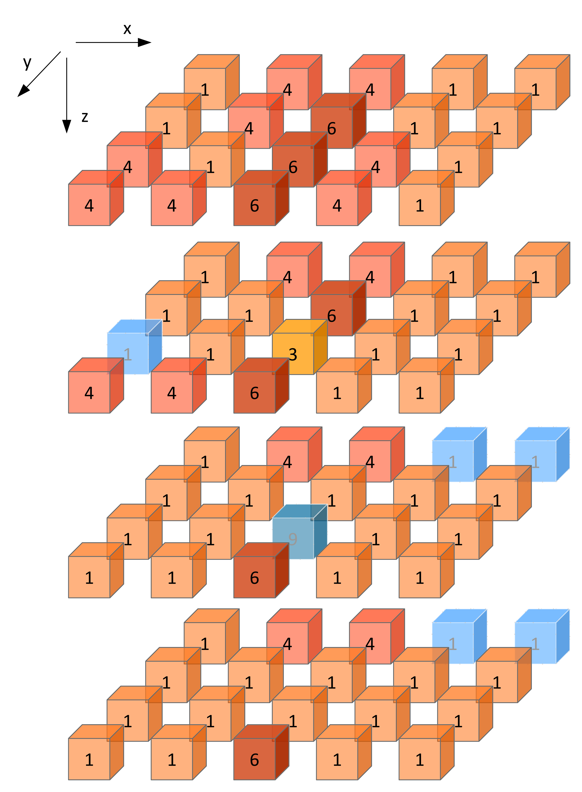

Benchmarking data sets
======================

Image features and image processing were benchmarked using a digital
image phantom and the CT image of a lung cancer patient, which are
described below.

Digital phantom
---------------

A small digital phantom was developed to compare image features. The
phantom is shown in figure [figTestVolume]. The phantom has the
following characteristics:

-  The phantom consists of :math:`5 \times 4 \times 4` :math:`(x,y,z)`
   voxels.

-  A slice consists of the voxels in :math:`(x,y)` plane for a
   particular slice at position :math:`z`. Therefore slices are stacked
   in the :math:`z` direction.

-  Voxels are :math:`2.0 \times 2.0 \times 2.0` mm in size.

-  Not all voxels are included in the region of interest. Several
   excluded voxels are located on the outside of the ROI, and one
   internal voxel was excluded as well. Voxels excluded from the ROI are
   shown in blue in figure [figTestVolume].

-  Some intensities are not present in the phantom. Notably, grey levels
   :math:`2` and :math:`5` are absent. :math:`1` is the lowest grey
   level present in the ROI, and :math:`6` the highest.

Calculating image features
^^^^^^^^^^^^^^^^^^^^^^^^^^

The digital phantom does not require the additional image processing
that conventional images require before feature calculation. Thus,
feature calculation is done directly on the phantom itself. The
following should be taken into account for calculating image features:

-  Discretisation is not required. All features are to be calculated
   using the phantom as it is. Alternatively, one could use a *fixed bin
   size* discretisation of 1 or *fixed bin number* discretisation of 6
   bins, which does not alter the contents of the phantom.

-  Grey level co-occurrence matrices are symmetrical and calculated for
   (Chebyshev) distance :math:`\delta=1`.

-  Neighbouring grey level dependence and neighbourhood grey tone
   difference matrices are likewise calculated for (Chebyshev) distance
   :math:`\delta=1`. Additionally, the neighbouring grey level
   dependence coarseness parameter has the value :math:`\alpha=0`.

-  Because discretisation is lacking, most intensity-based statistical
   features will match their intensity histogram-based analogues in
   value.

-  The ROI morphological and intensity masks are identical for the
   digital phantom, due to lack of re-segmentation.

.. _figTestVolume:

   Exploded view of the test volume. The number in each voxel
   corresponds with its grey level. Blue voxels are excluded from the
   region of interest. The coordinate system is so that :math:`x`
   increases from left to right, :math:`y` increases from back to front
   and :math:`z` increases from top to bottom, as is indicated by the
   axis definition in the top-left.

Radiomics phantom data
----------------------

A small dataset of CT images from four non-small-cell lung carcinoma
patients was made publicly available to serve as radiomics phantoms
`(DOI:10.17195/candat.2016.08.1) <http://dx.doi.org/10.17195/candat.2016.08.1>`__.
We use the image for the first patient (``PAT1``) to provide benchmarks
for different image processing steps.

The radiomics phantom data is stored as a stack of slices in ``DICOM``
format. The image slices can be identified by the ``DCM_IMG`` prefix.
The gross tumour volume (GTV) was delineated and is used as the region
of interest (ROI). Contour information is stored as an RT structure set
in the DICOM file starting with ``DCM_RS``. For broader use, both the
``DICOM`` set and segmentation mask have been converted to the ``NifTI``
format. When using the data in ``NifTI`` format, both image stacks
should be converted to (at least) 32-bit floating point and rounded to
the nearest integer before further processing.

Five image processing configurations are defined to test different image
processing algorithms, see Table [list\_summary\_cases]. While most
settings are self-explanatory, there are several aspects that require
some attention. Configurations are divided in 2D and 3D approaches. For
the 2D configurations (A, B), image interpolation is conducted within
the slice, and likewise texture features are extracted from the in-slice
plane, and not volumetrically (3D). For the 3D configurations (C-E)
interpolation is conducted in three dimensions, and features are
likewise extracted volumetrically. Discretisation is moreover required
for texture, intensity histogram and intensity-volume histogram
features, and both *fixed bin number* and *fixed bin size* algorithms
are tested.

Notes on interpolation
^^^^^^^^^^^^^^^^^^^^^^

Interpolation has a major influence on feature values. Different
algorithm implementations of the same interpolation method may
ostensibly provide the same functionality, but lead to different
interpolation grids. It is therefore recommended to read the
documentation of the particular implementation to assess if the
implementation allows or implements the following guidelines:

-  The spatial origin of the original grid in world coordinates matches
   the ``DICOM`` origin by definition.

-  The size of the interpolation grid is determined by rounding the
   fractional grid size towards infinity, i.e. a ceiling operation. This
   prevents the interpolation grid from disappearing for very small
   images, but is otherwise an arbitrary choice.

-  The centers of the interpolation and original image grids should be
   identical, i.e. the interpolation grid is centered on the center of
   the original image grid. This prevents spacing inconsistencies in the
   interpolation grid and avoids potential indexing issues.

-  The extent of the interpolation grid is, by definition, always equal
   or larger than that of the original grid. This means that intensities
   at the grid boundary are extrapolated. To facilitate this process,
   the image should be sufficiently padded with voxels that take on the
   nearest boundary intensity.

-  The floating point representation of the image and the ROI masks
   affects interpolation precision, and consequentially feature values.
   Image and ROI masks should at least be represented at full precision
   (``32-bit``) to avoid rounding errors. One example is the unintended
   exclusion of voxels from the interpolated ROI mask, which occurs when
   interpolation yields 0.4999…instead of 0.5. When images and ROI masks
   are converted from lower precision (e.g. ``16-bit``), they may
   require rounding if the original data were integer values, such as
   Hounsfield Units or the ROI mask labels.

More details are provided in Section [ref\_interpolation].

Diagnostic features
^^^^^^^^^^^^^^^^^^^

Identifying issues with an implementation of the image processing
sequence may be challenging. Multiple steps follow one another and
differences propagate. Hence we define a small number of diagnostic
features that describe how the image and ROI masks change with each
image processing step.

Import diagnostic features for the five different configurations are
shown in chapter [chap\_app\_diagnostic] of the appendix.

Initial image stack.
~~~~~~~~~~~~~~~~~~~~

The following features may be used to describe the initial image stack
(i.e. after loading image data for processing):

-  *Image dimensions.* This describes the image dimensions in voxels
   along the different image axes.

-  *Voxel dimensions.* This describes the voxel dimensions in mm. The
   dimension along the z-axis is equal to the distance between the
   origin voxels of two adjacent slices, and is generally equal to the
   slice thickness.

-  *Mean intensity.* This is the average intensity within the entire
   image.

-  *Minimum intensity.* This is the lowest intensity within the entire
   image.

-  *Maximum intensity.* This is the highest intensity within the entire
   image.

Interpolated image stack.
~~~~~~~~~~~~~~~~~~~~~~~~~

The above features may also be used to describe the image stack after
image interpolation.

Initial region of interest.
~~~~~~~~~~~~~~~~~~~~~~~~~~~

The following descriptors are used to describe the region of interest
(ROI) directly after segmentation of the image:

-  *ROI intensity mask dimensions.* This describes the dimensions, in
   voxels, of the ROI intensity mask.

-  *ROI intensity mask bounding box dimensions.* This describes the
   dimensions, in voxels, of the bounding box of the ROI intensity mask.

-  *ROI morphological mask bounding box dimensions.* This describes the
   dimensions, in voxels, of the bounding box of the ROI morphological
   mask.

-  *Number of voxels in the ROI intensity mask.* This describes the
   number of voxels included in the ROI intensity mask.

-  *Number of voxels in the ROI morphological mask.* This describes the
   number of voxels included in the ROI intensity mask.

-  *Mean ROI intensity.* This is the mean intensity of image voxels
   within the ROI intensity mask.

-  *Minimum ROI intensity.* This is the lowest intensity of image voxels
   within the ROI intensity mask.

-  *Maximum ROI intensity.* This is the highest intensity of image
   voxels within the ROI intensity mask.

Interpolated region of interest.
~~~~~~~~~~~~~~~~~~~~~~~~~~~~~~~~

The same features can be used to describe the ROI after interpolation of
the ROI mask.

Re-segmented region of interest.
~~~~~~~~~~~~~~~~~~~~~~~~~~~~~~~~

Again, the same features as above can be used to describe the ROI after
re-segmentation.

Calculating image features
^^^^^^^^^^^^^^^^^^^^^^^^^^

Unlike the digital phantom, the radiomics phantom does require
additional image processing, which is done according to the processing
configurations described in Table [list\_summary\_cases]. The following
should be taken into account when calculating image features:

-  Grey level co-occurrence matrices are symmetrical and calculated for
   (Chebyshev) distance :math:`\delta=1`.

-  Neighbouring grey level dependence and neighbourhood grey tone
   difference matrices are likewise calculated for (Chebyshev) distance
   :math:`\delta=1`. Additionally, the neighbouring grey level
   dependence coarseness parameter :math:`\alpha=0`.

-  Intensity-based statistical features and their intensity
   histogram-based analogues will differ in value due to discretisation,
   in contrast to the same features for the digital phantom.

-  Due to re-segmentation, the ROI morphological and intensity masks are
   not identical.

-  Calculation of IVH feature: since by default CT contains definite and
   discrete intensities, no separate discretisation prior to the
   calculation of intensity-volume histogram features is required. This
   is the case for configurations A, B and D (i.e. “definite intensity
   units – discrete case”). However, for configurations C and E, we
   re-discretise the ROI intensities prior to calculation of
   intensity-volume histogram features to provide better verification of
   processing algorithms. Configuration C simulates the “definite
   intensity units – continuous case”, while configuration E simulates
   the “arbitrary intensity units” case where re-segmentation range is
   not used. For details, please consult section [sect\_ivh].

| to 0.99 & config. A & config. B & config. C & config. D & config. E
| Sample & ``PAT1`` & ``PAT1`` & ``PAT1`` & ``PAT1`` & ``PAT1``
| ROI & ``GTV-1`` & ``GTV-1`` & ``GTV-1`` & ``GTV-1`` & ``GTV-1``
| Approach & 2D & 2D & 3D & 3D & 3D
| Interpolation & no & yes & yes & yes & yes
| Voxel dimension (mm)& & :math:`2\times 2` & :math:`2\times 2\times 2`
  & :math:`2\times 2\times 2` & :math:`2\times 2\times 2`
| Interpolation method & & bilinear & trilinear & trilinear & tricubic
  spline
| Grey level rounding & & nearest integer & nearest integer & nearest
  integer & nearest integer
| ROI interp. method & & bilinear & trilinear & trilinear & trilinear
| ROI partial volume & & :math:`0.5` & :math:`0.5` & :math:`0.5` &
  :math:`0.5`
| Re-segmentation & & & & &
| Range (HU) & :math:`\left[-500,400\right]` &
  :math:`\left[-500,400\right]` & :math:`\left[-1000,400\right]` & no &
  :math:`\left[-500,400\right]`
| Outliers & no & no & no & :math:`3\sigma` & :math:`3\sigma`
| Discretisation & & & & &
| Texture and IH & FBS: 25 HU & FBN: 32 bins & FBS: 25 HU & FBN: 32 bins
  & FBN: 32 bins
| IVH & no & no & FBS: 2.5 HU & no & FBN: 1000 bins
