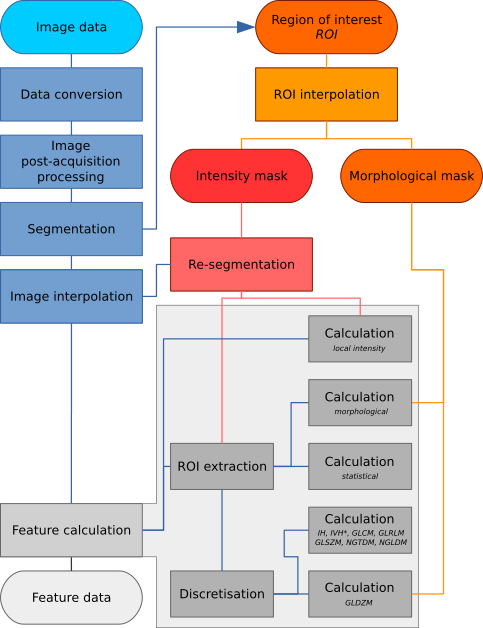
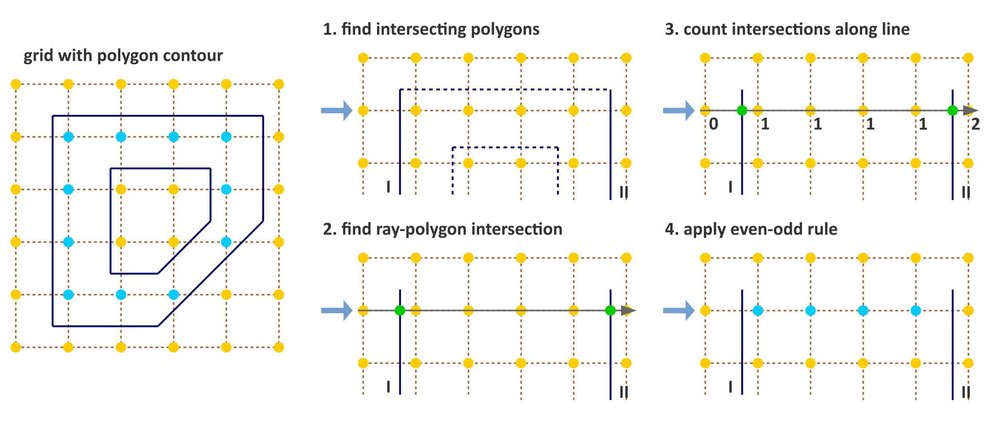
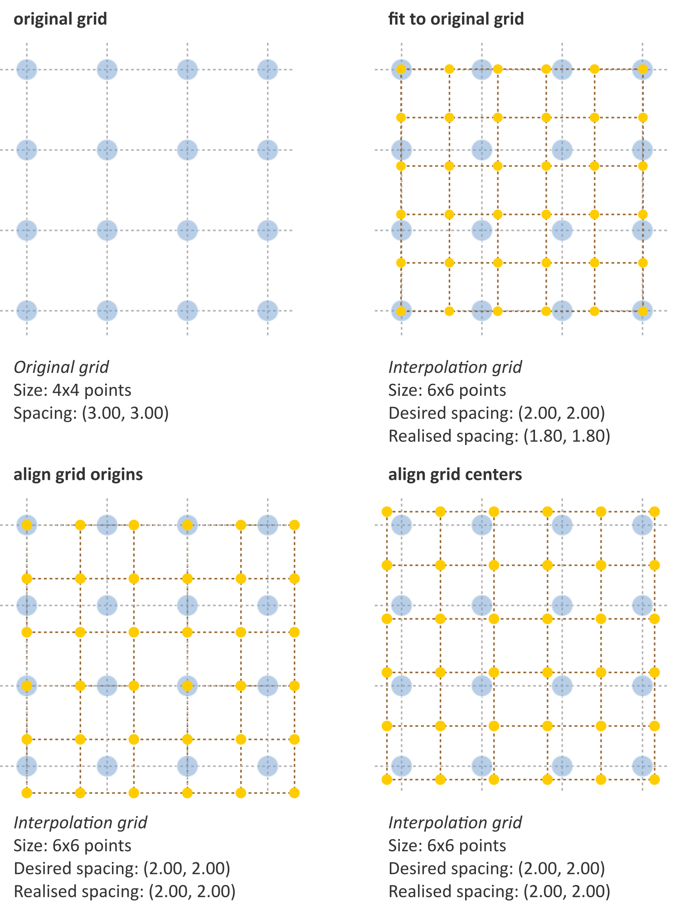
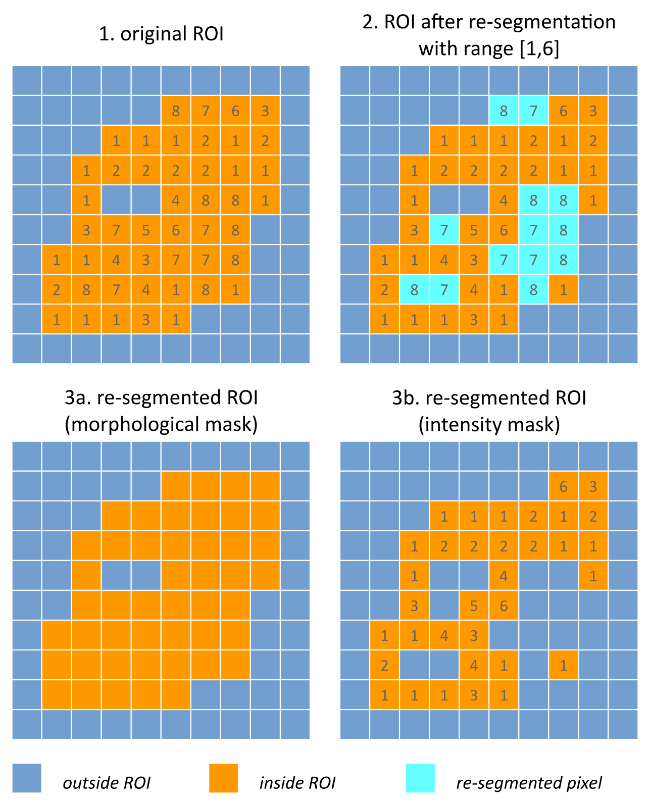
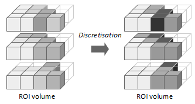

Image processing
================

Image processing is the sequence of operations required to derive image
biomarkers (features) from acquired images. In the context of this work
an image is defined as a three-dimensional (3D) stack of two-dimensional
(2D) digital image slices. Image slices are stacked along the
:math:`z`-axis. This stack is furthermore assumed to possess the same
coordinate system, i.e. image slices are not rotated or translated (in
the :math:`xy`-plane) with regards to each other. Moreover, digital
images typically possess a finite resolution. Intensities in an image
are thus located at regular intervals, or spacing. In 2D such regular
positions are called *pixels*, whereas in 3D the term *voxels* is used.
Pixels and voxels are thus represented as the intersections on a
regularly spaced grid. Alternatively, pixels and voxels may be
represented as rectangles and rectangular cuboids. The centers of the
pixels and voxels then coincide with the intersections of the regularly
spaced grid. Both representations are used in the document.

Pixels and voxels contain an intensity value for each channel of the
image. The number of channels depends on the imaging modality. Most
medical imaging generates single-channel images, whereas the number of
channels in microscopy may be greater, e.g. due to different stainings.
In such multi-channel cases, features may be extracted for each separate
channel, a subset of channels, or alternatively, channels may be
combined and converted to a single-channel representation. In the
remainder of the document we consider an image as if it only possesses a
single channel.

The intensity of a pixel or voxel is also called a *grey level* or *grey
tone*, particularly in single-channel images. Though practically there
is no difference, the terms *grey level* or *grey tone* are more
commonly used to refer to discrete intensities, including discretised
intensities.

Image processing may be conducted using a wide variety of schemes. We
therefore designed a general image processing scheme for image feature
calculation based on schemes used within scientific literature
\[1_\]. The image processing scheme is shown in
figure [figImageProc]. The processing steps referenced in the figure are
described in detail within this chapter.

.. _figImageProc:

   Image processing scheme for image feature calculation. Depending on
   the specific imaging modality and purpose, some steps may be omitted.
   The region of interest (ROI) is explicitly split into two masks,
   namely an intensity and morphological mask, after interpolation to
   the same grid as the interpolated image. Feature calculation is
   expanded to show the different feature families with specific
   pre-processing. IH: intensity histogram; IVH: intensity-volume
   histogram; GLCM: grey level cooccurrence matrix; GLRLM: grey level
   run length matrix; GLSZM: grey level size zone matrix; NGTDM:
   neighbourhood grey tone difference matrix; NGLDM: Neighbouring grey
   level dependence matrix; GLDZM: grey level distance zone matrix;
   \*Discretisation of IVH differs from IH and texture features, see
   section [sect\_ivh].

Data conversion
---------------

Some imaging modalities require conversion of raw image data into a more
meaningful presentation, e.g. standardised uptake values
(SUV) \[2_\]. This is performed during the
data conversion step. Assessment of data conversion methods falls
outside the scope of the current work.

Image post-acquisition processing
---------------------------------

Images are post-processed to enhance image quality. For instance,
magnetic resonance imaging (MRI) contains both Gaussian and Rician noise
\[3_\] and may benefit from denoising. As
another example, intensities measured using MR may be non-uniform across
an image and could require correction
\[4_, 5_, 6_\]. FDG-PET-based may
furthermore be corrected for partial volume effects
\[7_, 8_\] and noise
\[9_, 10_\]. In CT imaging, metal
objects, e.g. pacemakers and tooth implants, introduce artifacts and may
require artifinterpact suppression \[11_\].
Microscopy images generally benefit from field-of-view illumination
correction as illumination is usually inhomogeneous due to the
light-source or the optical path
\[12_, 13_\].

Evaluation and standardisation of various image post-acquisition
processing methods falls outside the scope of the current work. Note
that vendors may provide or implement software to perform noise
reduction and other post-processing during image reconstruction. In such
cases, additional post-acquisition processing may not be required.

Segmentation
------------

High-throughput image analysis, within the feature-based paradigm,
relies on the definition of regions of interest (ROI). ROIs are used to
define the region in which features are calculated. What constitutes an
ROI depends on the imaging and the study objective. For example, in 3D
microscopy of cell plates, cells are natural ROIs. In medical imaging of
cancer patients, the tumour volume is a common ROI. ROIs can be defined
manually by experts or (semi-)automatically using algorithms.

From a process point-of-view, segmentation leads to the creation of an
ROI mask :math:`\mathbf{R}`, for which every voxel
:math:`j \in \mathbf{R}` (:math:`R_j`) is defined as:

.. math::

   R_j =\begin{cases}
   1\qquad j \text{ in ROI}\\
   0\qquad \text{otherwise}\\
   \end{cases}

ROIs are typically stored with the accompanying image. Some image
formats directly store ROI masks as voxels (e.g. ``NIfTI``, ``NRRD`` and
``DICOM Segmentation``), and generating the ROI mask is conducted by
loading the corresponding image. In other cases the ROI is saved as a
set of :math:`(x,y,z)` points that define closed loops of (planar)
polygons, for example within ``DICOM RTSTRUCT`` or ``DICOM SR`` files.
In such cases, we should determine which voxel centers lie within the
space enclosed by the contour polygon in each slice to generate the ROI
mask.

A common method to determine whether a point in an image slice lies
inside a 2D polygon is the *crossing number* algorithm, for which
several implementations exist \[14_\]. The main
concept behind this algorithm is that for any point inside the polygon,
any line originating outside the polygon will cross the polygon an
uneven number of times. A simple example is shown in figure
[figImagePointGrid]. The implementation in the example makes use of the
fact that the ROI mask is a regular grid to scan entire rows at a time.
The example implementation consists of the following steps:

#. (optional) A ray is cast horizontally from outside the polygon for
   each of the :math:`n` image rows. As we iterate over the rows, it is
   computationally beneficial to exclude polygon edges that will not be
   crossed by the ray for the current row :math:`j`. If the current row
   has :math:`y`-coordinate :math:`y_j`, and edge :math:`k` has two
   vertices with :math:`y`-coordinates :math:`y_{k1}` and
   :math:`y_{k2}`, the ray will not cross the edge if both vertices lie
   either above or below :math:`y_j`, i.e. :math:`y_j < y_{k1}, y_{k2}`
   or :math:`y_j > y_{k1}, y_{k2}`. For each row :math:`j`, find those
   polygon edges whose :math:`y`-component of the vertices do not both
   lie on the same side of the row coordinate :math:`y_j`. This step is
   used to limit calculation of intersection points to only those that
   cross a ray cast from outside the polygon – e.g. ray with origin
   :math:`(-1, y_j)` and direction :math:`(1,0)`. This an optional step.

#. Determine intersection points :math:`x_i` of the (remaining) polygon
   edges with the ray.

#. Iterate over intersection points and add :math:`1` to the count of
   each pixel center with :math:`x \geq x_i`.

#. Apply the *even-odd* rule. Pixels with an odd count are inside the
   polygon, whereas pixels with an even count are outside.

Note that the example represents a relatively naive implementation that
will not consistently assign voxel centers positioned on the polygon
itself to the interior.

.. _figImagePointGrid:

   Simple algorithm to determine which pixels are inside a 2D polygon.
   The suggested implementation consists of four steps: (1) Omit edges
   that will not intersect with the current row of voxel centers. (2)
   Calculate intersection points of edges I and II with the ray for the
   current row. (3) Determine the number of intersections crossed from
   ray origin to the row voxel centers. (4) Apply *even-odd* rule to
   determine whether voxel centers are inside the polygon.

Interpolation
-------------

Texture feature sets require interpolation to isotropic voxel spacing to
be rotationally invariant, and to allow comparison between image data
from different samples, cohorts or batches. Voxel interpolation affects
image feature values as many image features are sensitive to changes in
voxel size
\[15_, 16_, 17_, 18_, 19_\].
Maintaining consistent isotropic voxel spacing across different
measurements and devices is therefore important for reproducibility. At
the moment there are no clear indications whether upsampling or
downsampling schemes are preferable. Consider, for example, an image
stack of slices with :math:`1.0 \times 1.0 \times 3.0~\text{mm}^3` voxel
spacing. Down-sampling (:math:`1.0 \times 1.0 \times 1.0~\text{mm}^3`)
requires inference and introduces artificial information, while
conversely upsampling to the largest dimension
(:math:`3.0 \times 3.0 \times 3.0~\text{mm}^3`) incurs information loss.
Multiple-scaling strategies potentially offer a good trade-off
\[20_\]. Note that upsampling may introduce
image aliasing artifacts that require anti-aliasing filters prior to
filtering \[21_, 22_\].

While in general 3D interpolation algorithms are used to interpolate 3D
images, 2D interpolation within the image slice plane may be recommended
in some situations. In 2D interpolation voxels are not interpolated
between slices. This may be beneficial if, for example, the spacing
between slices is large compared to the desired voxel size, and/or
compared to the in-plane spacing. Applying 3D interpolation would either
require inferencing a large number of voxels between slices
(upsampling), or the loss of a large fraction of in-plane information
(downsampling). The disadvantage of 2D interpolation is that voxel
spacing is no longer isotropic, and as a consequence texture features
can only be calculated in-plane.

Interpolation algorithms
^^^^^^^^^^^^^^^^^^^^^^^^

Interpolation algorithms translate image intensities from the original
image grid to an interpolation grid. In such grids, voxels are spatially
represented by their center. Several algorithms are commonly used for
interpolation, such as *nearest neighbour*, *trilinear*, *tricubic
convolution* and *tricubic spline interpolation*. In short, *nearest
neighbour interpolation* assigns the intensity of the most nearby voxel
in the original grid to each voxel in the interpolation grid. *Trilinear
interpolation* uses the intensities of the eight most nearby voxels in
the original grid to calculate a new interpolated intensity using linear
interpolation. *Tricubic convolution* and *tricubic spline
interpolation* draw upon a larger neighbourhood to evaluate a smooth,
continuous third-order polynomial at the voxel centers in the
interpolation grid. The difference between *tricubic convolution* and
*tricubic spline interpolation* lies in the implementation. Whereas
*tricubic spline interpolation* evaluates the smooth and continuous
third-order polynomial at every voxel center, *tricubic convolution*
approximates the solution using a convolution filter. Though *tricubic
convolution* is faster, with modern hardware and common image sizes, the
difference in execution speed is practically meaningless. Both
interpolation algorithms produce similar results, and both are often
referred to as *tricubic interpolation*.

While no consensus exists concerning the optimal choice of interpolation
algorithm, *trilinear interpolation* is usually seen as a conservative
choice. It does not lead to the blockiness produced by *nearest
neighbour interpolation* that introduces bias in local textures
\[1_\]. Nor does it lead to out-of-range
intensities which may occur due to overshoot with *tricubic* and higher
order interpolations. The latter problem can occur in acute intensity
transitions, where the local neighbourhood itself is not sufficiently
smooth to evaluate the polynomial within the allowed range. *Tricubic*
methods, however, may retain tissue contrast differences better.
Particularly when upsampling, *trilinear* interpolation may act as a
low-pass filter which suppresses higher spatial frequencies and cause
artefacts in high-pass spatial filters. Interpolation algorithms and
their advantages and disadvantages are treated in more detail elsewhere,
e.g. \[23_\].

In a phantom study, \[24_\] compared *nearest
neighbour*, *trilinear* and *tricubic* interpolation and indicated that
feature reproducibility is dependent on the selected interpolation
algorithm, i.e. some features were more reproducible using one
particular algorithm.

Rounding image intensities after interpolation 
^^^^^^^^^^^^^^^^^^^^^^^^^^^^^^^^^^^^^^^^^^^^^^^

Image intensities may require rounding after interpolation, or the
application of cut-off values. For example, in CT images intensities
represent Hounsfield Units, and these do not take non-integer values.
Following voxel interpolation, interpolated CT intensities are thus
rounded to the nearest integer.

Partial volume effects in the ROI mask
^^^^^^^^^^^^^^^^^^^^^^^^^^^^^^^^^^^^^^

If the image on which the ROI mask was defined, is interpolated after
the ROI was segmented, the ROI mask :math:`\mathbf{R}` should likewise
be interpolated to the same dimensions. Interpolation of the ROI mask is
best conducted using either the *nearest neighbour* or *trilinear
interpolation* methods, as these are guaranteed to produce meaningful
masks. *Trilinear interpolation* of the ROI mask leads to partial volume
effects, with some voxels containing fractions of the original voxels.
Since a ROI mask is a binary mask, such fractions need to be binarised
by setting a partial volume threshold :math:`\delta`:

.. math::

   R_j=\begin{cases}
   1\qquad R_{interp,j} \geq \delta\\
   0\qquad R_{interp,j} < \delta
   \end{cases}

A common choice for the partial volume threshold is :math:`\delta=0.5`.
For *nearest neighbour interpolation* the ROI mask does not contain
partial volume fractions, and may be used directly.

Interpolation results depend on the floating point representation used
for the image and ROI masks. Floating point representations should at
least be full precision (``32-bit``) to avoid rounding errors.

Interpolation grid
^^^^^^^^^^^^^^^^^^

Interpolated voxel centers lie on the intersections of a regularly
spaced grid. Grid intersections are represented by two coordinate
systems. The first coordinate system is the grid coordinate system, with
origin at :math:`(0.0, 0.0, 0.0)` and distance between directly
neighbouring voxel centers (spacing) of :math:`1.0`. The grid coordinate
system is the coordinate system typically used by computers, and
consequentially, by interpolation algorithms. The second coordinate
system is the world coordinate system, which is typically found in
(medical) imaging and provides an image scale. As the desired isotropic
spacing is commonly defined in world coordinate dimensions, conversions
between world coordinates and grid coordinates are necessary, and are
treated in more detail after assessing grid alignment methods.

Grid alignment affects feature values and is non-trivial. Three common
grid alignments may be identified, and are shown in figure
[figMeshGrids]:

#. **Fit to original grid** (). In this case the interpolation grid is
   deformed so that the voxel centers at the grid intersections overlap
   with the original grid vertices. For an original :math:`4\times4`
   voxel grid with spacing :math:`(3.00, 3.00)` mm and a desired
   interpolation spacing of :math:`(2.00, 2.00)` mm we first calculate
   the extent of the original voxel grid in world coordinates leading to
   an extent of :math:`((4-1)\,3.00, ((4-1)\,3.00) = (9.00, 9.00)` mm.
   In this case the interpolated grid will not exactly fit the original
   grid. Therefore we try to find the closest fitting grid, which leads
   to a :math:`6\times 6` grid by rounding up
   :math:`(9.00/2.00, 9.00/2.00)`. The resulting grid has a grid spacing
   of :math:`(1.80, 1.80)` mm in world coordinates, which differs from
   the desired grid spacing of :math:`(2.00, 2.00)` mm.

#. **Align grid origins** (). A simple approach which conserves the
   desired grid spacing is the alignment of the origins of the
   interpolation and original grids. Keeping with the same example, the
   interpolation grid is :math:`(6 \times 6)`. The resulting voxel grid
   has a grid spacing of :math:`(2.00, 2.00)` mm in world coordinates.
   By definition both grids are aligned at the origin,
   :math:`(0.00, 0.00)`.

#. **Align grid centers** (). The position of the origin may depend on
   image meta-data defining image orientation. Not all software
   implementations may process this meta-data the same way. An
   implementation-independent solution is to align both grids on the
   grid center. Again, keeping with the same example, the interpolation
   grid is :math:`(6 \times 6)`. Thus, the resulting voxel grid has a
   grid spacing of :math:`(2.00, 2.00)` mm in world coordinates.

*Align grid centers* is recommended as it is implementation-independent
and achieves the desired voxel spacing. Technical details of
implementing *align grid centers* are described below.

Interpolation grid dimensions
^^^^^^^^^^^^^^^^^^^^^^^^^^^^^

The dimensions of the interpolation grid are determined as follows. Let
:math:`n_a` be the number of points along one axis of the original grid
and :math:`s_{a,w}` their spacing in world coordinates. Then, let
:math:`s_{b,w}` be the desired spacing after interpolation. The axial
dimension of the interpolated mesh grid is then:

.. math:: n_b = \left\lceil \frac{n_a s_a}{s_b}\right\rceil 

Rounding towards infinity guarantees that the interpolation grid exists
even when the original grid contains few voxels. However, it also means
that the interpolation mesh grid is partially located outside of the
original grid. Extrapolation is thus required. Padding the original grid
with the intensities at the boundary is recommended. Some
implementations of interpolation algorithms may perform this padding
internally.

Interpolation grid position
^^^^^^^^^^^^^^^^^^^^^^^^^^^

For the *align grid centers* method, the positions of the interpolation
grid points are determined as follows. As before, let :math:`n_a` and
:math:`n_b` be the dimensions of one axis in the original and
interpolation grid, respectively. Moreover, let :math:`s_{a,w}` be the
original spacing and :math:`s_{b,w}` the desired spacing for the same
axis in world coordinates. Then, with :math:`x_{a,w}` the origin of the
original grid in world coordinates, the origin of the interpolation grid
is located at:

.. math:: x_{b,w} = x_{a,w} + \frac{s_a (n_a - 1) - s_b (n_b - 1)}{2}

In the grid coordinate system, the original grid origin is located at
:math:`x_{a,g} = 0`. The origin of the interpolation grid is then
located at:

.. math:: x_{b,g} = \frac{1}{2}\left(n_a - 1 - \frac{s_{b,w}}{s_{a,w}} \left(n_b -1\right) \right)

Here the fraction :math:`s_{b,w}/s_{a,w}= s_{b,g}` is the desired
spacing in grid coordinates. Thus, the interpolation grid points along
the considered axis are located at grid coordinates:

.. math:: x_{b,g},\,x_{b,g} + s_{b,g},\,x_{b,g} + 2s_{b,g},\,\ldots,\,x_{b,g} + (n_b-1)s_{b,g}

Naturally, the above description applies to each grid axis.

.. _figMeshGrids:

   Different interpolation mesh grids based on an original
   :math:`4\times 4` grid with :math:`(3.00, 3.00)` mm spacing. The
   desired interpolation spacing is :math:`(2.00, 2.00)` mm. *Fit to
   original grid* creates an interpolation mesh grid that overlaps with
   the corners of the original grid. *Align grid origins* creates an
   interpolation mesh grid that is positioned at the origin of the
   original grid. *Align grid centers* creates an interpolation grid
   that is centered on the center of original and interpolation grids.

.. _figReSegmentationExample:

   Example showing how intensity and morphological masks may differ due
   to re-segmentation. (1) The original region of interest (ROI) is
   shown with pixel intensities. (2) Subsequently, the ROI is
   re-segmented to only contain values in the range :math:`[1,6]`.
   Pixels outside this range are marked for removal from the intensity
   mask. (3a) Resulting morphological mask, which is identical to the
   original ROI. (3b) Re-segmented intensity mask. Note that due to
   re-segmentation, intensity and morphological masks are different.

Re-segmentation
---------------

Re-segmentation entails updating the ROI mask :math:`\mathbf{R}` based
on corresponding voxel intensities :math:`\mathbf{X}_{gl}`.
Re-segmentation may be performed to exclude voxels from a previously
segmented ROI, and is performed after interpolation. An example use
would be the exclusion of air or bone voxels from an ROI defined on CT
imaging. Two common re-segmentation methods are described in this
section. Combining multiple re-segmentation methods is possible.

Intensity and morphological masks of an ROI
^^^^^^^^^^^^^^^^^^^^^^^^^^^^^^^^^^^^^^^^^^^

Conventionally, an ROI consists of a single mask. However,
re-segmentation may lead to exclusion of internal voxels, or divide the
ROI into sub-volumes. To avoid undue complexity by again updating the
re-segmented ROI for a more plausible morphology, we define two separate
ROI masks.

The morphological mask () is not re-segmented and maintains the original
morphology as defined by an expert and/or (semi-)automatic segmentation
algorithms.

The intensity mask () can be re-segmented and will contain only the
selected voxels. For many feature families, only this is important.
However, for morphological and grey level distance zone matrix (GLDZM)
feature families, both intensity and morphological masks are used. A
two-dimensional example is shown in figure [figReSegmentationExample].

Range re-segmentation
^^^^^^^^^^^^^^^^^^^^^

Re-segmentation may be performed to remove voxels from the intensity
mask that fall outside of a specified range. An example is the exclusion
of voxels with Hounsfield Units indicating air and bone tissue in the
tumour ROI within CT images, or low activity areas in PET images. Such
ranges of intensities of included voxels are usually presented as a
closed interval :math:`\left[ a,b\right]` or half-open interval
:math:`\left[a,\infty\right)`, respectively. For arbitrary intensity
units (found in e.g. raw MRI data, uncalibrated microscopy images, and
many spatial filters), no re-segmentation range can be provided.

When a re-segmentation range is defined by the user, it needs to be
propagated and used for the calculation of features that require a
specified intensity range (e.g. intensity-volume histogram features)
and/or that employs *fixed bin size* discretisation. Recommendations for
the possible combinations of different imaging intensity definitions,
re-segmentation ranges and discretisation algorithms are provided in
Table [table\_discretisation].

Intensity outlier filtering
^^^^^^^^^^^^^^^^^^^^^^^^^^^

ROI voxels with outlier intensities may be removed from the intensity
mask. One method for defining outliers was suggested by
\[25_\] after
\[26_\]. The mean :math:`\mu` and standard
deviation :math:`\sigma` of grey levels of voxels assigned to the ROI
are calculated. Voxels outside the range
:math:`\left[\mu - 3\sigma, \mu + 3\sigma\right]` are subsequently
excluded from the intensity mask.

ROI extraction
--------------

Many feature families require that the ROI is isolated from the
surrounding voxels. The ROI intensity mask is used to extract the image
volume to be studied. Excluded voxels are commonly replaced by a
placeholder value, often *NaN*. This placeholder value may then used to
exclude these voxels from calculations. Voxels included in the ROI mask
retain their original intensity.

Intensity discretisation
------------------------

Discretisation or quantisation of image intensities inside the ROI is
often required to make calculation of texture features tractable
\[27_\], and possesses noise-suppressing properties
as well. An example of discretisation is shown in figure
[figImageDiscretisation].

.. _figImageDiscretisation:

   The image volume contained in the region of interest (ROI) is
   discretised. Here, intensities from the original ROI volume were
   assigned to 3 intensity bins to create a discretised volume.

Two approaches to discretisation are commonly used. One involves the
discretisation to a fixed number of bins, and the other discretisation
with a fixed bin width. As we will observe, there is no inherent
preference for one or the other method. However, both methods have
particular characteristics (as described below) that may make them
better suited for specific purposes. Note that the lowest bin always has
value :math:`1`, and not :math:`0`. This ensures consistency for
calculations of texture features, where for some features grey level
:math:`0` is not allowed .

Fixed bin number
^^^^^^^^^^^^^^^^

In the *fixed bin number* method, intensities :math:`X_{gl}` are
discretised to a fixed number of :math:`N_g` bins. It is defined as
follows:

.. math::

   X_{d,k} = \begin{cases}
   \left\lfloor N_g \frac{X_{gl,k}-X_{gl,min}}{X_{gl,max}-X_{gl,min}}\right\rfloor  + 1 & X_{gl,k}<X_{gl,max}\\
   N_g & X_{gl,k}=X_{gl,max}
   \end{cases}

In short, the intensity :math:`X_{gl,k}` of voxel :math:`k` is
corrected by the lowest occurring intensity :math:`X_{gl,min}` in the
ROI, divided by the bin width
:math:`\left(X_{gl,max}-X_{gl,min}\right)/N_g`, and subsequently rounded
down to the nearest integer (floor function). The *fixed bin number*
method breaks the relationship between image intensity and physiological
meaning (if any). However, it introduces a normalising effect which may
be beneficial when intensity units are arbitrary (e.g. raw MRI data and
many spatial filters), and where contrast is considered important.
Furthermore, as values of many features depend on the number of grey
levels found within a given ROI, the use of a *fixed bin number*
discretisation algorithm allows for a direct comparison of feature
values across multiple analysed ROIs (e.g. across different samples).

Fixed bin size
^^^^^^^^^^^^^^

*Fixed bin size* discretisation is conceptually simple. A new bin is
assigned for every intensity interval with width :math:`w_b`; i.e.
:math:`w_b` is the bin width, starting at a minimum :math:`X_{gl,min}`.
The minimum intensity may be a user-set value as defined by the lower
bound of the re-segmentation range, or data-driven as defined by the
minimum intensity in the ROI
:math:`X_{gl,min}=\text{min} \left( X_{gl} \right)`. In all cases, the
method used and/or set minimum value must be clearly reported. However,
to maintain consistency between samples, we strongly recommend to always
set the same minimum value for all samples as defined by the lower bound
of the re-segmentation range (e.g. HU of -500 for CT, SUV of 0 for PET,
etc.). In the case that no re-segmentation range may be defined due to
arbitrary intensity units (e.g. raw MRI data and many spatial filters),
the use of the *fixed bin size* discretisation algorithm is not
recommended.

The *fixed bin size* method has the advantage of maintaining a direct
relationship with the original intensity scale, which could be useful
for functional imaging modalities such as PET.

Discretised intensities are computed as follows:

.. math:: X_{d,k}=\left\lfloor \frac{X_{gl,k}-X_{gl,min}}{w_b}\right\rfloor  + 1

In short, the minimum intensity :math:`X_{gl,min}` is subtracted from
intensity :math:`X_{gl,k}` in voxel :math:`k`, and then divided by the
bin width :math:`w_b`. The resulting value is subsequently rounded down
to the nearest integer (floor function), and :math:`1` is added to
arrive at the discretised intensity.

Other methods
^^^^^^^^^^^^^

Many other methods and variations for discretisation exist, but are not
described in detail here. \[25_\] described
the use of *intensity histogram equalisation* and *Lloyd-Max* algorithms
for discretisation. *Intensity histogram equalisation* involves
redistributing intensities so that the resulting bins contain a similar
number of voxels, i.e. contrast is increased by flattening the histogram
as much as possible \[28_\]. Histogram
equalisation of the ROI imaging intensities can be performed before any
other discretisation algorithm (e.g. FBN, FSB, etc.), and it also
requires the definition of a given number of bins in the histogram to be
equalised. The *Lloyd-Max* algorithm is an iterative clustering method
that seeks to minimise mean squared discretisation errors
\[29_, 30_\].

Recommendations
^^^^^^^^^^^^^^^

The discretisation method that leads to optimal feature inter- and
intra-sample reproducibility is modality-dependent. Usage
recommendations for the possible combinations of different imaging
intensity definitions, re-segmentation ranges and discretisation
algorithms are provided in Table [table\_discretisation]. Overall, the
discretisation choice has a substantial impact on intensity
distributions, feature values and reproducibility
\[31_, 32_, 33_, 1_, 18_, 17_\].

to 0.8

| **Imaging intensity units\ :math:`^{(1)}`** & **Re-segmentation
  range** & **FBN\ :math:`^{(2)}`** &\ **FBS\ :math:`^{(3)}`**
| & :math:`[a,b]` & &
| & :math:`[a,\infty)` & &
| & none & &
| & & &
| arbitrary & none & &

Feature calculation
-------------------

Feature calculation is the final processing step where feature
descriptors are used to quantify characteristics of the ROI. After
calculation such features may be used as image biomarkers by relating
them to physiological and medical outcomes of interest. Feature
calculation is handled in full details in the next chapter.

Let us recall that the image processing steps leading to image biomarker
calculations can be performed in many different ways, notably in terms
of spatial filtering, segmentation, interpolation and discretisation
parameters. Furthermore, it is plausible that different texture features
will better quantify the characteristics of the ROI when computed using
different image processing parameters. For example, a lower number of
grey levels in the discretisation process (e.g. 8 or 16) may allow to
better characterize the sub-regions of the ROI using *grey level size
zone matrix* () features, whereas *grey level co-occurence matrix* ()
features may be better modeled with a higher number of grey levels (e.g.
32 or 64). Overall, these possible differences opens the door to the
optimization of image processing parameters for each different feature
in terms of a specific objective. For the specific case of the
optimization of image interpolation and discretisation prior to texture
analysis, Vallières *et al.* \[25_\] have
named this process *texture optimization*. The authors notably suggested
that the *texture optimization* process could have significant influence
of the prognostic capability of subsequent features. In another
study \[20_\], the authors constructed
predictive models using textures calculated from all possible
combinations of PET and CT images interpolated at four isotropic
resolutions and discretised with two different algorithms and four
numbers of grey levels.

.. [1] `Hatt, Mathieu, Tixier, Florent, Pierce, Larry, Kinahan, Paul E., Le Rest, Catherine Cheze, Visvikis, Dimitris; *Characterization of PET/CT images using texture analysis: the past, the present\ldots any future?*; European journal of nuclear medicine and molecular imaging; 2017; 44 (1); 151--165 <http://link.springer.com/10.1007/s00259-016-3427-0>`_
.. [2] `Boellaard, Ronald, Delgado-Bolton, Roberto, Oyen, Wim J. G., Giammarile, Francesco, Tatsch, Klaus, Eschner, Wolfgang, et al.; *FDG PET/CT: EANM procedure guidelines for tumour imaging: version 2.0.*; European journal of nuclear medicine and molecular imaging; 2015; 42 (2); 328--54 <http://www.ncbi.nlm.nih.gov/pubmed/25452219>`_
.. [3] `Gudbjartsson, H\'akon, Patz, Samuel; *The Rician distribution of noisy MRI data.*; Magnetic resonance in medicine; 1995; 34 (6); 910--4 <http://www.ncbi.nlm.nih.gov/pubmed/2254141>`_
.. [4] `Sled, John G., Zijdenbos, Alex P., Evans, Alan C.; *A nonparametric method for automatic correction of intensity nonuniformity in MRI data.*; IEEE transactions on medical imaging; 1998; 17 (1); 87--97 <http://www.ncbi.nlm.nih.gov/sites/entrez?Db=pubmed\&DbFrom=pubmed\&Cmd=Link\&LinkName=pubmed\_pubmed\&LinkReadableName=Related>`_
.. [5] `Vovk, Uros, Pernus, Franjo, Likar, Bostjan; *A review of methods for correction of intensity inhomogeneity in MRI.*; IEEE transactions on medical imaging; 2007; 26 (3); 405--21 <http://www.ncbi.nlm.nih.gov/pubmed/17354645>`_
.. [6] `Balafar, M. A., Ramli, A. R., Saripan, M. I., Mashohor, S.; *Review of brain MRI image segmentation methods*; Artificial Intelligence Review; 2010; 33 (3); 261--274 <http://link.springer.com/10.1007/s10462-010-9155-0>`_
.. [7] `Soret, Marine, Bacharach, Stephen L., Buvat, Ir\`ene; *Partial-volume effect in PET tumor imaging.*; Journal of nuclear medicine; 2007; 48 (6); 932--45 <http://jnm.snmjournals.org/cgi/doi/10.2967/jnumed.106.035774>`_
.. [8] `Boussion, N., Le Rest, Catherine Cheze, Hatt, Mathieu, Visvikis, Dimitris; *Incorporation of wavelet-based denoising in iterative deconvolution for partial volume correction in whole-body PET imaging.*; European journal of nuclear medicine and molecular imaging; 2009; 36 (7); 1064--75 <http://www.ncbi.nlm.nih.gov/pubmed/19224209>`_
.. [9] `Le Pogam, Adrien, Hanzouli, H., Hatt, Mathieu, Cheze Le Rest, Catherine, Visvikis, Dimitris; *Denoising of PET images by combining wavelets and curvelets for improved preservation of resolution and quantitation.*; Medical image analysis; 2013; 17 (8); 877--91 <http://dx.doi.org/10.1016/j.media.2013.05.005>`_
.. [10] `El Naqa, Issam; *Image Processing and Analysis of PET and Hybrid PET Imaging*; 2017; 285--301 <https://doi.org/10.1007/978-3-319-40070-9\_12>`_
.. [11] `Gjesteby, Lars, De Man, Bruno, Jin, Yannan, Paganetti, Harald, Verburg, Joost, Giantsoudi, Drosoula, et al.; *Metal Artifact Reduction in CT: Where Are We After Four Decades?*; IEEE Access; 2016; 4; 5826--5849 <http://ieeexplore.ieee.org/document/7565564/>`_
.. [12] `Caicedo, Juan C., Cooper, Sam, Heigwer, Florian, Warchal, Scott, Qiu, Peng, Molnar, Csaba, et al.; *Data-analysis strategies for image-based cell profiling*; Nature Methods; 2017; 14 (9); 849--863 <https://doi.org/10.1038/nmeth.4397>`_
.. [13] `Smith, Kevin, Li, Yunpeng, Piccinini, Filippo, Csucs, Gabor, Balazs, Csaba, Bevilacqua, Alessandro, et al.; *CIDRE: An illumination-correction method for optical microscopy*; Nature Methods; 2015; 12 (5); 404--406 <https://doi.org/10.1038/nmeth.3323>`_
.. [14] `Schirra, Stefan; *How Reliable Are Practical Point-in-Polygon Strategies?*; 2008; 744--755 <http://link.springer.com/10.1007/978-3-540-87744-8\_62>`_
.. [15] `Yan, Jianhua, Chu-Shern, Jason Lim, Loi, Hoi Yin, Khor, Lih Kin, Sinha, Arvind K., Quek, Swee Tian, et al.; *Impact of Image Reconstruction Settings on Texture Features in 18F-FDG PET.*; Journal of nuclear medicine; 2015; 56 (11); 1667--73 <http://jnm.snmjournals.org/cgi/doi/10.2967/jnumed.115.156927\%5Cnhttp://www.ncbi.nlm.nih.gov/pubmed/26229145>`_
.. [16] `Bailly, Cl\'ement, Bodet-Milin, Caroline, Couespel, Sol\`ene, Necib, Hatem, Kraeber-Bod\'er\'e, Fran\ccoise, Ansquer, Catherine, et al.; *Revisiting the Robustness of PET-Based Textural Features in the Context of Multi-Centric Trials.*; PloS one; 2016; 11 (7); e0159984 <http://www.ncbi.nlm.nih.gov/pubmed/27467882>`_
.. [17] `Altazi, Baderaldeen A, Zhang, Geoffrey G, Fernandez, Daniel C, Montejo, Michael E, Hunt, Dylan, Werner, Joan, et al.; *Reproducibility of F18-FDG PET radiomic features for different cervical tumor segmentation methods, gray-level discretization, and reconstruction algorithms.*; Journal of applied clinical medical physics; 2017; 18 (6); 32--48 <http://www.ncbi.nlm.nih.gov/pubmed/28891217>`_
.. [18] `Shafiq-Ul-Hassan, Muhammad, Zhang, Geoffrey G., Latifi, Kujtim, Ullah, Ghanim, Hunt, Dylan C., Balagurunathan, Yoganand, et al.; *Intrinsic dependencies of CT radiomic features on voxel size and number of gray levels.*; Medical physics; 2017; 44 (3); 1050--1062 <http://doi.wiley.com/10.1002/mp.12123>`_
.. [19] `Shiri, Isaac, Rahmim, Arman, Ghaffarian, Pardis, Geramifar, Parham, Abdollahi, Hamid, Bitarafan-Rajabi, Ahmad; *The impact of image reconstruction settings on 18F-FDG PET radiomic features: multi-scanner phantom and patient studies*; European Radiology; 2017; 27 (11); 4498--4509 <http://link.springer.com/10.1007/s00330-017-4859-z>`_
.. [20] `Valli\`eres, Martin, Kay-Rivest, Emily, Perrin, L\'eo Jean, Liem, Xavier, Furstoss, Christophe, Aerts, Hugo J. W. L., et al.; *Radiomics strategies for risk assessment of tumour failure in head-and-neck cancer.*; Scientific reports; 2017; 7 (); 10117 <http://arxiv.org/abs/1703.08516>`_
.. [21] `Mackin, Dennis, Fave, Xenia, Zhang, Lifei, Yang, Jinzhong, Jones, A. Kyle, Ng, Chaan S., et al.; *Harmonizing the pixel size in retrospective computed tomography radiomics studies*; PLOS ONE; 2017; 12 (9); e0178524 <http://dx.plos.org/10.1371/journal.pone.0178524>`_
.. [22] `Zwanenburg, Alex, Leger, Stefan, Agolli, Linda, Pilz, Karoline, Troost, Esther G. C., Richter, Christian, et al.; *Assessing robustness of radiomic features by image perturbation*; eprint arXiv:1806.06719 [cs.CV]; 2018 <http://arxiv.org/abs/1806.06719>`_
.. [23] Th\'evenaz, Philippe, Blu, Thierry, Unser, Michael; *Image interpolation and resampling*; 2000; 393--420
.. [24] `Larue, Ruben T. H. M., van Timmeren, Janna E., de Jong, Evelyn E. C., Feliciani, Giacomo, Leijenaar, Ralph T. H., Schreurs, Wendy M. J., et al.; *Influence of gray level discretization on radiomic feature stability for different CT scanners, tube currents and slice thicknesses: a comprehensive phantom study.*; Acta oncologica; 2017; 1--10 <https://www.tandfonline.com/doi/full/10.1080/0284186X.2017.1351624>`_
.. [25] `Valli\`eres, Martin, Freeman, Carolyn R., Skamene, Sonia R., El Naqa, Issam; *A radiomics model from joint FDG-PET and MRI texture features for the prediction of lung metastases in soft-tissue sarcomas of the extremities.*; Physics in medicine and biology; 2015; 60 (14); 5471--96 <http://www.ncbi.nlm.nih.gov/pubmed/26119045>`_
.. [26] `Collewet, G., Strzelecki, M., Mariette, F.; *Influence of MRI acquisition protocols and image intensity normalization methods on texture classification.*; Magnetic resonance imaging; 2004; 22 (1); 81--91 <http://www.ncbi.nlm.nih.gov/pubmed/14972397>`_
.. [27] `Yip, Stephen S. F., Aerts, Hugo J. W. L.; *Applications and limitations of radiomics.*; Physics in medicine and biology; 2016; 61 (13); R150--66 <http://stacks.iop.org/0031-9155/61/i=13/a=R150?key=crossref.134478778713970aff90f16abe110608>`_
.. [28] `Hall, Ernest L., Kruger, Richard P., Samuel, J., Dwyer, D., McLaren, Robert W., Hall, David L., et al.; *A Survey of Preprocessing and Feature Extraction Techniques for Radiographic Images*; IEEE Transactions on Computers; 1971; C-20 (9); 1032--1044 <https://doi.org/10.1109/T-C.1971.223399>`_
.. [29] `Max, Joel; *Quantizing for minimum distortion*; IEEE Transactions on Information Theory; 1960; 6 (1); 7--12 <http://ieeexplore.ieee.org/lpdocs/epic03/wrapper.htm?arnumber=1057548>`_
.. [30] `Lloyd, Stuart P.; *Least Squares Quantization in PCM*; IEEE Transactions on Information Theory; 1982; 28 (2); 129--137 <https://doi.org/10.1109/TIT.1982.1056489>`_
.. [31] `Hatt, Mathieu, Majdoub, Mohamed, Valli\`eres, Martin, Tixier, Florent, Le Rest, Catherine Cheze, Groheux, David, et al.; *18F-FDG PET uptake characterization through texture analysis: investigating the complementary nature of heterogeneity and functional tumor volume in a multi-cancer site patient cohort.*; Journal of nuclear medicine; 2015; 56 (1); 38--44 <http://jnm.snmjournals.org/content/56/1/38.abstractN2>`_
.. [32] `Leijenaar, Ralph T. H., Nalbantov, Georgi, Carvalho, Sara, van Elmpt, Wouter J. C., Troost, Esther G. C., Boellaard, Ronald, et al.; *The effect of SUV discretization in quantitative FDG-PET Radiomics: the need for standardized methodology in tumor texture analysis.*; Scientific reports; 2015; 5 (August); 11075 <http://www.pubmedcentral.nih.gov/articlerender.fcgi?artid=4525145\&tool=pmcentrez\&rendertype=abstract>`_
.. [33] `Desseroit, Marie-Charlotte, Tixier, Florent, Weber, Wolfgang A., Siegel, Barry A., Cheze Le Rest, Catherine, Visvikis, Dimitris, et al.; *Reliability of PET/CT Shape and Heterogeneity Features in Functional and Morphologic Components of Non-Small Cell Lung Cancer Tumors: A Repeatability Analysis in a Prospective Multicenter Cohort.*; Journal of nuclear medicine; 2017; 58 (3); 406--411 <http://jnm.snmjournals.org/lookup/doi/10.2967/jnumed.116.180919>`_